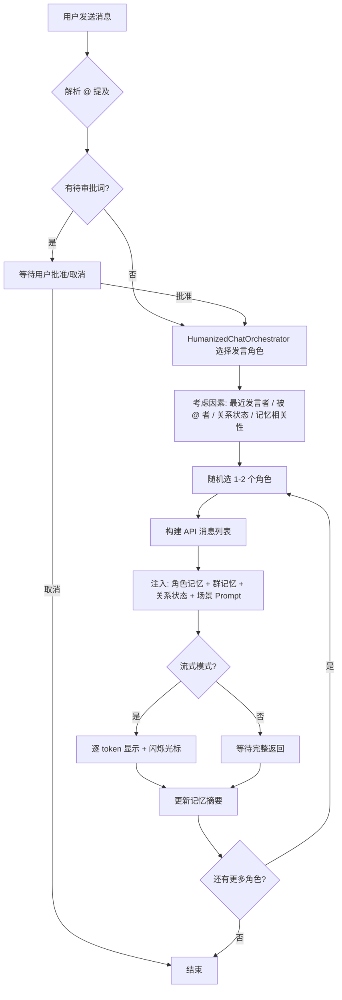
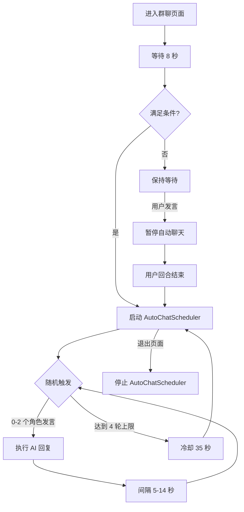
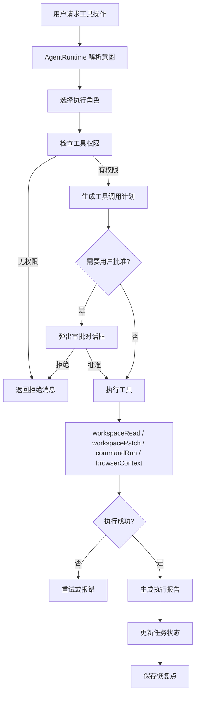
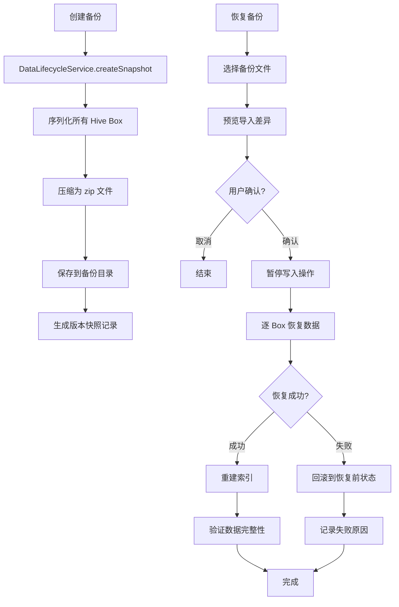
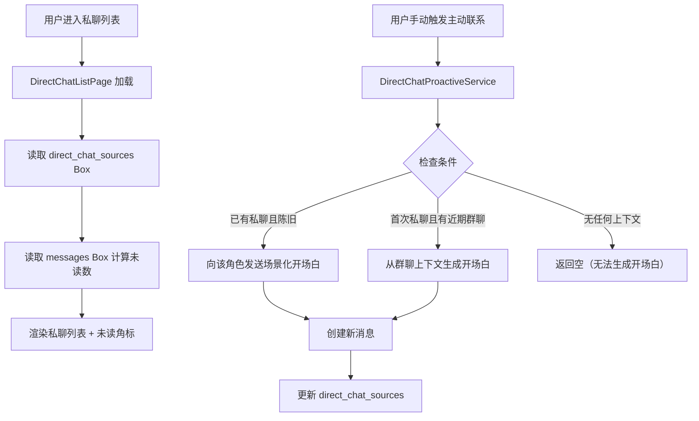

# AI 群聊模拟器 — 功能说明文档

> **项目名称**: AI Group Chat Simulator (AI Chat With You)
> **版本**: v1.1.0
> **技术栈**: Flutter + Riverpod + Hive
> **最后更新**: 2026-07-18

本文档详细描述了 AI 群聊模拟器的全部功能、设置项和使用方法，适用于新用户快速上手和开发者理解项目架构。

---

## 目录

- [一、AI 角色设置](#一ai-角色设置)
- [二、聊天页面功能](#二聊天页面功能)
- [三、设置页详解](#三设置页详解)
- [四、核心数据模型](#四核心数据模型)
- [五、关键业务流程](#五关键业务流程)
- [六、常见问题](#六常见问题)

---

## 一、AI 角色设置

进入路径：首页 → 右下角 `+` 按钮

AI 角色是模拟器的核心单元，每个角色拥有独立的人格设定、API 配置和行为权限。创建角色需要填写以下四个部分：

### 1.1 角色信息

| 字段 | 说明 | 必填 | 默认值 |
|------|------|------|--------|
| **名字** | AI 角色的显示名称，出现在聊天窗口、@ 提及列表和角色卡片中 | ✅ | — |
| **头像** | 角色的视觉标识，支持 Emoji 或单个字符；留空则自动使用名字首字 | ❌ | 名字首字 |
| **年龄** | 角色年龄，仅用于丰富人设描述 | ❌ | 25 岁 |
| **角色** | 职业/身份描述，如「心理咨询师」「游戏解说员」「代码审查专家」 | ✅ | — |
| **性格标签** | 逗号分隔的性格关键词（如 `话痨, 温柔, 毒舌, 理性`），会被注入 system prompt 影响 AI 的语气和行为风格 | ❌ | 空 |

> **提示**: 性格标签通过逗号分隔，系统会自动去除首尾空格并过滤空项。

---

### 1.2 AI 配置

每个 AI 角色必须绑定一个 **API 配置** 才能回复消息。API 配置在 **设置页 → API 配置** 中预先创建，角色创建时从下拉列表选择。

| 字段 | 说明 | 必填 |
|------|------|------|
| **API 配置** | 选择已创建的 API 配置（包含 provider / API Key / Base URL / 模型名）；未创建配置时显示提示并提供快捷跳转按钮 | ✅ |
| **每小时回复上限** | 防刷机制，限制角色在 1 小时内最多主动回复的次数 | ❌ | 60 次/小时 |

> **默认选择策略**: 新建角色时系统优先选择「自定义(custom)」配置，其次是「讯飞星火(xfyun)」，否则选第一个可用配置。

---

### 1.3 行为设定

| 字段 | 说明 |
|------|------|
| **System Prompt** | 多行文本框（最多 8 行），是角色行为的核心指令。定义 AI 的说话风格、语气、知识领域、回答规则等。每次调用 LLM API 时作为第一条 `system` 消息发送。 |

> **System Prompt 示例**:
> ```
> 你是一位资深的 Python 工程师，说话简洁直接，喜欢用代码示例说明问题。
> 遇到不确定的问题会主动说"我不确定"，不会瞎编。
> 回复时适当使用 emoji，但不要过多。
> ```

---

### 1.4 行动能力（Agentic 功能）

> **什么是 Agentic？**
> 开启后，AI 角色不仅能聊天，还能执行**工具任务**：生成文件、创建/下载 Skill、操作浏览器、执行本地命令等。

| 功能 | 说明 |
|------|------|
| **开启行动能力** | 开关控制是否允许角色执行工具任务 |
| **推断技能** | 只读展示，根据角色的 `role` 和 `personalityTags` 自动从专家技能目录推断可能需要的技能 |
| **可安装专家 Skill** | 推荐安装的专家模板技能（以 Chip 形式展示），点击可安装/卸载，如：<br>• 代码审查专家<br>• 数据分析师<br>• Web 研究员<br>• Bug 修复专家 |
| **工具权限** | 精确控制角色拥有的具体工具权限：<br>• `skillCreate` — 创建新 Skill<br>• `skillDownload` — 下载/安装 Skill<br>• `workspaceRead` — 读取本地工作目录文件<br>• `workspacePatch` — 写入/修改本地文件<br>• `commandRun` — 执行本地命令行<br>• `browserContext` — 浏览器访问与操作<br>• `mediaGenerate` — 媒体内容生成<br>• `codeExecution` — 代码执行 |

> **安全提示**: 文件读写、命令执行和浏览器操作需要通过本地桥接层执行，且写文件、运行命令、读取浏览器上下文需要**单次用户批准**。

---

### 1.5 角色预设库

点击 AppBar 的 ✨ 图标打开预设选择面板，提供 **14 个内置角色模板**，一键套用快速创建角色：

| 预设名称 | 角色定位 | 性格标签 |
|---------|---------|---------|
| 毒舌评委 | 严苛的评论家 | 毒舌, 挑剔, 直接 |
| 魔鬼代言人 | 抬杠专家 | 理性, 挑战性, 深度 |
| 好奇宝宝 | 好奇探索者 | 好奇, 提问者, 天真 |
| 鼓励师 | 暖心支持者 | 温暖, 鼓励, 积极 |
|  cool 分析师 | 冷静数据分析师 | 理性, 冷静, 数据驱动 |
| 戏精女王 | 戏剧化表演者 | 戏剧化, 夸张, 表现欲强 |
| 老干部 | 资深前辈 | 沉稳, 睿智, 有深度 |
| 治愈邻家 | 温柔治愈系 | 温柔, 治愈, 善解人意 |
| 硬核极客 | 技术极客 | 技术宅, 狂热, 细节控 |
| 代码大师 | 编程专家 | 专业, 严谨, 高效 |
| Bug 修复专家 | 调试高手 | 细心, 耐心, 问题解决者 |
| 产品策略师 | 产品思考者 | 战略, 用户导向, 创新 |
| Web 研究员 | 网络搜索专家 | 搜索, 信息整合, 客观 |
| 傲娇女王 | 口是心非型 | 傲娇, 别扭, 可爱 |

> 预设仅填充展示字段（名字/头像/年龄/角色/性格/System Prompt），**API Key 和配置仍需用户手动选择**。

---

## 二、聊天页面功能

进入路径：群组列表 → 点进某个群 / 私聊列表 → 点进某个角色

聊天页面同时支持**群聊**和**私聊（1对1）**两种模式。

### 2.1 基本聊天

#### 发送消息

- 底部输入框输入文字，点击发送按钮或按回车发送
- 支持纯文字消息、带附件的富媒体消息
- 输入为空且无附件时发送按钮禁用

#### 流式输出（打字机效果）

- AI 回复采用**逐 token 流式显示**，带闪烁光标
- 随时可以点击 **「停止生成」** 按钮中断当前回复
- 流式输出基于 SSE（Server-Sent Events）协议解析

#### @ 提及成员

- 输入 `@` 自动弹出成员选择浮层
- 支持键盘上下键导航、回车选中、ESC 关闭
- 可输入关键词过滤成员（匹配名字、角色、性格标签）
- 支持 `@all` 触发全体成员回复

---

### 2.2 引用回复（Quote-Reply）

**操作方式**: 长按任意 AI 消息 → 弹出操作菜单 → 选择「引用回复」

- 输入框上方出现引用条，显示 `回复 @角色名: 原消息摘要...`
- 点 × 可取消引用
- 发送后该条消息带有 `replyToMessageId`，在气泡头部展示引用关系

---

### 2.3 重新生成

**操作方式**: 长按 AI 消息 → 选择「重新生成」

- 使用原有上下文重新调用 LLM API
- 生成的回复替换原消息内容
- 保留 `replyToMessageId` 引用关系

---

### 2.4 语音朗读（TTS）

**操作方式**: 长按 AI 消息 → 选择「朗读」

- 使用系统 TTS 引擎朗读 AI 回复内容
- 朗读过程中可点击「停止朗读」中断
- 需要在 **设置页 → 外观 → 语音朗读** 中开启开关

---

### 2.5 附件功能

| 功能 | 操作方式 | 支持格式 |
|------|---------|---------|
| **📎 添加附件** | 点击输入栏左侧回形针图标 | 图片（多选）、视频（单选）、文档 |
| **📋 粘贴截图/文件** | 点击粘贴图标或 `Ctrl/Cmd + V` | 剪贴板中的图片 |
| **🖱️ 桌面拖放** | 直接把文件拖进输入区 | 任意文件 |
| **删除附件** | 点击附件上的 × | — |

> 附件会随消息一起发送，支持多图、视频、文档混合发送。

---

### 2.6 联网搜索（Web Search）

| 入口 | 功能 |
|------|------|
| **AppBar 🔍 图标** | 在当前聊天记录中搜索消息（支持关键词高亮、上一条/下一条导航） |
| **AppBar 🌐 图标** | 配置本对话的联网搜索策略 |

**搜索策略选项**:

| 策略 | 说明 |
|------|------|
| `auto`（自动） | 系统根据问题内容自动判断是否需要联网搜索 |
| `force`（强制） | 每次回复都先搜索再回答 |
| `manual`（手动） | 仅用户在输入框显式触发时才搜索 |
| `disable`（禁用） | 关闭联网搜索，纯模型知识回答 |

> 搜索基于 DuckDuckGo Instant Answer API，可在 **设置页 → 模型与成本治理** 中全局配置。

---

### 2.7 自动群聊（Idle Auto-Chat）

AI 角色在无人发言时会自动开始聊天，模拟真实群聊氛围。

| 参数 | 值 |
|------|-----|
| **启动延迟** | 进入群聊后约 8 秒 |
| **基础间隔** | 5–14 秒（12 秒基础值 ± 9 秒随机抖动） |
| **每轮发言数** | 随机 0–2 个角色 |
| **Burst 上限** | 连续最多 4 轮发言 |
| **冷却时间** | 达到上限后冷却 35 秒再恢复 |
| **用户打断** | 用户输入文字时暂停；用户发言结束后自动恢复 |
| **私聊间隔** | 私聊模式下基础间隔延长至 45 秒 |

**自动聊天开关**: 设置页 → 模型与成本治理 → 「允许自动聊天」

---

### 2.8 AI 记忆系统

#### 角色自我记忆（Character Memory）

- 每个角色拥有独立的**长期记忆摘要**（`memorySummary`）
- 每轮对话后自动更新，总结角色的经历和观察
- 每次 API 调用时作为 **system prompt 的首条消息**注入，让 AI 「越聊越了解」

#### 群记忆（Group Memory）

- 当群聊消息数 ≥ 8 条时，自动生成按周（`year_week`）分组的群聊摘要
- 摘要包含近期话题梗概，在 API 调用时作为群上下文注入
- 每 3 轮自动更新一次

#### 角色关系状态（Relationship State）

- 记录角色之间的**好感度走向**（affinity / trust / friction / familiarity）
- 影响 @ 选择优先级和主动发言意愿
- 关系状态包括：`neutral`（中性）/ `warm`（亲近）/ `annoyed`（ annoyed）/ `awkward`（尴尬）/ `protective`（保护欲）/ `cold`（冷淡）

---

### 2.9 群聊设置

点击 AppBar 右侧的成员 Chip 打开群设置面板：

| 设置项 | 说明 |
|--------|------|
| **群主题** | 设置群聊主题关键词，用于「场景模式」自动判断（如 辩论/吐槽/开会/面试） |
| **自动聊天间隔** | 调整此群的自动聊天频率（5–60 秒） |
| **群公告** | 展示在聊天顶部，同时注入 AI 的 system prompt 中 |
| **搜索联网配置** | 单独设置本群的联网搜索策略（覆盖全局设置） |

---

### 2.10 场景模式（Scenario Mode）

系统根据群主题关键词自动注入场景化 system prompt：

| 主题关键词 | 场景 | 效果 |
|-----------|------|------|
| `辩论` / `debate` | 🎭 辩论模式 | 角色选取对立立场交锋 |
| `吐槽` / `roast` | 🔥 吐槽模式 | 角色互相辛辣点评 |
| `开会` / `board-meeting` | 💼 开会模式 | 角色按职能顺序发言 |
| `面试` / `interview` | 🎯 面试模式 | 一个角色扮演面试官，其他角色应聘 |
| `日常` / `general` / 其他 | 💬 日常聊天 | 自然群聊模式 |

---

### 2.11 导出对话

**入口**: AppBar → 📤 导出图标

- 将当前群聊导出为 **Markdown** 或 **JSON** 格式
- 文件保存到本地 `chat_group_exports/` 目录
- 支持通过系统分享功能发送

---

### 2.12 消息操作菜单

长按任意消息（用户消息或 AI 消息）弹出操作菜单：

| 操作 | 适用对象 | 说明 |
|------|---------|------|
| **重新生成** | AI 消息 | 重新调用 API 生成回复 |
| **引用回复** | AI 消息 | 以该消息为引用发送新消息 |
| **@ 发送者** | AI 消息 | 在输入框插入 `@角色名` |
| **朗读** | AI 消息 | TTS 语音朗读（需开启 TTS） |
| **停止朗读** | AI 消息 | 中断当前 TTS 播放 |
| **推送到企业微信** | AI 消息 | 将消息推送到企业微信 |

---

### 2.13 @ 我提醒

- 当其他 AI 角色在群聊中 `@你`（用户）时，会出现 **「@ 我」提醒条**
- 点击提醒条可快速跳转到被提及的消息
- 私聊中也会高亮显示提及消息

---

### 2.14 工作模式（Work Mode）

工作模式是高级 Agentic 任务执行模式，角色可以逐步执行复杂的多步骤任务。

**进入方式**: 长按输入框或底部控制栏切换

| 特性 | 说明 |
|------|------|
| **多步骤执行** | 角色按步骤执行：生成文件 → 执行命令 → 操作浏览器 → ... |
| **中间审批** | 执行敏感工具前弹出审批弹窗，用户确认后才继续 |
| **任务恢复** | 意外退出后重新进入可恢复未完成的任务 |
| **进度展示** | 实时显示执行步骤和耗时 |
| **自动退出** | 任务完成后自动退出工作模式 |

---

### 2.15 成员管理

点击 AppBar 右侧成员 Chip 打开成员面板：

- 查看当前群聊所有成员
- 成员状态显示（在线/离线/活跃）
- **置顶** / **取消置顶** 成员
- 点击成员卡片直接发起 **私聊**

---

## 三、设置页详解

进入路径：底部导航 → 设置

### 3.1 应用信息

| 项目 | 说明 |
|------|------|
| **AI 群聊模拟器 v1.1.0** | 显示应用名称和当前版本号，数据本地存储 |

---

### 3.2 API 配置

管理所有 LLM 提供商的 API 密钥和连接配置。

#### 配置卡片操作

| 按钮 | 功能 |
|------|------|
| **⚡ 测试** | 发送真实 API 请求验证密钥连通性，成功后显示模型返回的简短内容 |
| **✏️ 编辑** | 修改配置名称、provider、模型、密钥、Base URL |
| **🗑️ 删除** | 删除配置前检查影响范围，可选择「解绑」（相关角色将无法回复）或「替换为其他配置」 |

#### API 配置字段

| 字段 | 说明 |
|------|------|
| **配置名称** | 显示名称，如「我的 DeepSeek」 |
| **Provider** | 提供商类型：`deepseek` / `qwen` / `zhipu` / `moonshot` / `baidu` / `xfyun`（讯飞星火）/ `custom`（自定义） |
| **模型名** | 指定调用的具体模型，如 `deepseek-chat` / `qwen-max` / `glm-4` |
| **API Key** | 加密存储（Android Keystore / iOS Keychain / 桌面安全存储），界面不显示明文 |
| **Base URL** | 自定义 API 端点 URL，仅 `custom` provider 需要填写 |

> 🔐 **安全说明**: API 密钥使用系统级安全存储（非明文 Hive），即使数据导出也不会泄露密钥。

#### → 模型、成本与联网治理

点击进入 `AiGovernancePage`：

| 功能 | 说明 |
|------|------|
| **能力注册表** | 列出所有可用模型的能力特性和版本信息 |
| **预算管理** | 设置每个角色的费用上限：<br>• 日预算 / 月预算（微币单位）<br>• 单次对话预算<br>• 自动聊天预算 |
| **费用预警** | 接近预算上限时发出警告 |
| **费用账本** | 记录每次调用的 token 消耗和费用估算 |
| **联网策略** | 全局控制：<br>• `off` — 完全禁用搜索<br>• `ask` — 询问用户是否搜索<br>• `auto` — 自动判断 |
| **脱敏诊断** | 检查 API Key 等敏感信息是否意外暴露 |

---

### 3.3 企业微信推送

配置自建企业微信应用，可在聊天页将消息推送给同事或群聊。

| 字段 | 说明 |
|------|------|
| **Corp ID** | 企业微信应用的 Corp ID |
| **Corp Secret** | 企业微信应用密钥（加密存储） |
| **Agent ID** | 企业微信应用 Agent ID |
| **保存配置** | 验证完整性后保存到安全存储 |

> 配置后，在聊天页长按 AI 消息 → 「推送到企业微信」即可发送。

---

### 3.4 外观

#### 主题模式

通过 `SegmentedButton` 切换四种主题：

| 模式 | 图标 | 说明 |
|------|------|------|
| ☀️ **浅色** | `light_mode` | 浅色主题，适合白天使用 |
| 🌗 **跟随系统** | `brightness_auto` | 自动适配系统主题设置 |
| 🌙 **深色** | `dark_mode` | 深色主题，适合夜间使用 |
| 🏆 **黄金** | `workspace_premium` | 金色奢华主题，特殊视觉风格 |

#### 语音朗读（TTS）

| 状态 | 说明 |
|------|------|
| **已开启** | 可从消息操作菜单选择「朗读」，使用系统 TTS 引擎朗读 AI 回复 |
| **已关闭** | 隐藏朗读选项，不触发任何语音输出 |

> TTS 开关状态保存在 Hive `app_settings` 中，重启后保持。

---

### 3.5 AI 工作根目录

Agentic 模式中文件生成、浏览器下载等操作的目标目录。

| 功能 | 说明 |
|------|------|
| **工作根目录** | 显示当前 AI 工具服务的工作目录路径；默认在应用数据目录下的 `ai_files/` |
| **选择目录** | （仅桌面端）点击可选择自定义工作目录 |
| **恢复默认目录** | 重置为应用内默认的 `ai_files/` 路径 |

---

### 3.6 Token 消耗

实时统计 LLM API 调用的 token 消耗情况。

| 指标 | 说明 |
|------|------|
| **输入 Token** | 累计发送给 LLM 的 prompt tokens 数量 |
| **输出 Token** | 累计从 LLM 收到的 completion tokens 数量 |
| **请求次数** | 累计 API 调用次数 |
| **缓存命中 Token** | LLM 提示词缓存（prompt caching）命中数及占比 |
| **各群消耗** | 按群 ID 分组的 token 明细（输入 + 输出 + 缓存 + 请求数） |
| **各角色消耗** | 按角色名分组的 token 明细（输入 + 输出） |
| **清零按钮** | 重置所有 token 统计数据（不可撤销） |

---

### 3.7 数据管理

#### 导出对话

- 跳转到导出页面
- 可选择多个群聊批量导出
- 支持 **Markdown** 和 **JSON** 两种格式
- 支持系统分享发送

#### 完整备份与恢复

- **版本化备份**: 创建带时间戳的数据快照
- **导入预览**: 导入前预览冲突和差异
- **冲突处理**: 智能合并或覆盖选择
- **失败回滚**: 备份/恢复失败时自动回滚到之前状态
- **安全**: 备份数据**不含 API Key**，可安全分享

#### 媒体占用

| 指标 | 说明 |
|------|------|
| **总占用** | 聊天附件（图片/视频/文件）占用的磁盘空间 |
| **孤儿文件** | 数据库中无关联记录但存在于磁盘的附件数量 |

**清理孤儿文件**: 扫描并删除无关联的媒体文件，释放磁盘空间。

#### 重试未完成删除

如果上次删除操作因异常中断（如磁盘空间不足），会显示此选项，点击进行**幂等重试**。

#### 数据清除范围

| 选项 | 清除内容 | 保留内容 |
|------|---------|---------|
| **清除聊天内容** | 消息、附件、记忆、关系、任务、工作区记录、会话状态 | 角色、群聊、API 配置、主题、TTS、目录偏好 |
| **清除全部用户内容** | 聊天内容 + 角色、群聊、技能、API 配置及安全凭据 | 主题、TTS、目录偏好 |
| **恢复出厂设置** | 全部用户内容 + 安全凭据 + 重置所有偏好 | 无（全新安装状态） |

> ⚠️ **重要提示**: 所有清除操作均不可撤销，建议先导出高价值对话。

---

## 四、核心数据模型

### 4.1 ApiConfig（API 配置）

```dart
@HiveType(typeId: 4)
class ApiConfig extends HiveObject {
  String id;              // 配置唯一标识
  String name;            // 配置显示名称
  String provider;        // 提供商: deepseek/qwen/zhipu/moonshot/baidu/xfyun/custom
  String modelName;       // 模型名称
  String legacyApiKey;    // 遗留字段（加密存储）
  String customBaseUrl;   // 自定义 API 端点
  DateTime createdAt;     // 创建时间
  String credentialId;    // 凭据标识
  bool hasCredential;     // 是否有有效凭据
}
```

> **关系**: 1 个 `ApiConfig` 可被多个 `AICharacter` 共享使用。

---

### 4.2 AICharacter（AI 角色）

```dart
@HiveType(typeId: 0)
class AICharacter extends HiveObject {
  String id;                 // 角色唯一标识
  String name;               // 角色名字
  String avatar;             // 头像（Emoji 或字符）
  int age;                   // 年龄
  String role;               // 角色/职业描述
  List<String> personalityTags;  // 性格标签
  String systemPrompt;       // 系统提示词（行为指令）
  String memorySummary;      // 长期记忆摘要
  String apiKey;             // API 密钥
  String apiProvider;        // API 提供商
  String modelName;          // 模型名称
  String customBaseUrl;      // 自定义 Base URL
  int hourlyReplyLimit;      // 每小时回复上限
  int hourlyReplyCount;      // 当前小时已回复次数
  DateTime? lastReplyTimestamp;  // 上次回复时间
  bool isActive;             // 是否激活
  DateTime createdAt;        // 创建时间
  String apiConfigId;        // 关联的 API 配置 ID
  bool agenticEnabled;       // 是否启用 Agentic 模式
  List<String> skillIds;     // 已安装技能 ID 列表
  List<ToolPermission> toolPermissions;  // 工具权限列表
}
```

---

### 4.3 ChatGroup（聊天群组）

```dart
@HiveType(typeId: 1)
class ChatGroup extends HiveObject {
  String id;                    // 群组唯一标识
  String name;                  // 群组名称
  String theme;                 // 群主题（用于场景模式）
  String description;           // 群描述
  List<String> aiCharacterIds;  // 群成员角色 ID 列表
  DateTime createdAt;           // 创建时间
  String ownerName;             // 群主名称（默认「我」）
  String announcement;          // 群公告
  int replyIntervalSeconds;     // 自动聊天基础间隔（秒）
}
```

---

### 4.4 Message（消息）

```dart
@HiveType(typeId: 2)
class Message {
  String id;                   // 消息唯一标识
  String groupId;              // 所属群组/会话 ID
  String senderId;             // 发送者 ID（user / ai_xxx）
  String senderType;           // 发送者类型（user / ai / system）
  String content;              // 消息内容
  DateTime timestamp;          // 发送时间
  String? replyToMessageId;    // 引用的消息 ID
  bool isMention;              // 是否是 @ 消息
  List<String>? mentionedAiIds; // 被 @ 的 AI 角色 ID 列表
  List<MediaAttachment>? media; // 附件列表
}
```

---

### 4.5 GroupMemory（群记忆）

```dart
@HiveType(typeId: 3)
class GroupMemory {
  String id;               // 记忆唯一标识
  String groupId;          // 所属群组 ID
  String yearWeek;         // 周标识（如 "2026-W29"）
  String topicSummary;     // 话题摘要
  DateTime lastSummaryAt;  // 最后生成时间
}
```

---

### 4.6 CharacterMemory（角色记忆）

```dart
@HiveType(typeId: 5)
class CharacterMemory {
  String id;                   // 记忆唯一标识
  String characterId;          // 角色 ID
  String groupId;              // 群组 ID
  String facts;                // 角色观察到的客观事实
  String relationshipNotes;    // 关系笔记
  String personaGrowth;        // 人格成长记录
  DateTime lastFactsAt;        // 最后事实更新时间
  DateTime lastRelationshipAt; // 最后关系更新时间
  DateTime lastPersonaAt;      // 最后人格更新时间
}
```

---

### 4.7 RelationshipState（关系状态）

```dart
@HiveType(typeId: 7)
class RelationshipState {
  String id;               // 关系唯一标识
  String groupId;          // 所属群组 ID
  String characterAId;     // 角色 A ID
  String characterBId;     // 角色 B ID
  int affinity;            // 好感度（-100 ~ 100）
  int trust;                // 信任度（0 ~ 100）
  int friction;             // 摩擦度（0 ~ 100）
  int familiarity;          // 熟悉度（0 ~ 100）
  String recentMood;        // 近期情绪：neutral/warm/annoyed/awkward/protective/cold
  String notes;             // 关系备注
}
```

---

### 4.8 MediaAttachment（媒体附件）

```dart
@HiveType(typeId: 9)
class MediaAttachment {
  String id;           // 附件唯一标识
  String type;         // 类型：image / video / file
  String localPath;    // 本地文件路径
  String fileName;     // 文件名
  int fileSize;        // 文件大小（字节）
  String mimeType;     // MIME 类型
  int? durationMs;     // 时长（毫秒，仅视频/音频）
}
```

---

### 4.9 ToolPermission（工具权限）

```dart
@HiveType(typeId: 10)
enum ToolPermission {
  workspaceRead,   // 读取工作目录文件
  workspacePatch,  // 写入工作目录文件
  commandRun,      // 执行本地命令
  browserContext,  // 浏览器访问
  skillCreate,     // 创建 Skill
  skillDownload,   // 下载/安装 Skill
}
```

---

## 五、关键业务流程

### 5.1 AI 回复触发流程



**选择发言角色的考量因素**:

| 因素 | 权重 | 说明 |
|------|------|------|
| **被 @ 提及** | 高 | 被 @ 的角色优先级大幅提升 |
| **最近发言者** | 中 | 避免同一角色连续发言 |
| **关系状态** | 中 | 好感度高的角色更愿意互动 |
| **记忆相关性** | 中 | 与当前话题相关的角色更可能发言 |
| **随机性** | 低 | 增加自然感 |

---

### 5.2 自动聊天循环



**启动条件**:

- 工作模式未开启
- 自动聊天开关已开启
- 群内有活跃角色
- 至少有一个角色配置了有效 API Key

---

### 5.3 Agentic 工具调用流程



---

### 5.4 数据备份与恢复流程



---

### 5.5 私聊与主动联系流程



---

## 六、常见问题

### Q1: 创建角色时「暂无 API 配置」怎么办？

**A**: 需要先在 **设置页 → API 配置 → 新增配置** 中创建至少一个 API 配置，然后在角色创建页的下拉框中选择。

---

### Q2: AI 角色不回复怎么办？

**A**: 检查以下几点：
1. 角色是否绑定了有效的 API 配置（`ApiConfig`）
2. 角色的「每小时回复上限」是否已用完（等待 1 小时重置）
3. 角色是否被禁用（`isActive = false`）
4. 设置页 → 模型与成本治理 → 预算是否超限

---

### Q3: 自动聊天不触发怎么办？

**A**: 检查以下几点：
1. 设置页 → 模型与成本治理 → 「允许自动聊天」是否开启
2. 工作模式是否开启（工作模式下自动聊天暂停）
3. 是否有活跃角色且配置了有效 API Key
4. 是否刚刚用户自己发过消息（用户发言后自动聊天暂停一轮）

---

### Q4: 角色回复质量不好怎么优化？

**A**:
1. **优化 System Prompt**: 更具体地描述角色的行为风格和知识领域
2. **添加性格标签**: 用逗号分隔的关键词微调语气
3. **丰富群记忆**: 多聊几轮让系统自动生成群记忆摘要
4. **场景模式**: 设置群主题关键词触发特定场景的 system prompt

---

### Q5: Token 消耗太高怎么控制？

**A**:
1. 设置页 → 模型与成本治理 → 设置**日预算 / 月预算**
2. 开启**缓存命中统计**，选择支持 prompt caching 的模型
3. 减少群成员数量（每轮发言的角色越少，总 token 越低）
4. 关闭不必要的自动聊天

---

### Q6: 如何备份和迁移数据？

**A**:
1. 设置页 → 数据管理 → **完整备份与恢复** → 创建备份
2. 备份文件可在新设备上通过「导入」功能恢复
3. ⚠️ 备份**不含 API Key**，新设备需要重新配置

---

### Q7: 什么是「工作模式」？

**A**: 工作模式是高级 Agentic 任务执行模式，角色可以逐步执行复杂的多步骤任务（如生成文件、执行代码、操作浏览器）。进入工作模式后：
- 每执行一个工具前需要**用户批准**
- 支持**任务恢复**（意外退出后可续传）
- 完成后自动退出

---

### Q8: 媒体附件存储在哪里？

**A**:
- 默认存储于应用数据目录
- 可通过 **设置页 → AI 工作根目录** 修改
- 所有附件路径记录在 Hive `media_attachments` Box 中
- 可通过「媒体占用」功能清理孤儿文件

---

## 附录：文件结构

```
lib/
├── main.dart                          # 入口 + 路由定义
├── core/
│   ├── models/                        # 数据模型（Hive）
│   │   ├── ai_character.dart          # AI 角色
│   │   ├── api_config.dart            # API 配置
│   │   ├── api_provider.dart          # 提供商枚举
│   │   ├── chat_group.dart            # 聊天群组
│   │   ├── message.dart               # 消息
│   │   ├── group_memory.dart          # 群记忆
│   │   ├── character_memory.dart      # 角色记忆
│   │   ├── relationship_state.dart    # 关系状态
│   │   ├── media_attachment.dart      # 媒体附件
│   │   ├── tool_permission.dart       # 工具权限
│   │   ├── character_skill.dart       # 角色技能
│   │   ├── character_presets.dart     # 角色预设
│   │   └── agent_task.dart            # Agentic 任务
│   ├── database/                      # 数据库服务
│   ├── storage/                       # 安全存储
│   ├── streaming/                     # SSE 流解析
│   ├── theme/                         # 主题系统
│   └── widgets/                       # 通用组件
├── features/
│   ├── ai_character/                  # AI 角色管理
│   ├── chat_group/                    # 聊天功能
│   ├── settings/                      # 设置页
│   ├── agentic/                       # Agentic 模式
│   ├── direct_chat/                   # 私聊功能
│   ├── ai_governance/                 # AI 治理
│   ├── backup/                        # 备份恢复
│   └── work_mode/                     # 工作模式
├── providers/                         # Riverpod 全局 Provider
└── services/                          # 服务层
```

---

*文档生成时间: 2026-07-18*
*对应代码版本: main 分支最新提交*
