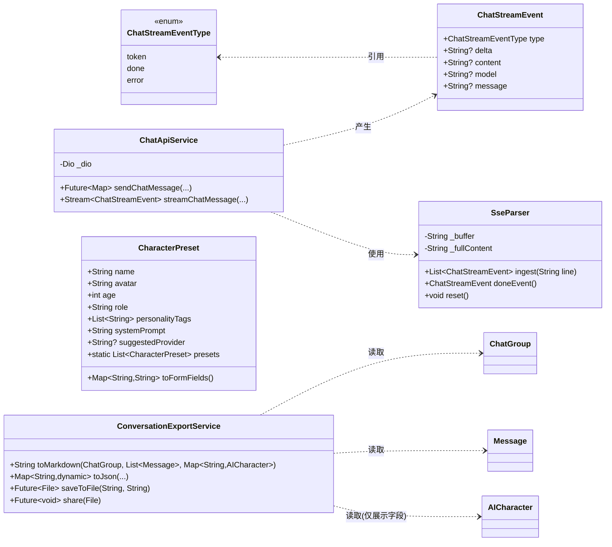
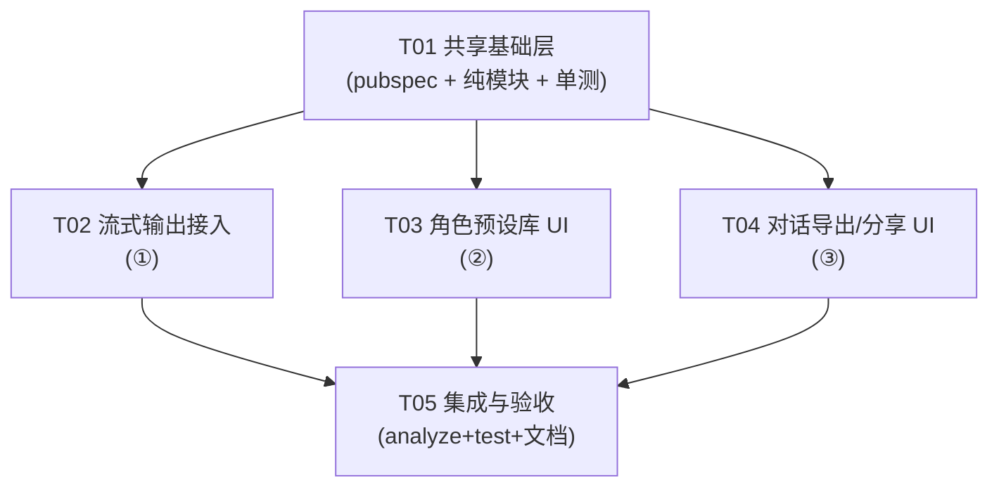

# chat_group 增强功能 · 系统架构设计与任务拆解

> 版本日期：2026-07-07
> 作者：高见远（架构师）
> 关联需求：流式输出（打字机）、角色人设预设库、对话导出/分享
> 环境：Flutter 3.24.0 / Dart 3.6.0，可运行 `flutter test` / `flutter analyze`

---

## 一、实现方案与框架选型

三项功能均建立在现有代码之上，**不引入重型依赖、不新增 Hive 模型或字段、不改动现有 Riverpod Provider 树**，以降低旧数据迁移风险并复用既有风格。

| 功能 | 技术难点 | 选型 / 方案 |
|------|----------|-------------|
| ① 流式输出 | 现有 `ChatApiService.sendChatMessage` 整段 `await`；需增量渲染且避免每 token 写库 | 复用 **Dio** 的 `responseType: ResponseType.stream` 拿到 `ResponseBody.stream`，按行解析 **SSE**（`data:` 增量 JSON），用 `async*` 生成器返回 `Stream<ChatStreamEvent>`。聊天室维护**内存态临时 `Message`**，逐 token 更新 `content` 并 `setState`，**仅整条完成时 `put` 一次 Hive**。 |
| ② 角色预设库 | `AICharacter` 字段齐全但每次从零填 | 新增**纯 Dart** 类 `CharacterPreset`（非 Hive），以 `static const`/工厂列表内置 8~10 个人设；表单页提供「从预设套用」弹窗填充控制器；列表页 FAB 增加「用预设快速创建」入口。 |
| ③ 导出/分享 | 设置页无导出；需 Markdown/JSON 且**严禁泄露 API Key** | 新增**纯 Dart** `ConversationExportService`：`toMarkdown` / `toJson` / `saveToFile`（用既有 `path_provider`）/ `share`（建议新增 `share_plus`）。导出只取**展示性字段**（name/avatar/role/tags/age + 消息内容），**绝不包含 `apiKey`/`apiProvider`/`apiConfigId`**。导出前弹安全提示。 |

**架构模式**：保持现有「页面直接实例化 Service」惯例（`chat_room_page` 内 `final _chatApi = ChatApiService();`），新增的 `SseParser` / `ChatApiService.streamChatMessage` / `ConversationExportService` / `CharacterPreset` 均不进 Riverpod Provider，**因此本次改动无需 `dart run build_runner build`**（无新增 `@HiveType` / `@HiveField` / 注解 Provider）。

**依赖结论**：除可选 `share_plus` 外，无需新增依赖。`dio` / `hive` / `riverpod` / `path_provider` / `uuid` / `intl` 均已存在。

---

## 二、文件列表（相对路径，自 `lib/`）

| 文件 | 操作 | 说明 |
|------|------|------|
| `pubspec.yaml` | 修改 | 可选新增 `share_plus`（分享面板）；其余依赖已具备 |
| `core/models/chat_stream_event.dart` | **新增** | `ChatStreamEvent` 数据类 + `ChatStreamEventType` 枚举（token/done/error） |
| `services/sse_parser.dart` | **新增** | `SseParser`：纯函数式 SSE 行解析，可单测 |
| `services/chat_api_service.dart` | 修改 | 新增 `streamChatMessage(...)` 返回 `Stream<ChatStreamEvent>`；保留 `sendChatMessage` 供记忆摘要复用 |
| `core/models/character_presets.dart` | **新增** | `CharacterPreset` 类 + `CharacterPreset.presets` 静态列表（8~10 个）；`toFormFields()` 纯映射 |
| `services/conversation_export_service.dart` | **新增** | `ConversationExportService`：MD/JSON 生成、写文件、分享；纯逻辑可单测 |
| `features/chat_group/chat_room_page.dart` | 修改 | 接入流式渲染（`_streamingMessage` / 订阅取消）；AppBar 增加「导出对话」菜单 |
| `features/ai_character/ai_character_form_page.dart` | 修改 | 顶部「从预设套用」按钮 + 底部弹窗网格；`_applyPreset` 填充控制器 |
| `features/ai_character/ai_character_list_page.dart` | 修改 | FAB 增加「用预设快速创建」入口（选预设 → 跳表单预填） |
| `features/settings/settings_page.dart` | 修改 | 「数据管理」区新增「导出对话」入口 → `ExportPage` |
| `features/settings/export_page.dart` | **新增** | 导出 UI：选群组 + MD/JSON 切换 + 安全提示 + 导出/分享 |
| `README.md` | 修改 | 增补导出/预设说明与安全提示口径 |
| `CLAUDE.md` | 修改 | Roadmap 中三项由「待做」更新为「已实现」标注 |
| `test/sse_parser_test.dart` | **新增** | SSE 解析单测（完整/分块/[DONE]/错误行/累计内容） |
| `test/character_presets_test.dart` | **新增** | 预设数量、字段非空、`toFormFields` 映射正确 |
| `test/conversation_export_service_test.dart` | **新增** | MD 格式、JSON 结构（不含 key）、文件写出 |
| `docs/plans/class-diagram.mermaid` | **新增** | 类图（见附件） |
| `docs/plans/sequence-diagram.mermaid` | **新增** | 时序图（见附件） |

---

## 三、数据结构与接口设计

### 3.1 新增模型与接口



**ChatStreamEvent**（新增 `core/models/chat_stream_event.dart`）

```dart
enum ChatStreamEventType { token, done, error }

class ChatStreamEvent {
  final ChatStreamEventType type;
  final String? delta;    // type==token 时的增量文本
  final String? content;  // type==done 时的完整文本
  final String? model;    // type==done 时的模型名
  final String? message;  // type==error 时的错误信息
  const ChatStreamEvent({required this.type, this.delta, this.content, this.model, this.message});
}
```

**SseParser**（新增 `services/sse_parser.dart`，纯逻辑、可单测）

```dart
class SseParser {
  String _buffer = '';
  String _fullContent = '';
  /// 处理一行（或一段）SSE 文本，返回该行产生的 token 事件。
  List<ChatStreamEvent> ingest(String chunk);
  /// 流结束时调用，返回携带完整内容的 done 事件。
  ChatStreamEvent doneEvent();
  void reset();
}
```

- `ingest` 处理规则：按行切分；以 `data: ` 开头的行，去掉前缀；若为 `data: [DONE]` 忽略；否则 `jsonDecode` 后取 `choices[0].delta.content` 累加进 `_fullContent` 并产出 `token` 事件；非 `data:` 行（如 `:` 注释）忽略；跨 chunk 的不完整行暂存 `_buffer`。
- 解析/网络异常不抛异常，统一由 `ChatApiService` 在 `streamChatMessage` 中 yield `error` 事件。

**ChatApiService.streamChatMessage**（修改 `services/chat_api_service.dart`）

```dart
Stream<ChatStreamEvent> streamChatMessage({
  required String apiKey,
  required ApiProvider provider,
  String? customBaseUrl,
  required String model,
  required List<Map<String, dynamic>> messages,
  double temperature = 0.85,
});
```

- 与 `sendChatMessage` 共用 URL/Header 构造；`data` 增加 `'stream': true`；请求级 `Options(responseType: ResponseType.stream, receiveTimeout: const Duration(seconds: 120))`。
- 用 `async*`：`await for (final line in response.data!.stream.transform(utf8.decoder).transform(const LineSplitter())) { for (final e in _parser.ingest(line)) yield e; }`，结束后 `yield _parser.doneEvent()`。
- 非 200 或 `DioException` → `yield ChatStreamEvent(type: error, message: ...)` 后结束。

**CharacterPreset**（新增 `core/models/character_presets.dart`，非 Hive）

```dart
class CharacterPreset {
  final String name;
  final String avatar;
  final int age;
  final String role;
  final List<String> personalityTags;
  final String systemPrompt;
  final String? suggestedProvider; // 仅提示用，不写入 AICharacter
  const CharacterPreset({...});
  /// 纯映射：返回表单控制器需要的字段值（供单测）。
  Map<String, String> toFormFields();
  static const List<CharacterPreset> presets = [ /* 8~10 个 */ ];
}
```

> `toFormFields()` 返回 `{ 'name','avatar','age','role','personality','systemPrompt' }`（personality 以 `, ` 连接），表单页据此填充控制器，API Key 仍由用户选 `ApiConfig` 决定。

**ConversationExportService**（新增 `services/conversation_export_service.dart`，纯逻辑）

```dart
class ConversationExportService {
  /// 生成 Markdown：标题(群组名/主题) + 按时间排序的「角色名: 内容」段落。
  String toMarkdown(ChatGroup group, List<Message> messages, Map<String, AICharacter> charById);
  /// 生成 JSON：{ group:{id,name,theme}, exportedAt, messages:[{sender,name,role,content,timestamp}] }
  Map<String, dynamic> toJson(ChatGroup group, List<Message> messages, Map<String, AICharacter> charById);
  /// 写入 ApplicationDocumentsDirectory/chat_group_exports/<fileName>。
  Future<File> saveToFile(String content, String fileName);
  /// 调 share_plus 分享（可选）。
  Future<void> share(File file);
}
```

- **安全红线**：`charById` 仅取 `name/avatar/role/personalityTags/age`，映射中**不出现 `apiKey`/`apiProvider`/`apiConfigId`/`apiConfig`**。
- 文件名示例：`chat_group_exports/<群组名>_2026-07-07_1530.md`。

### 3.2 既有模型（仅说明复用，不改字段）

- `AICharacter`（Hive typeId 0）：预设套用只写其展示字段部分；`apiKey` 等由 `ApiConfig` 关联决定，本设计**不新增 `@HiveField`**。
- `Message.content` 为非 `final` `String`，流式期间可在内存中增量修改而无需落库。
- `ChatGroup`：导出读取 `id/name/theme`。

---

## 四、程序调用流程

```mermaid
sequenceDiagram
    autonumber
    actor User
    participant Room as ChatRoomPage
    participant Svc as ChatApiService
    participant LLM as LLM (SSE)
    participant Parser as SseParser
    participant DB as Hive(messageBox)

    User->>Room: 发送消息 (_sendMessage)
    Room->>Room: _runAiRound → _generateAiReply
    Room->>Room: 创建内存态 Message(空内容, 不落库)
    Room->>Room: setState(_streamingMessage = msg)
    Room->>Svc: streamChatMessage(messages, config)
    Svc->>LLM: POST /chat/completions (stream:true)
    loop 每个 SSE 分块
        LLM-->>Svc: 字节流 (ResponseBody.stream)
        Svc->>Parser: ingest(行文本)
        Parser-->>Svc: ChatStreamEvent(token, delta)
        Svc-->>Room: yield token
        Room->>Room: msg.content += delta; setState; 滚动到底
    end
    LLM-->>Svc: data:[DONE]
    Svc-->>Room: ChatStreamEvent(done, fullContent)
    Room->>Room: 解析 @提及 → mentionedAiIds
    Room->>DB: put(最终 Message)  ← 仅完成时持久化一次
    Room->>Room: _delay 后下一发言者 / 收尾
```

（导出流程见 `docs/plans/sequence-diagram.mermaid` 第二节。）

**聊天室改动要点（`chat_room_page.dart`）**

- 新增状态：`Message? _streamingMessage`、`StreamSubscription<ChatStreamEvent>? _streamSub`。
- `_generateAiReply` 改造：解析配置、构建 `apiMessages` 后，构造内存态 `Message(groupId, senderId: character.id, senderType:'ai', content:'')` 并 `setState` 加入渲染；`await for (final e in _chatApi.streamChatMessage(...))`：
  - `token`：`msg.content += e.delta!; setState((){}); _scrollToBottom();`
  - `done`：解析 `@提及` → `mentionedAiIds`；`await db.messageBox.put(msg.id, msg); _streamingMessage = null;`
  - `error`：`msg.content = '[${name} 回复失败: ${e.message}]';` 持久化。
- `_MessageBubble` 增加 `isStreaming` 标志：流式气泡末尾渲染闪烁光标（`_streamingMessage` 即最后一条）。
- `dispose()` 中 `_streamSub?.cancel()`，为「停止生成」预留能力。
- 维持 `_isAiReplying` 门控，保证同一时刻仅一轮 AI 回复（自动聊天循环同理顺序执行）。

---

## 五、共享约定（跨功能 / 给工程师）

- **统一事件契约**：所有流式解析结果都用 `ChatStreamEvent`（`token/done/error`），页面不得自行解析 SSE。
- **持久化纪律**：流式期间**绝不**每 token 写 Hive；只在 `done` 后 `put` 一次最终 `Message`。
- **安全红线**：导出内容**严禁**包含 `apiKey` / `apiProvider` / `apiConfigId`；只输出展示性字段；导出前必须弹「明文存本机、不含 Key 但仍需妥善保管」提示，口径与 README 一致。
- **预设即纯数据**：预设为静态 Dart 列表，**不落 Hive**；套用只填表单字段，API Key 由用户后续选 `ApiConfig` 决定（保持现有表单「必须选 API 配置」校验）。
- **实例化惯例**：新增 Service 类沿用「页面内 `final _x = XService();`」模式，不进 Riverpod Provider，避免 `build_runner`。
- **错误兜底**：网络/超时/解析失败统一 yield `error` 事件或返回 `{success:false, message}`；UI 统一渲染 `[角色 回复失败: ...]`。
- **时间格式**：导出文件名与时间展示统一用 `intl`/`DateTime` 格式，避免平台差异。
- **TDD 强制**：三个纯逻辑模块（`SseParser` / `CharacterPreset` / `ConversationExportService`）必须配套单测，CI（`flutter analyze` + `flutter test`）通过方可合入。

---

## 六、待明确事项（需用户/主理人拍板）

1. **「分享」是否引入 `share_plus`？** 建议引入（轻量、官方推荐），否则仅「写文件 + 显示路径」无系统分享面板。
2. **预设套用后是否允许「一键直接创建角色」？** 建议仍要求用户选 `ApiConfig` 再保存（与现有校验一致，避免创建出无法回复的角色）。
3. **是否本期做「停止生成」按钮？** 本设计已预留 `_streamSub.cancel()` 能力；是否加按钮请确认（建议本期加，成本低、体验好）。
4. **导出范围**：建议先做「整组全量消息」；是否需按时间/角色筛选留待后续。
5. **导出存放路径**：默认 `ApplicationDocumentsDirectory/chat_group_exports/`，文件名含群组名+时间戳，是否接受？
6. **预设清单**：本文拟 10 个（毒舌评委/杠精/好奇宝宝/鼓励师/冷静分析师/戏精/老干部/治愈邻家/硬核极客/毒舌御姐），是否需要增删或调整人设文案？

---

## 七、依赖包清单

```
# 已有（无需新增）
dio: ^5.4.0                       # 流式 SSE 读取（ResponseBody.stream）
hive / hive_flutter: ^2.2.3/^1.1.0 # 本地存储（最终 Message 持久化）
flutter_riverpod: ^2.5.0          # 状态管理（本次不改 Provider 树）
path_provider: ^2.1.4             # 导出文件落盘（已存在）
uuid: ^4.3.3 / intl: ^0.19.0      # ID 与日期格式

# 建议新增（小依赖，可选）
share_plus: ^10.0.0               # 系统分享面板（功能③「分享」）
```

---

## 八、有序任务列表（按实现顺序，含依赖与触及文件）

> 任务上限 5 个；T02/T03/T04 互相独立，均只依赖 T01；T05 为最终集成验收。
> 每个任务均标注：所属功能、优先级 P0/P1、依赖、预估触及文件。

### T01 · 共享基础层（配置 + 纯逻辑模块 + 单测）　【功能：①②③ 共用】
- **优先级**：P0
- **依赖**：无（首个任务，含 `pubspec.yaml` 依赖声明）
- **预估触及文件**：
  - `pubspec.yaml`（可选加 `share_plus`）
  - `core/models/chat_stream_event.dart`（新增）
  - `services/sse_parser.dart`（新增）
  - `core/models/character_presets.dart`（新增，含 8~10 预设）
  - `services/conversation_export_service.dart`（新增）
  - `test/sse_parser_test.dart`（新增）
  - `test/character_presets_test.dart`（新增）
  - `test/conversation_export_service_test.dart`（新增）
- **完成标准**：三个纯模块可单测通过；`flutter analyze` 无 warning。

### T02 · 流式输出接入　【功能：① 流式输出】
- **优先级**：P0
- **依赖**：T01
- **预估触及文件**：
  - `services/chat_api_service.dart`（新增 `streamChatMessage`）
  - `features/chat_group/chat_room_page.dart`（流式渲染 + 订阅取消 + `_MessageBubble` 光标）
- **完成标准**：发送消息后气泡逐字显示；整条完成后才落 Hive；`flutter test` 通过。

### T03 · 角色人设预设库 UI　【功能：② 预设库】
- **优先级**：P1
- **依赖**：T01
- **预估触及文件**：
  - `features/ai_character/ai_character_form_page.dart`（「从预设套用」弹窗 + `_applyPreset`）
  - `features/ai_character/ai_character_list_page.dart`（FAB「用预设快速创建」入口）
- **完成标准**：套用后表单字段被填充；创建流程仍强制选 `ApiConfig`；`flutter analyze` 通过。

### T04 · 对话导出 / 分享 UI　【功能：③ 导出】
- **优先级**：P1
- **依赖**：T01
- **预估触及文件**：
  - `features/settings/settings_page.dart`（「导出对话」入口）
  - `features/settings/export_page.dart`（新增：选群组 + MD/JSON + 安全提示 + 导出/分享）
  - `features/chat_group/chat_room_page.dart`（AppBar「导出对话」菜单）
  - `services/conversation_export_service.dart`（T01 已建，此处接线调用）
- **完成标准**：导出 MD/JSON 不含 Key；导出前弹安全提示；文件可落盘/分享；`flutter analyze` 通过。

### T05 · 集成、文档与安全提示落地　【功能：①②③ 验收】
- **优先级**：P0
- **依赖**：T02、T03、T04
- **预估触及文件**：
  - `README.md`（增补导出/预设说明与安全口径）
  - `CLAUDE.md`（Roadmap 三项标注已实现）
  - `features/settings/export_page.dart` / 相关页（路由用 `Navigator.push(MaterialPageRoute)` 即可，无需改 `main.dart` 的 `routes`）
- **完成标准**：`flutter analyze` + `flutter test` 全绿；手动验证三项功能可用；文档与代码一致。

### 任务依赖图



---

## 九、风险与规避

- **SSE 分块边界**：JSON 可能被拆成多 chunk → `SseParser` 用 `_buffer` 暂存不完整行，单测覆盖「分块喂入」场景。
- **流式期间导航离开**：`dispose` 取消订阅；用 `mounted` 守卫 `setState`，避免 `setState after dispose`。
- **Hive 写入放大**：严格遵守「仅 done 后写一次」，杜绝每 token `put`。
- **Key 泄露**：导出映射显式只取展示字段；代码评审把住 `apiKey` 不进 `toJson`/`toMarkdown`。
- **无 build_runner 风险**：本次无 `@HiveType`/`@HiveField`/注解 Provider 新增，故不存在旧数据迁移问题。
