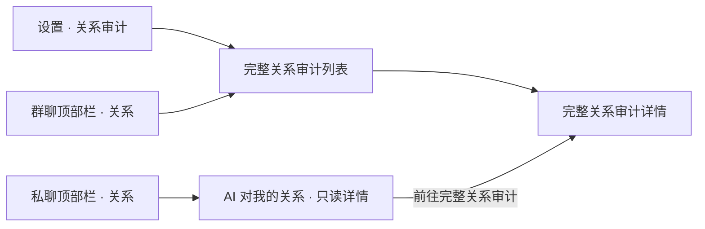

# 关系审计体验重设计文档

> 状态：设计定稿，待实现  
> 日期：2026-08-17  
> 设计基准：方案 2「聚焦关系阶段」  
> 适用端：桌面端优先，兼顾窄屏与移动端  
> 实现原则：复用永久记忆审计的布局语言，不新增依赖，不修改 Hive 数据结构

## 1. 文档目的

本文定义关系审计功能的入口、信息架构、页面布局、交互规则、数据语义、状态处理、响应式行为、可访问性要求、验收标准，以及可直接交给设计模型或编码代理使用的提示词。

本次设计覆盖三个页面：

1. 完整关系审计列表页。
2. 完整关系审计详情页。
3. 私聊中的“AI 对我的关系”只读详情页。

本文不包含业务代码实现，也不改变关系计算逻辑。

## 2. 最终设计参考

### 2.1 完整关系审计列表页

- 方案：聚焦关系阶段。
- 文件：`exec-f018b41e-4926-4431-9597-7f983d5a1b4f.png`
- 本机路径：`/Users/fengye/.codex/generated_images/01a00ddd-5ac0-7251-b7a6-cb33a35e1f47/exec-f018b41e-4926-4431-9597-7f983d5a1b4f.png`

### 2.2 完整关系审计详情页

- 文件：`exec-53d5ac3c-b642-4051-a853-c6c4f85eef92.png`
- 本机路径：`/Users/fengye/.codex/generated_images/01a00ddd-5ac0-7251-b7a6-cb33a35e1f47/exec-53d5ac3c-b642-4051-a853-c6c4f85eef92.png`

### 2.3 私聊只读关系详情页

- 文件：`exec-680347ce-fee0-4cf2-ac2f-d2104f72dc78.png`
- 本机路径：`/Users/fengye/.codex/generated_images/01a00ddd-5ac0-7251-b7a6-cb33a35e1f47/exec-680347ce-fee0-4cf2-ac2f-d2104f72dc78.png`

上述视觉稿用于确定信息层级和布局，不要求逐像素照搬其中的示例角色、示例数值或示例文案。真实页面必须使用本地数据库数据。

## 3. 背景与问题

当前关系审计页把以下内容同时铺在同一个滚动面中：

- 六组下拉筛选器。
- 全局关系快照。
- 四项关系数值。
- 当前情绪、阶段、备注和更新时间。
- `revision`、事件 ID、置信度、原始会话 ID 等技术字段。
- 每条关系的完整事件时间线。
- 编辑、固定、重置、删除操作。

这导致三个主要问题：

1. **信息层级缺失**：列表、详情和技术诊断混在一起。
2. **扫描效率低**：用户无法快速回答“某个 AI 对谁亲近、普通或紧张”。
3. **入口不完整**：私聊看不到当前 AI 对用户的关系；群聊不能直接进入关系审计。

永久记忆审计页已经形成更成熟的浏览模式：左侧选择观察 AI，右侧搜索、筛选并浏览扁平列表。本次关系审计应复用这套结构和视觉语言。

## 4. 设计目标

### 4.1 核心目标

- 让用户先选择“谁的视角”，再查看该 AI 对其他对象的方向性关系。
- 让列表承担浏览和比较，详情页承担解释、追溯和管理。
- 在私聊中一键查看“当前 AI → 我”的关系，不暴露管理操作。
- 在群聊中一键进入关系审计，并保持当前群上下文。
- 明确区分“全局关系快照”和“来源场合事件”。
- 与永久记忆审计保持同一产品家族的布局、密度和交互语言。

### 4.2 非目标

- 不改变关系计算、关系阶段迁移或事件生成逻辑。
- 不增加“我 → AI”的反向关系；当前数据模型只展示 AI 作为观察者的方向。
- 不新增图表库、状态管理方案或第三方 UI 依赖。
- 不新增 Hive 类型或字段。
- 不把群聊关系误建模为独立的群内关系快照。
- 不在私聊只读页提供编辑、固定、重置或删除入口。
- 不将关系数值改造成雷达图。

## 5. 已确认的产品决策

| 主题 | 最终决策 |
| --- | --- |
| 私聊展示范围 | 只显示当前 AI → 我的关系 |
| 私聊权限 | 只读 |
| 私聊入口 | 聊天顶部栏独立图标，与“查看记忆”并列 |
| 私聊布局 | 简化详情页，不显示观察者侧栏、搜索或筛选 |
| 群聊入口 | 聊天顶部栏独立图标，与“查看记忆”并列 |
| 群聊打开范围 | 完整全局关系审计 |
| 群聊观察者列表 | 只显示当前群成员 |
| 群聊来源语义 | 当前关系仍是全局快照；当前群只过滤事件时间线 |
| 完整审计侧栏 | 代表关系观察者，即“谁的视角” |
| 完整审计布局 | 对齐永久记忆审计的侧栏、搜索、筛选和列表密度 |
| 列表信息 | 头像、目标名称、关系阶段、当前情绪、最近变化、更新时间 |
| 四项关系数值 | 进入详情页后用水平进度条展示准确值 |
| 时间线入口 | 点击关系行进入独立详情页 |
| 技术字段 | 默认隐藏在“技术详情”折叠区 |
| 管理操作 | 完整审计详情页中全部收入“更多”菜单 |
| 设计优先级 | 桌面端优先，同时适配窄屏和移动端 |

## 6. 数据语义与边界

### 6.1 方向性

关系始终以以下方向展示：

```text
sourceCharacterId → targetType + targetId
```

示例：

```text
周明 → 我
周明 → HR 小姐姐
```

左侧“观察 AI”切换的是 `sourceCharacterId`，不是关系目标。

### 6.2 全局关系与来源事件

`RelationshipState.groupId == 'global'` 的关系快照是当前权威状态。群聊或私聊只是关系事件发生的来源场合。

必须遵守：

- 群聊入口不能把全局关系快照裁剪成“群内关系”。
- 群聊入口只限制可选择的观察者为当前群成员。
- 群聊入口的 `conversationId` 只传给 `RelationshipControls.eventsFor`，用于过滤详情时间线。
- 列表中的阶段、情绪、备注和四项数值始终来自全局快照。
- 来源标签应明确写成“事件来源”，避免让用户误解为关系归属。

### 6.3 私聊固定关系

私聊只读页固定查询：

```text
sourceCharacterId = 当前私聊 AI ID
targetType = RelationshipTargetType.user
targetId = "user"
```

私聊页不提供其他观察者或目标切换。

### 6.4 数值范围

| 字段 | 数据范围 | 展示规则 |
| --- | --- | --- |
| `affinity` 亲密度 | -100…100 | 使用带中心零点的双向水平条；负值向左、正值向右 |
| `trust` 信任 | -100…100 | 使用带中心零点的双向水平条；负值向左、正值向右 |
| `friction` 摩擦 | 0…100 | 普通单向水平条 |
| `familiarity` 熟悉度 | 0…100 | 普通单向水平条 |

视觉稿中的正数示例可使用普通填充效果，但正式实现不得把负数错误地截断为 0。

### 6.5 阶段分组

列表按关系阶段聚合成三组：

| 页面分组 | `RelationshipStage` |
| --- | --- |
| 亲近关系 | `friend`、`closeFriend`、`romantic` |
| 普通关系 | `stranger`、`acquaintance` |
| 紧张关系 | `strained`、`hostile` |

组内排序：固定关系优先，其次按 `updatedAt` 倒序，再以稳定关系 ID 保证确定性。

阶段中文标签统一为：陌生人、认识、朋友、密友、浪漫关系、紧张、敌对。

## 7. 信息架构与导航



### 7.1 设置入口

- 保持设置页现有“关系审计”入口。
- 打开无范围限制的完整关系审计。
- 左侧可显示全部 AI。
- 时间线默认不限制来源场合。

### 7.2 群聊入口

- 在 `ChatRoomAppBar` 中新增独立关系图标。
- 位置紧邻“查看记忆”。
- Tooltip：`查看关系`。
- 打开完整关系审计列表。
- 观察者侧栏只显示当前群成员。
- 页面显示上下文条：`事件来源 · {群名} · 仅群成员`。
- 当前群来源默认锁定；允许返回聊天页，不在页面内静默切换成其他群。

### 7.3 私聊入口

- 在 `ChatRoomAppBar` 中新增同一个独立关系图标。
- Tooltip：`查看 AI 对我的关系`。
- 直接打开当前 AI → 我的只读详情。
- 不先经过完整列表。

## 8. 页面一：完整关系审计列表

### 8.1 桌面端结构

当可用宽度 `>= 900dp`：

```text
┌──────────── 220–240dp ────────────┬──────────────────────────────┐
│ 观察 AI                           │ 全局关系审计       刷新  筛选 │
│ [搜索观察 AI]                     │ [观察者与来源上下文条]         │
│ 全部 AI / 群成员                  │ [全部目标][关于我][其他角色]   │
│ 角色列表                          │ [搜索关系]                     │
│                                   │ 亲近关系                       │
│                                   │ 关系行…                         │
│                                   │ 普通关系                       │
│                                   │ 关系行…                         │
│                                   │ 紧张关系                       │
└───────────────────────────────────┴──────────────────────────────┘
```

### 8.2 观察者侧栏

- 标题：`观察 AI`。
- 顶部提供搜索框，按角色名称和职业匹配。
- 设置入口显示“全部 AI”选项。
- 群聊入口不显示群外角色。
- 当前选中角色使用与永久记忆页一致的浅紫背景、左侧强调线和主色文字。
- 角色行展示头像、名称、性别与职业。
- 已删除角色保留占位项：`已删除角色 · 历史记录`。
- 长列表使用惰性构建；侧栏独立滚动。

### 8.3 页面头部

- 标题：`全局关系审计`。
- 标题旁展示当前结果数量，例如 `12 条关系`。
- 右侧操作：刷新、筛选。
- 不在头部展示编辑或删除。

### 8.4 上下文条

设置入口：

```text
周明 · 周明的关系视角
```

群聊入口：

```text
周明 · 周明的关系视角 · 狼人杀 · 仅群成员 · 事件来源已锁定
```

“事件来源已锁定”只描述时间线过滤，不描述关系快照。

### 8.5 快捷目标筛选

- `全部目标`：不限制目标类型。
- `关于我`：`targetType == user`。
- `其他角色`：`targetType == ai`。
- 使用与永久记忆页对象筛选相同的分段按钮样式。
- 高级筛选继续支持目标 AI、阶段、固定状态和来源场合。
- 高级筛选进入弹窗或底部面板，不再把六个下拉框全部铺在页面首屏。

### 8.6 搜索

搜索范围：

- 观察者名称。
- 目标名称。
- 目标职业。
- 阶段中文标签。
- 情绪中文标签。
- 关系备注。

搜索不扫描原始事件 ID、revision 或会话 ID。

### 8.7 关系分组与关系行

每个分组标题显示名称和数量，例如：

```text
亲近关系 2
普通关系 7
紧张关系 3
```

每个关系行展示：

1. 目标头像。
2. 目标名称与职业。
3. 关系阶段。
4. 当前情绪。
5. 最近变化摘要。
6. 最近更新时间。
7. 固定图标（仅固定时显示）。
8. 进入详情的箭头。

关系行不展示：

- 四项数值。
- 关系备注全文。
- revision。
- 事件 ID。
- 置信度。
- 完整时间线。
- 管理菜单。

整组使用单一表面和行分隔线，不为每一行创建独立 Card。

### 8.8 最近变化摘要

根据最新一条符合当前事件来源过滤的事件生成确定性文案：

- 只有熟悉度上升：`熟悉度提升 · 来自狼人杀`。
- 只有熟悉度下降：`熟悉度下降 · 来自狼人杀`。
- 信任上升：`信任提升 · 来自私聊`。
- 摩擦上升：`摩擦增加 · 来自狼人杀`。
- 阶段变化：`关系阶段更新 · 来自狼人杀`。
- 没有符合来源的事件：`当前来源暂无关系事件`。

不要调用 LLM 生成列表摘要；使用本地确定性规则即可。

## 9. 页面二：完整关系审计详情

### 9.1 头部

- 返回按钮。
- 标题：`{观察者} → {目标}`。
- 身份方向区同时展示观察者与目标头像、名称、职业。
- 展示当前阶段与当前情绪。
- 右上角只显示“更多”菜单。

### 9.2 更多菜单

菜单项：

1. 编辑关系。
2. 固定关系 / 取消固定。
3. 重置关系。
4. 删除关系及历史。

规则：

- 重置和删除必须二次确认。
- 删除文案必须说明会删除该方向的全局快照、全部来源事件和固定状态。
- 菜单操作沿用现有 `RelationshipControls`，不得复制持久化逻辑到 Widget。

### 9.3 当前关系概览

- 四项数值使用水平进度条。
- 始终显示准确数字。
- 亲密度与信任支持负值双向展示。
- 摩擦使用橙色或红色，但不能只靠颜色表达含义。
- 熟悉度使用蓝色。
- 每个指标提供 Tooltip 或辅助说明。
- 下方展示关系备注、最近互动时间、更新时间。

### 9.4 事件来源提示

- 设置入口：不显示锁定提示，或显示“全部来源”。
- 群聊入口：显示 `事件来源 · {群名}（已锁定）`。
- 关系概览仍是全局状态；应在提示旁提供简短说明：`来源筛选仅影响下方时间线`。

### 9.5 事件时间线

- 按日期分组，日期倒序。
- 日期内按事件时间倒序。
- 支持搜索事件原因和来源名称。
- 支持筛选创建方式、阶段变化和数值变化类型。
- 支持时间正序/倒序切换。

事件行默认展示：

- 时间。
- 事件原因。
- 发生变化的字段；未变化字段不显示。
- 阶段或情绪变化；仅发生变化时显示。
- 来源场合名称。
- `查看原消息`。
- `技术详情`折叠入口。

技术详情折叠后展示：

- revision。
- 置信度。
- 事件 ID。
- 原始会话 ID。
- 创建方式。
- 来源消息 ID 列表。

### 9.6 原消息跳转

- 来源消息存在且会话仍可访问时，跳转到 `ChatRoomPage` 并传入 `initialMessageId`。
- 来源角色或群已删除但历史仍可访问时，沿用现有删除角色兼容逻辑。
- 原消息不可访问时，禁用入口并显示 `原消息不可用`，不能抛出异常。

## 10. 页面三：私聊只读关系详情

### 10.1 页面定位

该页面回答一个问题：

> 当前正在私聊的 AI，现在如何看待我？

它不是管理页面，也不是完整审计页面。

### 10.2 页面结构

- 标题：`{AI 名称}对我的关系`。
- 标题旁显示 `只读`。
- 显示 `{AI} → 我` 的身份方向区。
- 展示当前阶段、当前情绪和简短关系摘要。
- 展示四项水平进度条与准确值。
- 展示关系备注、最近互动时间、更新时间。
- 只展示最近 3 条变化。
- 底部提供 `前往完整关系审计`。

### 10.3 禁止出现

- 观察者侧栏。
- 搜索框。
- 筛选器。
- 编辑。
- 固定。
- 重置。
- 删除。
- revision、置信度、事件 ID 或技术详情。

### 10.4 关系摘要

优先使用已有非空 `relationship.notes`。

当备注为空时，使用阶段、情绪和四项数值生成本地确定性摘要。示例：

```text
周明目前把我视为朋友，整体态度温暖，信任较高，近期互动让关系保持稳定。
```

不要为了这段摘要发起 LLM 请求。

### 10.5 无关系状态

如果当前 AI → user 的全局关系不存在：

- 显示双方身份方向。
- 主文案：`尚未形成可展示的关系`。
- 辅助文案：`继续聊天后，关系变化会逐步记录在这里。`。
- 不创建默认关系记录。
- 不显示 0 分进度条伪装成已有关系。

## 11. 响应式设计

### 11.1 宽屏 `>= 900dp`

- 列表页显示固定观察者侧栏。
- 详情页四项指标横向排列。
- 时间线使用对齐列。

### 11.2 窄屏 `< 900dp`

- 列表页隐藏固定侧栏。
- 在内容顶部显示观察者选择器，行为与永久记忆页窄屏一致。
- 目标筛选按钮允许横向滚动或换行。
- 关系行改为两行布局：第一行目标与阶段，第二行情绪、最近变化和时间。
- 详情页四项指标使用 2×2 网格。
- 时间线改为纵向条目，不保持桌面表格列宽。

### 11.3 手机窄屏

- 四项指标单列或 2×2，取决于可用宽度。
- 所有触控目标至少 44×44dp。
- “更多”菜单保持右上角单一入口。
- 禁止水平溢出。

## 12. 视觉规范

### 12.1 延续现有产品语言

- 使用应用现有 Theme 和 `ColorScheme`。
- 基础背景保持浅灰紫倾向。
- 主色使用现有紫色/靛蓝色。
- 选中态使用浅紫背景和主色文字。
- 普通列表使用同一表面加分隔线。
- 阴影仅在必要的浮层和菜单中使用。

### 12.2 层级优先级

依次使用：

1. 间距、分组、对齐、字号和字重。
2. 分隔线。
3. 轻微表面色差。
4. 边框。
5. 阴影。

禁止用大量 Card 弥补信息架构问题。

### 12.3 状态颜色

- 温暖、友好：绿色，同时配文字。
- 中性：灰色，同时配文字。
- 尴尬、摩擦：橙色，同时配文字。
- 冷淡、敌对：红色或冷蓝，同时配文字。
- 固定：主色图钉，同时保留 Tooltip。

颜色不得成为唯一的信息载体。

## 13. 交互与状态

### 13.1 加载

- 保留页面骨架和标题。
- 中央显示进度指示与 `正在加载关系数据`。
- 避免整个窗口只出现空白。

### 13.2 加载失败

- 文案：`关系数据加载失败`。
- 操作：`重试`。
- 不显示原始异常或本地路径。

### 13.3 空列表

- 无全局关系：`暂无关系记录`。
- 当前观察者无关系：`{角色名} 尚未形成可展示的关系`。
- 搜索无结果：`没有找到匹配的关系`，并提供清除搜索。
- 群来源无事件：列表仍显示全局关系，最近变化写 `当前群暂无关系事件`。

### 13.4 刷新

- 刷新重新读取 Hive 快照。
- 保留当前观察者、快捷目标筛选、搜索词和来源范围。
- 刷新后尽量保留滚动位置。

### 13.5 已删除角色

- 使用 `DataLifecycleService` 的删除角色占位能力。
- 目标或观察者已删除时仍允许查看历史。
- 禁止因为角色盒中缺失记录而丢弃关系和事件。

## 14. 可访问性

- 所有纯图标按钮必须有 Tooltip 和语义标签。
- 侧栏、筛选、关系行和菜单支持键盘焦点。
- Enter/Space 可打开当前关系。
- 焦点顺序遵循从左侧栏到主内容、从上到下。
- 文本与背景满足可读对比度。
- 阶段、情绪和变化不能只用颜色表达。
- 进度条提供语义值，例如 `亲密度 72，范围负 100 到 100`。
- 窄屏触控目标至少 44×44dp。

## 15. 建议代码结构

优先复用现有永久记忆审计模式，保持最少文件和单一职责。

建议职责：

- `relationship_audit_page.dart`：页面状态、快照加载、范围控制和导航。
- 新的列表展示组件：观察者侧栏、分组标题、关系行。
- 新的关系详情页：全量时间线与管理入口。
- 新的私聊只读详情页：固定 AI → user 查询与最近 3 条变化。
- `relationship_audit_filter.dart`：扩展搜索与范围约束；不要承载 Widget。
- `relationship_controls.dart`：继续作为编辑、固定、重置、删除的唯一持久化边界。
- `chat_room_app_bar.dart`：只新增回调和图标，不承载导航逻辑。
- `chat_room_page.dart`：根据群聊/私聊构建正确的关系页面范围并导航。

可增加一个纯展示 Presenter，用于：

- 中文阶段和情绪标签。
- 关系分组。
- 最近变化摘要。
- 搜索投影。
- 数值条展示模型。

只有当这些逻辑被列表、完整详情和私聊详情共同使用时才抽取；不要创建只有一个实现的接口或工厂。

## 16. 实现约束

- 不新增第三方依赖。
- 不修改 `RelationshipState` 或 `RelationshipEvent` 的 Hive 字段。
- 不修改 `.g.dart`。
- 不为摘要调用 LLM。
- 不重复实现 `RelationshipControls` 中的持久化逻辑。
- 不改变全局关系的稳定 ID 规则。
- 不把 `originConversationId` 加入关系快照过滤。
- 不读取或显示 API Key。
- 不影响现有记忆审计行为。
- 不影响聊天页面已有消息、搜索、滚动和生成状态。
- 新增聊天顶部栏图标时注意现有图标密度与窗口窄宽度。

## 17. 测试与验收

### 17.1 最小测试集

1. 设置入口显示全部观察者和全部全局关系。
2. 群聊入口只显示当前群成员作为观察者。
3. 群聊入口仍显示选中观察者的全局关系目标。
4. 群聊 `conversationId` 只过滤事件时间线，不过滤全局关系列表。
5. 私聊入口只读取当前 AI → user。
6. 私聊页没有任何管理入口。
7. 完整详情的所有管理操作位于更多菜单。
8. 亲密度和信任负数能正确双向展示。
9. 阶段分组与组内排序确定且稳定。
10. 搜索能匹配目标名、职业、阶段、情绪和备注。
11. 已删除角色仍能显示历史关系。
12. 原消息不可用时页面安全降级。
13. 无关系时私聊页不创建新记录。
14. 900dp 上下布局切换无溢出。

### 17.2 视觉验收

- 与永久记忆审计具有明显一致的侧栏、间距、筛选和列表语言。
- 首屏不出现六个铺开的下拉框。
- 列表不展开时间线。
- 列表行不是独立 Card。
- 技术字段默认不可见。
- 私聊页一眼可辨识为只读。
- 群来源提示不会让人误解为“群内独立关系”。
- 文字无裁切、溢出或过密堆叠。

### 17.3 质量命令

```bash
dart format lib test
flutter analyze
flutter test
```

如果只新增普通 Widget、过滤器或 Presenter，不需要运行 `build_runner`。只有修改 Hive 模型或新增注解 Provider 时才运行代码生成；本设计不要求这些修改。

## 18. 详细实现提示词

以下提示词可直接交给 Codex、Claude Code 或其他编码代理：

```text
你正在修改 Flutter 项目“AI Group Chat Simulator”。请完整实现“关系审计体验重设计”，不要只做静态 UI。

【设计来源】
1. 先完整阅读：docs/relationship_audit_redesign.md
2. 全局列表视觉参考：
   /Users/fengye/.codex/generated_images/01a00ddd-5ac0-7251-b7a6-cb33a35e1f47/exec-f018b41e-4926-4431-9597-7f983d5a1b4f.png
3. 完整详情视觉参考：
   /Users/fengye/.codex/generated_images/01a00ddd-5ac0-7251-b7a6-cb33a35e1f47/exec-53d5ac3c-b642-4051-a853-c6c4f85eef92.png
4. 私聊只读详情视觉参考：
   /Users/fengye/.codex/generated_images/01a00ddd-5ac0-7251-b7a6-cb33a35e1f47/exec-680347ce-fee0-4cf2-ac2f-d2104f72dc78.png
5. 现有永久记忆审计是布局和组件语言基准：
   lib/features/memory/memory_management_page.dart
   lib/features/memory/memory_management_content.dart
   lib/features/memory/memory_observer_sidebar.dart
   lib/features/memory/memory_audit_list.dart

【必须先理解的现有实现】
- lib/features/memory/relationship_audit_page.dart
- lib/features/memory/relationship_audit_card.dart
- lib/features/memory/relationship_audit_filter.dart
- lib/features/memory/relationship_audit_filter_widget.dart
- lib/features/memory/relationship_controls.dart
- lib/features/memory/relationship_edit_dialog.dart
- lib/core/models/relationship_state.dart
- lib/core/models/relationship_event.dart
- lib/features/chat_group/widgets/chat_room_app_bar.dart
- lib/features/chat_group/chat_room_page.dart

修改任何共享函数前先搜索所有调用方。复用现有 Helper、Theme、DataLifecycleService、RelationshipControls 和 Memory 页面模式；不要重复实现。

【核心语义红线】
- RelationshipState 的 global 快照是权威当前关系。
- 群聊只限制观察者为群成员，并只按当前 conversationId 过滤事件时间线。
- 禁止用 conversationId 过滤全局关系快照或关系列表。
- 私聊固定查询 sourceCharacterId=当前 AI、targetType=user、targetId='user'。
- 私聊只读页不存在关系时只显示空状态，禁止创建默认记录。
- 管理写入必须继续走 RelationshipControls。

【页面 1：完整关系审计列表】
- 桌面 >=900dp 使用与永久记忆相同的左侧观察 AI 侧栏。
- 设置入口显示全部 AI；群聊入口只显示群成员。
- 主区包含标题、数量、刷新、筛选、观察者/来源上下文条、全部目标/关于我/其他角色、搜索。
- 按亲近关系、普通关系、紧张关系分组。
- 每行只显示目标头像/名称/职业、阶段、情绪、最近变化、更新时间、固定图标和箭头。
- 点击进入独立完整详情页。
- 列表禁止展示四项数值、技术字段或展开时间线。
- 普通列表使用同一表面和轻量分隔线，禁止每行一个 Card。

【页面 2：完整关系详情】
- 显示观察者 → 目标身份、阶段、情绪。
- 四项指标使用水平条并显示准确值。
- affinity/trust 范围是 -100..100，必须正确表现负值；friction/familiarity 是 0..100。
- 展示备注、最近互动和更新时间。
- 时间线按日期分组，默认隐藏未变化字段。
- revision、confidence、事件 ID、原始 conversation ID 和 message IDs 放进“技术详情”折叠区。
- 查看原消息沿用 ChatRoomPage(initialMessageId) 跳转和已删除角色兼容逻辑。
- 编辑、固定、重置、删除全部放进右上角更多菜单；重置和删除保留确认流程。

【页面 3：私聊只读详情】
- 顶部明确“只读”。
- 无观察者侧栏、搜索、筛选或更多菜单。
- 显示 AI → 我、阶段、情绪、本地确定性摘要、四项指标、备注和最近 3 条变化。
- 不显示任何技术字段。
- 不提供编辑、固定、重置或删除。
- 底部可前往该方向的完整关系详情。

【聊天入口】
- ChatRoomAppBar 增加独立关系图标和回调，与查看记忆并列。
- 群聊点击后打开限定观察者为群成员、事件来源为当前群的完整审计。
- 私聊点击后直接打开当前 AI → user 的只读详情。
- 不破坏搜索模式、现有 AppBar 操作、消息滚动或生成状态。

【响应式】
- >=900dp：固定侧栏、四指标横排、时间线对齐列。
- <900dp：观察者顶部选择器、关系行两行布局、四指标 2×2、时间线纵向。
- 手机不得水平溢出，触控目标至少 44dp。

【实现约束】
- 不新增依赖。
- 不修改 Hive 模型和 .g.dart。
- 不调用 LLM 生成摘要。
- 不在业务逻辑写死 URL、角色 ID 或会话 ID。
- 复杂展示逻辑提取为纯函数/Presenter，并写最小单测。
- 单函数约 50 行以内，单文件约 500 行以内；超过时按职责拆分。
- 非自解释逻辑写 why 注释。

【测试】
至少覆盖：设置范围、群成员观察者限制、事件来源只过滤时间线、DM 固定方向与只读、无关系空状态、阶段分组、负值指标、搜索、删除角色兼容、原消息不可用、900dp 响应式。

【完成前验证】
1. 逐项对照 docs/relationship_audit_redesign.md。
2. 运行 dart format lib test。
3. 运行 flutter analyze。
4. 运行相关测试，再运行 flutter test。
5. 手工检查桌面宽屏、800px 窄屏和手机宽度，无溢出或裁切。
6. 最终报告列出修改文件、实现范围、测试结果、未实现项和原因。

不要修改无关代码，不要清理用户已有改动，不要提交或推送，除非用户明确要求。
```

## 19. 详细视觉生成提示词

以下提示词用于重新生成或迭代视觉稿：

```text
为 Flutter 桌面应用“AI 群聊模拟器”设计一组生产级关系审计界面。目标尺寸 1440×1024，只输出应用内容，不包含设备边框、操作系统状态栏或浏览器框架。

视觉语言必须延续现有永久记忆审计：浅灰紫背景、紫色/靛蓝主色、紧凑清晰的中文字体、固定观察者侧栏、轻量选中态、简单分隔线、克制边框、极少阴影。不要创造新品牌，不要使用渐变、玻璃拟态、装饰插画、雷达图、指标卡墙、卡片套卡片。

主页面为“全局关系审计”：
- 左侧 220–240px 观察 AI 侧栏，包含搜索、头像、名称、性别和职业，选中周明。
- 主区标题“全局关系审计”，显示 12 条关系、刷新和筛选。
- 上下文条显示“周明的关系视角 · 狼人杀 · 仅群成员 · 事件来源已锁定”。
- 快捷筛选为“全部目标 / 关于我 / 其他角色”，下方有“搜索关系”。
- 按“亲近关系 / 普通关系 / 紧张关系”分组。
- 每行显示目标头像、名称、职业、阶段、情绪、最近变化、更新时间、可选图钉和箭头。
- 列表不显示四项数值、revision、事件 ID、置信度或展开时间线。
- 每组是一个轻量表面，行之间用分隔线，不要每行单独 Card。

完整关系详情页：
- 标题“周明 → 我”，显示双方头像、名称、职业、阶段“朋友”和情绪“温暖”。
- 右上只有“更多”。
- 四条水平指标：亲密度 72、信任 81、摩擦 8、熟悉度 66，保留准确数字。
- 展示关系备注、最近互动、更新时间，并说明“事件来源 · 狼人杀（已锁定），只影响时间线”。
- 下方按日期展示事件时间线，只显示发生变化的字段、原因、来源和查看原消息。
- revision、置信度、事件 ID 和原始会话 ID 默认隐藏在“技术详情”。

私聊只读详情页：
- 标题“周明对我的关系”，旁边显示“只读”。
- 显示“周明 → 我”、阶段、情绪和人类可读关系摘要。
- 展示相同四项水平指标、备注、时间。
- 只展示最近 3 条变化。
- 不显示侧栏、搜索、筛选、更多菜单、编辑、固定、重置、删除或技术字段。
- 底部提供“前往完整关系审计”。

所有中文必须清晰可读，层级依靠间距、分组、对齐和字重建立。页面应宽松但不松散，信息密度接近成熟桌面生产工具，无裁切和溢出。
```

## 20. 设计完成定义

满足以下条件即可认为本设计已被正确实现：

- 用户能从设置、群聊和私聊进入正确范围的关系页面。
- 用户能从观察者视角快速扫描关系阶段和情绪。
- 用户能进入独立详情查看准确数值、来源证据和完整历史。
- 群聊来源只影响事件时间线，不改变全局关系快照。
- 私聊页面只读且固定为当前 AI → 我。
- 技术信息默认隐藏，管理操作不挤占浏览界面。
- 页面视觉和响应式行为与永久记忆审计一致。
- 不新增依赖、Hive 字段或 LLM 请求。
- 静态分析、相关测试和完整测试通过。
