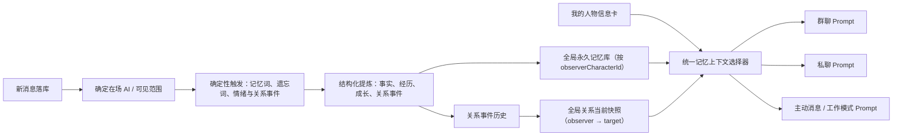

# 全局永久记忆与方向性关系系统：需求、技术设计与执行计划

日期：2026-08-04

状态：待评审

范围：需求与技术设计，不包含代码实现

分阶段执行与提示词：[全局永久记忆系统：分阶段实施与可复制提示词](2026-08-04-global-permanent-memory-implementation-prompts.md)

## 1. 已确认需求

### 1.1 目标

将当前按群聊/私聊隔离的角色记忆升级为“以 AI 角色身份为观察者”的全局永久记忆：群聊和私聊只是记忆发生的场合，不再决定记忆是否可见。

同一个 AI 无论进入哪个群或私聊，都应延续它亲历过的事实、承诺、共同经历、自身成长，以及它对用户和其他 AI 的方向性关系。

### 1.2 已确认的产品规则

1. 用户是全局唯一真人身份，所有群的 `ownerName` 都指向同一张“我的人物信息卡”。
2. 每个 AI 拥有自己的主观记忆视角；AI 只能读取自己参与或在场见证的内容。
3. AI 不得知道发生在其他 AI 私聊中的内容，除非后来在它在场的场合被告知。
4. `AI A → 用户`、`AI B → 用户`、`AI A → AI B`、`AI B → AI A` 分别独立，允许关系不对称。
5. 群聊/私聊必须作为来源保留：时间、场合、参与者、原始消息 ID 均可追溯。
6. 只把重要事实、偏好、共同经历、承诺、冲突、关系转折和人格成长沉淀为永久记忆；普通寒暄不保存。
7. 明确出现“记忆、记住、永久”等记忆意图时必须触发记忆处理；“忘记、别记、不要记住”等否定意图进入遗忘/抑制流程，不能反向保存为事实。
8. 会引发情绪或关系变化的事件必须记录；直接参与者和旁观 AI 可以产生不同的主观反应。
9. 新事实与旧记忆冲突时保留历史，用“有效、已过时、被修正”表达演变，不直接覆盖历史。
10. 人物信息卡是用户主动维护的最高可信事实；它与 AI 旧记忆冲突时，旧记忆保留但失效。
11. 关系除亲密度、信任、摩擦、熟悉度和近期情绪外，还需要关系身份/阶段，并记录每次变化的原因和来源。
12. 记忆和关系均可查看、追溯、编辑、固定、删除和人工纠正。

### 1.3 非目标

- 不保存每一句原始聊天为永久记忆；原始聊天仍由 `Message` 保存。
- 不让所有 AI 共享一份无归属的“公共大脑”。
- 不让 AI 读取自己未见证的私聊。
- 不引入向量数据库或新的检索依赖；首版先用结构化过滤和本地相关性排序。
- 不删除短期会话上下文能力。`GroupMemory` 可以继续作为当前群的话题摘要，但它不是永久人物记忆，也不得参与全局关系隔离。
- 本文不实现代码。

### 1.4 设计假设

- 应用继续保持单一真人用户，不在首版扩展多用户账号系统。
- 关系的观察者只允许是 AI；不模拟或自动维护 `用户 → AI` 的关系数值。
- 群聊“在场 AI”定义为消息发送时属于该群且未停用的角色；消息发送者即使随后停用，仍保留其当时来源身份。
- 数据继续以本地 Hive 为权威存储，不增加云同步或服务端记忆。
- 记忆提炼继续使用角色现有 API 配置和统一 AI 请求网关；没有可用 API 时保留确定性结果并等待重试。

### 1.5 技术栈

- Flutter / Dart，兼容仓库当前 Flutter 3.24 fork。
- Riverpod 管理应用状态，Hive 提供本地持久化。
- Dio 和现有 AI gateway 调用 OpenAI-compatible LLM 接口。
- `json_annotation` / `json_serializable` 与 Hive code generation 继续生成 `.g.dart`。
- 不新增第三方依赖。

## 2. 成功标准

以下场景必须全部成立：

1. AI A 在群 1 得知用户住在上海，进入群 2 或与用户私聊时仍能自然使用该事实，并可跳回群 1 的来源消息。
2. AI A 与 AI B 在群 1 建立的关系，二者在群 2 再次见面时沿用同一份方向性关系状态。
3. 用户与 AI B 的私聊不会出现在 AI A 的可检索记忆中。
4. AI A 在群里冒犯 AI B 时，B 和旁观者 C 可以产生不同的 `B → A`、`C → A` 关系事件。
5. 用户修改人物卡后，所有群聊、私聊、主动消息和工作模式都使用新资料；旧 `ownerName` 不再形成不同用户。
6. 新事实修正旧事实后，Prompt 只注入当前有效事实，审计页仍可查看旧事实和修正链。
7. 删除群聊默认不删除从该群形成的永久记忆；来源显示为“原会话已删除”。只有用户明确选择“同时删除源自该会话的永久记忆”才删除。
8. 删除一条永久记忆后，所有 Prompt 入口都不再注入该内容。
9. 完整备份/恢复后，人物卡、永久记忆、关系当前状态、关系事件历史和来源引用均保持一致。
10. 旧版 `CharacterMemory`、`RelationshipState` 和 `memorySummary` 完成一次性迁移后不再作为运行时记忆源，避免重复注入或双写分叉。

## 3. 当前实现证据与根因

### 3.1 隔离不只发生在加载层

| 链路 | 当前证据 | 影响 |
|---|---|---|
| 群聊加载 | `chat_room_loader.dart:81-86` 按 `groupId` 过滤角色记忆和关系 | 其他群的记录根本不进入页面状态 |
| 私聊加载 | `chat_room_loader.dart:122-127` 按 `dm:{characterId}` 过滤 | 私聊与群聊形成独立记忆岛 |
| 角色记忆查找 | `humanized_memory_service.dart:39-55` 同时匹配 `groupId + characterId` | 换场合会创建新的空 `CharacterMemory` |
| 关系更新 | `humanized_memory_service.dart:58-82`、`chat_room_page.dart:2814-2848` 以 `groupId + speaker + target` 查找和写回 | 同一方向关系在不同场合重复建档 |
| 发言选择 | `humanized_chat_orchestrator.dart:301-347` 查关系时再次要求 `groupId` 相等 | 即使数据库里有其他群关系，也不会影响本轮行为 |
| 群聊 Prompt | `chat_room_page.dart:2886-2927` 同时注入 legacy 摘要和当前会话分层记忆 | 跨场合只能依赖薄摘要，且存在双源 |
| 私聊 Prompt | `chat_room_page.dart:3238-3301` 仍查当前 DM 的分层记忆和关系 | DM 无法读取群内的结构化记忆 |
| 记忆演进 | `chat_room_page.dart:3573-3677` 只为本轮发言角色更新当前会话记录 | 未发言的在场观察者不会形成主观记忆 |
| 管理 UI | `memory_management_page.dart:37-63` 按 `conversationId` 过滤全部数据 | 用户无法从全局角色视角审计记忆 |
| 删除 | `data_lifecycle_service.dart:222-235` 删除群时同时删除该群角色记忆和关系 | 与“场合删除、永久记忆保留”的目标冲突 |
| 备份 | `backup_snapshot.dart:55-80` 按 `groupId` 选择记忆和关系 | 全局关系无法按现有会话归属规则正确导出 |

### 3.2 `ownerName` 为什么用户从未用过

`ChatGroup.ownerName` 默认值为“我”，但 `chat_group_form_page.dart` 没有对应输入控件；保存时只是把旧值原样传回。它实际用于群聊 Prompt、@用户识别、成员列表、主动消息和消息索引。因此现状是“内部在用，但用户没有配置入口”，不是字段完全无效。

### 3.3 额外缺口

- 当前关系更新只更新“本轮发言 AI → 本轮目标”，没有根据一条消息更新直接接收者和旁观者的主观关系。
- `CharacterMemory` 只保存字符串列表，没有来源消息、置信度、重要度、状态、冲突链或主体索引，无法满足审计和历史保留。
- `RelationshipState` 只有当前快照，没有事件历史；当前分数变化无法解释“为什么变成这样”。
- `AICharacter.memorySummary` 是 900 字符以内的兼容摘要，不适合作为永久事实库。
- 主动群聊、主动私聊和工作模式分别直接使用 `ownerName` 或 `memorySummary`；只修聊天页会继续出现跨入口失忆。

结论：这是存储主键、观察者语义、写入流程、检索、Prompt、治理、迁移和生命周期共同构成的系统性改造，不能靠移除两个 `.where(groupId...)` 完成。

## 4. 目标架构



### 4.1 不变量

实现中必须始终满足以下不变量：

1. 永久记忆的归属键是 `observerCharacterId`，不是 `conversationId`。
2. 关系当前状态的唯一键是 `(sourceCharacterId, targetType, targetId)`，不包含群或 DM。
3. `conversationId` 只存在于来源信息中，不参与记忆或关系的可见性判断。
4. 每条自动记忆必须有观察者；没有观察者的“全局公共记忆”禁止落库。
5. 每条自动记忆和关系事件必须有来源；人工创建则标记为 `manual`。
6. Prompt 只读取 `active` 记忆；`superseded`、`invalidated`、`deleted` 不参与生成。
7. 人物卡字段优先于 AI 主观记忆；Prompt 必须明确冲突优先级。
8. 关系事件追加写入；关系快照是可重建投影，不是唯一历史。
9. 同一来源事件重复处理必须幂等，不得重复增加关系分数或重复创建记忆。

## 5. 数据模型

### 5.1 `UserProfile`：全局唯一真人信息卡

新增 Hive 模型和 `user_profile` box，固定使用单例 key `me`。

| 字段 | 类型 | 说明 |
|---|---|---|
| `id` | `String` | 固定为 `me` |
| `displayName` | `String` | 所有旧 `ownerName` 的最终替代值 |
| `preferredAddress` | `String` | AI 对用户的默认称呼 |
| `avatar` | `String` | 用户头像路径或资源标识 |
| `pronouns` | `String` | 可为空，不强制二元性别 |
| `age` | `int?` | 可为空 |
| `bio` | `String` | 简介 |
| `personality` | `List<String>` | 用户主动维护的性格描述 |
| `interests` | `List<String>` | 兴趣与偏好 |
| `importantBackground` | `List<String>` | 重要背景和明确事实 |
| `updatedAt` | `DateTime` | 最近更新时间 |
| `createdAt` | `DateTime` | 创建时间 |

规则：

- 首次启动若无人物卡，从第一个非空 `ChatGroup.ownerName` 迁移 `displayName`；若没有则使用“我”。
- `ChatGroup.ownerName` 保留一个兼容版本周期，只读、不再作为权威来源；迁移稳定后再删除字段。
- 人物卡属于用户明确声明的事实，注入优先级高于任何 AI 记忆。

### 5.2 `PermanentMemory`：观察者视角的永久记忆

新增 Hive 模型和 `permanent_memories` box。每条记录是一条可独立审计、失效和检索的记忆，不再把多条事实塞进一个字符串数组。

建议字段：

| 字段 | 类型 | 说明 |
|---|---|---|
| `id` | `String` | UUID；自动提炼时可由来源生成稳定去重键 |
| `observerCharacterId` | `String` | 这是谁的记忆，核心归属字段 |
| `kind` | enum | `fact`、`preference`、`commitment`、`sharedExperience`、`relationshipNote`、`personaGrowth`、`explicitInstruction` |
| `content` | `String` | 给角色使用的简洁记忆正文 |
| `subjectIds` | `List<String>` | 涉及的主体：`user` 或 AI character ID；允许多人事件 |
| `status` | enum | `active`、`superseded`、`invalidated` |
| `importance` | `int` | `0..100`，用于检索排序 |
| `confidence` | `double` | `0..1`；人工输入和人物卡为 1.0 |
| `explicitlyRequested` | `bool` | 是否由“记住/永久”等明确意图触发 |
| `pinned` | `bool` | 固定后自动流程不得使其失效 |
| `supersedesIds` | `List<String>` | 本记录修正或取代的旧记忆 |
| `originType` | enum | `group`、`direct`、`manual`、`legacyMigration` |
| `originConversationId` | `String?` | 来源场合，仅用于追溯和筛选 |
| `originNameSnapshot` | `String` | 删除/改名后仍能说明原场合 |
| `sourceMessageIds` | `List<String>` | 原始证据消息；人工输入为空 |
| `participantIds` | `List<String>` | 事件当时参与者 |
| `occurredAt` | `DateTime` | 事件发生时间 |
| `createdAt` | `DateTime` | 记忆记录创建时间 |
| `updatedAt` | `DateTime` | 编辑或状态变化时间 |

不保存独立 `deleted` 状态：用户明确删除属于隐私/控制操作，应物理删除记录并清理 Prompt；历史保留只适用于事实演变，不用于对抗用户删除。

### 5.3 `RelationshipState`：全局方向性当前快照

复用现有 `RelationshipState` 和 `relationship_states` box，降低调用方和备份迁移成本，但改变唯一性语义：

- 唯一键从 `(groupId, sourceCharacterId, targetId)` 改为 `(sourceCharacterId, targetType, targetId)`。
- 旧 `groupId` Hive 字段暂时保留为 legacy 迁移材料；迁移后的记录统一写入保留值 `global`，运行时禁止用它筛选。
- `id` 改用稳定键，例如 `rel:<source>:<targetType>:<target>`，避免并发入口创建重复关系。
- 新增 `stage`、`revision`、`lastEventId`、`updatedAt`。

关系阶段建议首版使用：

- `stranger`
- `acquaintance`
- `friend`
- `closeFriend`
- `romantic`
- `strained`
- `hostile`

阶段不是简单数值别名：

- 普通自动变化最多跨一个阶段。
- `romantic` 必须有明确语义证据或用户手工确认，不能仅凭高亲密度自动推断。
- 一次短暂负面情绪不能把朋友直接改成敌对；需要重大事件或连续证据。
- 人工编辑可以直接改变阶段，但必须生成 `manual` 关系事件。

### 5.4 `RelationshipEvent`：不可覆盖的关系历史

新增 Hive 模型和 `relationship_events` box。

| 字段 | 说明 |
|---|---|
| `id` | 使用来源消息、观察者、目标和事件序号生成稳定 ID，保证重试幂等 |
| `sourceCharacterId` / `targetType` / `targetId` | 方向性关系键 |
| `reason` | 为什么变化 |
| `affinityBefore/After` 等 | 记录亲密、信任、摩擦、熟悉度的前后值 |
| `moodBefore/After` | 情绪变化 |
| `stageBefore/After` | 阶段变化 |
| `originConversationId` / `originNameSnapshot` | 发生场合 |
| `sourceMessageIds` | 原始证据 |
| `occurredAt` | 发生时间 |
| `confidence` | 自动判断置信度 |
| `createdBy` | `automatic`、`manual`、`legacyMigration` |
| `revision` | 对同一方向关系单调递增 |

事件保存绝对的 `After` 快照而不只保存 delta。若 Hive 跨 box 写入中断，重放同一事件只是把当前状态设置为同一绝对值，不会重复加分。

### 5.5 `Message` 的观察范围快照

给 `Message` 增加可选字段 `visibleToCharacterIds`：

- 群聊消息：发送时群内所有可见 AI 成员 ID 的快照。
- 私聊消息：仅该私聊 AI 的 ID。
- 旧消息字段为空时不进行全量反推；迁移旧结构化记忆时沿用其已有 `characterId` 作为观察者，避免错误赋予上帝视角。

该字段解决“成员后来加入/退出后，回放旧消息时谁当时在场”的歧义。

## 6. 写入流程

### 6.1 统一入口

所有普通群聊、自动群聊、私聊、主动私聊产生的消息，都在 `Message` 成功落库后进入同一个永久记忆协调入口。不能继续把记忆副作用散落在 `_generateAiReply` 的多个成功分支中。

推荐顺序：

1. 消息落库，并记录 `visibleToCharacterIds`。
2. 对每个在场 AI 建立独立观察上下文。
3. 运行确定性触发器。
4. 立即写入必须保证的本地结果。
5. 必要时调用一次结构化 LLM 提炼，输出每个观察者自己的记忆和关系事件建议。
6. 校验、裁剪、去重、冲突处理后落库。
7. 追加 `RelationshipEvent`，再幂等更新 `RelationshipState` 当前快照。
8. 失败不影响聊天；待处理消息 ID 保存在轻量设置队列，下次启动或下一轮重试。

### 6.2 确定性触发器

必须先用本地规则触发，不能把“是否记住”的全部责任交给 LLM：

- 强制记忆词：`记忆`、`记住`、`记得`、`别忘`、`不要忘`、`永久`、`一直记着`。
- 遗忘词：`忘记`、`别记`、`不要记住`、`删除记忆`。这类进入删除/抑制意图确认，不创建正向永久事实。
- 明确承诺、身份信息、长期偏好、重大共同经历。
- 冒犯、安慰、保护、背叛、站队、公开支持等高关系影响行为。
- `UserMessageSentiment` 或 `ReplyIntent` 命中显著情绪变化。

显式记忆指令需要立即创建一条 `explicitInstruction` 记忆，即使后续 LLM 暂时失败也不会丢。后续提炼可以新增更规范的事实并用 `supersedesIds` 取代原始指令。

### 6.3 观察者和旁观者

同一条消息按观察者分别产出结果：

- 用户在群里发言：在场的 A、B、C 都可形成各自的 `AI → user` 认知和关系变化。
- A 对 B 发言：A 可形成 `A → B` 的主观事件；B 可形成 `B → A`；旁观 C 可形成 `C → A` 或关于 A/B 的事件记忆。
- 用户与 B 私聊：观察者只有 B；A 不创建候选、不参与提炼、不能检索该来源。

LLM 输出必须按 `observerCharacterId` 分组。保存前验证输出观察者属于 `visibleToCharacterIds`；模型擅自返回其他观察者时直接丢弃该项。

### 6.4 冲突、修正与历史

新记忆落库前只与同一观察者、同一主要主体和同类有效记忆比较：

- 补充：两条都保留为 `active`。
- 重复：合并来源或忽略新记录，不制造重复 Prompt。
- 冲突/修正：先写新记录并填 `supersedesIds`，再把旧记录标记为 `superseded`。
- 用户人物卡冲突：不修改人物卡；AI 旧记忆标记为 `invalidated`，原因记录为 `profileOverride`。

检索时即使异常中断导致旧记录尚未改状态，只要它的 ID 已出现在新记录的 `supersedesIds` 中，也必须排除旧记录，保证迁移和写入过程幂等。

## 7. 读取与 Prompt 注入

### 7.1 统一选择器

扩展现有 `MemoryPromptSelector`，让所有生成入口调用同一个全局选择器。输入至少包括：

- 当前发言 AI，即观察者。
- 当前用户消息和最近话题。
- 当前参与的 AI ID。
- 本轮主要目标 ID。
- Prompt 字符预算。

候选过滤：

1. `observerCharacterId == 当前 AI`。
2. `status == active`。
3. 主体命中用户、当前目标或当前在场成员；无主体的自身成长记忆允许参与。
4. 排除被新记录 `supersedesIds` 指向的旧记录。

首版相关性排序使用本地结构化分数：固定/明确要求、主体命中、类别、重要度、关键词重合、置信度和新近度。中文关键词可用字符 bigram，不新增分词或向量依赖。默认只注入字符预算内的最高分记录；预算应集中为可测试常量，不散落魔法数字。

当单个观察者的有效记忆达到约 1000 条，或真实测试证明本地排序明显漏召回时，再评估 embeddings/向量索引；首版不为预测规模引入它。

### 7.2 Prompt 优先级

统一生成的记忆上下文按以下优先级表达：

1. 我的全局人物信息卡：权威事实。
2. 当前 AI 对本轮目标的全局关系快照和阶段。
3. 当前目标/参与者相关的有效永久记忆。
4. 当前场合的短期摘要与最近消息。

Prompt 中明确说明：人物卡与主观记忆冲突时以人物卡为准；来源场合只用于自然回忆，不代表记忆仅在该场合有效；不得声称自己在读取数据库。

### 7.3 必须接入的生成入口

以下入口必须一次性切换，禁止保留 `memorySummary` 旁路：

- 群聊普通回复与自动聊天：`ChatRoomPage._buildApiMessages`。
- 私聊普通回复与主动消息：`_buildDirectApiMessages`、`DirectChatProactiveService`。
- 群聊主动消息：`GroupChatProactiveService`。
- 工作模式：`WorkModePolicy.planningContext` 的调用链。
- 发言选择：`HumanizedChatOrchestrator` 的关系和兴趣检索。
- @用户识别、成员列表和消息转写：全部改读 `UserProfile.displayName`。

`AICharacter.memorySummary` 在迁移后仅保留兼容读取期，不再注入 Prompt，也不再写入。

## 8. UI 设计

### 8.1 我的人物信息卡

在设置页新增“我的资料”入口，支持编辑第 5.1 节字段。保存后立即影响所有场合，不逐群同步字符串。

页面需提示：这些资料会随对话上下文发送给用户配置的 LLM 服务。

### 8.2 全局记忆审计页

将现有 `MemoryManagementPage(conversationId)` 改为全局页面，聊天页打开时可带 `originConversationId` 作为初始筛选，而不是数据边界。

最低功能：

- 按“哪个 AI 的记忆”筛选。
- 按“关于我/关于某 AI/自身成长”筛选。
- 按来源群聊/私聊、状态和记忆类型筛选。
- 显示正文、有效状态、重要度、置信度、发生时间和来源场合。
- 点击来源跳转原消息；消息或会话不存在时显示来源快照。
- 编辑产生人工修正版并保留旧记录，不原地抹掉历史。
- 删除为真实删除，并立即停止 Prompt 注入。
- 固定后自动提炼不得让该条失效。

### 8.3 全局关系页

按方向展示 `AI A → 用户`、`AI A → AI B`，不能用无方向连线掩盖不对称关系。

最低功能：

- 当前分数、情绪、阶段、备注和最近更新时间。
- 关系事件时间线，可跳转来源。
- 人工编辑分数、情绪、阶段和备注；保存时追加 `manual` 事件。
- 删除当前关系时同时删除其事件历史需二次确认；若只想归零，使用“重置关系”并保留重置事件。

## 9. 迁移方案

### 9.1 迁移原则

- 新旧结构不得长期双写。
- 迁移可重复执行；使用 `app_settings` 中的 schema marker 记录完成版本。
- 先写新数据并验证，再切换运行时读取；旧 box 在至少一个版本周期内保留只读，以便回滚。
- 现有开发 `data/*.hive` 含真实数据，迁移前必须用副本演练，禁止在唯一副本上试跑。

### 9.2 `ownerName` 迁移

1. 收集所有非空、非“我”的 `ownerName`。
2. 只有一个候选时写入 `UserProfile.displayName`。
3. 多个候选不猜测合并，默认取最近创建/使用群的名称并在迁移报告列出其他名称，供用户首次打开人物卡确认。
4. 所有运行时调用改读人物卡；旧字段暂时不清空。

### 9.3 `CharacterMemory` 迁移

对每条旧记录：

- `observerCharacterId = characterId`。
- `facts`、`relationshipNotes`、`personaGrowth` 分别展开为独立 `PermanentMemory`。
- `originConversationId = old.groupId`，`originType` 根据 `dm:` 判断。
- 因旧结构没有原始消息证据，`sourceMessageIds = []`，`confidence` 标为迁移低置信度，来源显示“旧版会话摘要”。
- 不尝试从现有消息反向猜测具体来源，避免伪造证据。

### 9.4 `AICharacter.memorySummary` 迁移

- 解析现有 `【事实】/【关系】/【成长】` 标签；无法解析的文本作为一条 `legacyMigration` 自身成长记忆。
- 与已迁移 `CharacterMemory` 完全相同的正文去重。
- 来源标为“旧版跨会话摘要，原场合未知”。
- 新系统启用后停止读取和更新 `memorySummary`，但首个兼容周期不清空原字段。

### 9.5 `RelationshipState` 迁移

按 `(sourceCharacterId, targetType, targetId)` 聚合旧的各群快照：

- `familiarity`：各场合相加后 clamp 到 `0..100`。
- `affinity`、`trust`、`friction`：按旧记录 `max(1, familiarity)` 加权平均后 clamp，避免简单累加把多个普通群关系放大到极端值。
- `recentMood`：取 `lastInteractionAt` 最新记录。
- `stage`：按合并结果和明确旧备注推导；不自动推导 `romantic`。
- 每个旧群快照生成一条 `legacyMigration` 关系事件，保留原 `groupId`、分数和备注。

无法恢复旧版从未记录的逐次变化；迁移报告必须明确“仅保留各场合最后快照，迁移前的完整事件历史不可重建”。

## 10. 删除、备份与恢复

### 10.1 数据生命周期

- 删除群：删除消息、群短期摘要和群本身；默认保留永久记忆/关系事件，仅保留来源名称快照并让消息链接失效。
- 清空聊天：默认不清除永久记忆，维持现有“聊天记录与记忆分离”语义。
- 删除 AI 且保留历史：保留其他 AI 关于它的记忆和关系事件，用已删除角色快照显示；删除 AI 自己作为观察者的私有记忆，需在确认页明确数量。
- 删除 AI 及关联数据：删除它作为观察者或目标的全部永久记忆、关系状态和关系事件。
- 清除用户内容：必须覆盖人物卡、永久记忆、关系状态、关系事件、旧记忆 box 和 legacy 摘要。

### 10.2 备份格式

备份 schema 版本升级，新增：

- `data/user_profile.json`
- `data/permanent_memories.json`
- `data/relationship_events.json`
- 更新后的 `data/relationships.json`

完整备份包含全部上述数据。会话备份只包含 `originConversationId` 命中的永久记忆和关系事件，不直接导出聚合了其他场合的全局关系快照；恢复后由事件合并/重建当前快照。人物卡只进入完整备份，避免会话包意外携带全部个人资料。

`copyWithNewIds` 恢复时必须重映射：观察者 ID、AI 主体 ID、关系双方 ID、参与者 ID、来源消息 ID、`supersedesIds` 和事件 ID。`user` 是稳定内建主体，不重映射。

## 11. 组件与文件边界

建议复用现有 `lib/features/memory/`，不要继续把逻辑堆进已经很大的 `chat_room_page.dart`。

```text
lib/core/models/
  user_profile.dart                 # 全局用户资料
  permanent_memory.dart             # 单条永久记忆与枚举
  relationship_event.dart           # 关系历史
  relationship_state.dart           # 复用并升级为全局当前快照

lib/features/memory/
  permanent_memory_service.dart     # 触发、提炼、冲突处理、关系事件应用
  memory_controls.dart              # 扩展现有编辑/删除/固定能力
  memory_context_selector.dart      # 结构化检索与统一 Prompt 片段
  memory_migrator.dart              # 一次性幂等迁移
  memory_management_page.dart       # 改为全局审计 UI
  user_profile_page.dart            # 人物信息卡 UI

lib/features/chat_group/
  chat_room_page.dart               # 仅接入统一服务，不承载新算法
  chat_room_loader.dart             # 加载全局关系/必要记忆，不按会话隔离
  humanized_chat_orchestrator.dart  # 使用全局关系选择发言

lib/features/backup/                # 增加新实体 codec/snapshot/restore/remap
lib/core/database/                  # 注册 box、迁移、删除与清理语义
test/                               # 单元、迁移、备份和跨场景验收测试
```

不新增依赖：继续使用 Hive、uuid、crypto 和现有 LLM 网关。

## 12. 代码风格与边界

### 12.1 示例约定

```dart
final relationId = RelationshipState.globalId(
  sourceCharacterId: observer.id,
  targetType: targetType,
  targetId: targetId,
);
final relation = repository.relationship(relationId) ??
    RelationshipState.global(
      id: relationId,
      sourceCharacterId: observer.id,
      targetType: targetType,
      targetId: targetId,
    );
```

- 名称必须表达观察者、目标和来源，不使用含糊的 `data`、`item`、`handle`。
- 非自解释逻辑写“为什么”的注释；迁移权重、幂等键和阶段防跳变必须写原因。
- 单函数约 50 行以内；解析、验证、冲突判断、投影更新分别测试和封装。
- 新文件保持约 500 行以内；`ChatRoomPage` 只做调用和页面状态同步。
- 所有阈值集中为有名字的常量，并通过测试固定行为。

### 12.2 边界

始终执行：

- 对 LLM JSON 做类型、观察者可见范围、分数范围和引用完整性校验。
- 所有自动写入具备稳定幂等键。
- 记忆删除后检查所有 Prompt 入口不再注入。
- 新 Hive 模型或字段执行 `dart run build_runner build`。
- 迁移和恢复先在临时 Hive 目录验证。

实施前需再次确认：

- 修改已发布备份 schema 的兼容窗口。
- 将来引入 embeddings、云同步或服务端推送。
- 自动判断恋爱关系或其他敏感关系类型的产品规则。

禁止：

- 把未见证的私聊内容写给其他 AI。
- 用 `conversationId` 再次作为永久记忆或关系唯一键。
- 迁移成功前清空旧 box 或 `memorySummary`。
- 删除群时静默删除永久记忆。
- 把人物卡、记忆或关系内容写入日志。
- 在备份中包含 API Key。

## 13. 测试策略

### 13.1 纯 Dart 单元测试

- 观察范围：群成员均可见；DM 只有目标 AI 可见；非观察者输出被拒绝。
- 触发器：记忆词必触发；否定记忆词进入遗忘；普通寒暄被丢弃。
- 冲突链：新事实取代旧事实，旧事实仍可审计但不进入 Prompt。
- 人物卡覆盖：冲突记忆失效，人物卡始终优先。
- 关系事件：同一事件重放不重复加分；旁观者结果彼此独立。
- 阶段变化：普通事件不跨多级；恋爱阶段不能仅由高分触发。
- 检索：只返回当前观察者的有效记忆，主体和关键词排序稳定。

### 13.2 Hive 迁移与生命周期测试

- 旧 per-group `CharacterMemory` 展开为带来源的全局记录。
- 多群同方向关系合并结果稳定且迁移可重复。
- 旧 `memorySummary` 去重且迁移后不再注入。
- 删除群保留永久记忆；选择关联删除时才删除。
- 删除角色的两种策略符合第 10.1 节。

### 13.3 集成与 Widget 测试

- 群 1 → 群 2、群 → DM、DM → 群的 Prompt 都能检索同一 AI 的记忆。
- A/B 在群 1 的关系会影响群 2 的发言选择和语气。
- A 无法读取用户与 B 的私聊记忆。
- 人物卡编辑后群聊、私聊、主动消息、工作模式同步生效。
- 记忆/关系审计、来源跳转、编辑、删除和固定可用。
- 备份 v2 round-trip 和 ID 重映射保持引用完整。

### 13.4 验证命令

```bash
flutter pub get
dart run build_runner build
flutter analyze
flutter test test/humanized_memory_service_test.dart
flutter test test/humanized_prompt_builder_test.dart
flutter test test/humanized_chat_orchestrator_test.dart
flutter test test/memory_controls_test.dart
flutter test test/backup_restore_service_test.dart
flutter test test/data_lifecycle_service_test.dart
flutter test
```

## 14. 分阶段执行计划

### Phase 1：模型、存储与幂等迁移

#### Task 1：新增人物卡和永久记忆模型

验收：

- `UserProfile`、`PermanentMemory`、`RelationshipEvent` adapter 和 box 可正常打开。
- 新 Hive typeId 不与现有 `0..16` 冲突。
- 新旧数据同时存在时应用可启动。

验证：模型 round-trip 测试；运行 `dart run build_runner build` 和 `flutter analyze`。

依赖：无。

预计范围：M，3-5 个模型/数据库文件。

#### Task 2：实现可重复迁移

验收：

- 人物卡、旧角色记忆、legacy 摘要和旧关系均按第 9 节迁移。
- 连续运行两次不会重复生成记录或改变分数。
- 迁移报告能说明无来源的旧记忆和无法重建的历史。

验证：临时 Hive fixture 迁移测试。

依赖：Task 1。

预计范围：M，3-5 个文件。

### Checkpoint A

- [ ] 旧数据副本迁移前后条目数和聚合结果人工核对。
- [ ] 全量测试仍通过。
- [ ] 暂不切换 Prompt，确认回滚仍可读取旧结构。

### Phase 2：全局读取链路

#### Task 3：实现统一全局检索和 Prompt 片段

验收：

- 只按观察者和主体过滤，不按会话过滤。
- 人物卡、关系、记忆按固定优先级和字符预算输出。
- 失效、被取代和其他 AI 的私有记忆不会输出。

验证：选择器和 Prompt 单元测试。

依赖：Task 1、2。

预计范围：M，3-4 个文件。

#### Task 4：切换群聊、私聊和发言选择

验收：

- 群聊/私聊加载不再建立会话级永久记忆边界。
- `HumanizedChatOrchestrator` 使用全局方向关系。
- `memorySummary` 和旧 `CharacterMemory` 不再进入群聊/私聊 Prompt。

验证：跨群、群转 DM、DM 转群测试。

依赖：Task 3。

预计范围：M，4-5 个文件。

#### Task 5：切换主动消息、工作模式和用户称呼

验收：

- 主动群聊、主动私聊和工作模式使用同一记忆上下文。
- 所有 `ownerName` 运行时读取改为人物卡。
- @用户识别仍兼容“我”和新显示名。

验证：相关 service 测试与 mention 测试。

依赖：Task 3。

预计范围：M，4-5 个文件。

### Checkpoint B

- [ ] 所有 Prompt 入口只存在一个永久记忆源。
- [ ] A 无法读取 B 私聊的泄漏测试通过。
- [ ] `rg "memorySummary|ownerName" lib/features` 的剩余命中均有明确 legacy 理由。

### Phase 3：统一写入与关系历史

#### Task 6：记录消息观察范围并统一触发入口

验收：

- 新消息保存当时可见 AI 快照。
- 普通、自动、主动、群聊和私聊消息都走同一观察入口。
- 记忆词必触发，遗忘词不误存为正向事实。

验证：消息可见范围和触发器测试。

依赖：Task 1。

预计范围：M，3-5 个文件。

#### Task 7：实现永久记忆提炼、冲突与重试

验收：

- LLM 输出按观察者分组并经过可见范围校验。
- 重复、补充、修正和人物卡冲突按第 6.4 节处理。
- LLM 失败不影响消息；显式记忆不丢；待处理消息可重试。

验证：解析失败、越权观察者、幂等重试和冲突测试。

依赖：Task 3、6。

预计范围：M，3-5 个文件。

#### Task 8：实现旁观者关系事件和全局投影

验收：

- 直接双方和旁观者可产生不同方向事件。
- 每次变化可追溯，事件重放不重复累计。
- 关系阶段防跳变和恋爱语义约束生效。

验证：三角色群聊、DM 隔离、事件重放测试。

依赖：Task 6、7。

预计范围：M，3-5 个文件。

### Checkpoint C

- [ ] 用真实对话副本演练群 1 → 群 2 → DM。
- [ ] 关闭网络模拟提炼失败，聊天仍成功且后续可重试。
- [ ] 关系事件数与快照 revision 一致。

### Phase 4：治理 UI 与生命周期

#### Task 9：实现人物卡和全局审计 UI

验收：

- 人物卡字段可编辑并立即全局生效。
- 记忆可筛选、溯源、修正、删除、固定。
- 关系可查看时间线并人工修改/重置。

验证：Widget 测试和人工来源跳转。

依赖：Task 3、7、8。

预计范围：拆成两个 M 任务实施，每个不超过 5 个文件。

#### Task 10：更新删除、清空与角色生命周期

验收：

- 删除群默认保留永久记忆。
- 删除角色两种策略对全局记忆和关系的处理明确且可预览。
- 清除用户内容没有遗留 Prompt 注入路径。

验证：data lifecycle 单元/Widget 测试。

依赖：Task 2、8。

预计范围：M，3-5 个文件。

### Phase 5：备份恢复与最终切换

#### Task 11：升级备份 schema 和恢复重映射

验收：

- 完整备份 round-trip 保留人物卡、记忆、关系历史和来源。
- 会话备份不泄漏其他场合的全局资料。
- `copyWithNewIds` 后所有主体、消息、修正链和事件引用有效。

验证：备份 v1 兼容、v2 round-trip、重复导入和损坏引用测试。

依赖：Task 1、2、8、10。

预计范围：拆成 codec/snapshot 和 restore/remap 两个 M 任务。

#### Task 12：停止旧结构运行时读写

验收：

- `CharacterMemory`、per-group `RelationshipState` 和 `memorySummary` 仅剩迁移/兼容代码。
- 新对话不再写旧结构。
- 迁移 marker 完成后运行时只有新路径。

验证：静态搜索、全量测试和真实数据副本升级演练。

依赖：Task 4、5、7、8、11。

预计范围：S-M，2-4 个文件。

### Final Checkpoint

- [ ] 第 2 节 10 条成功标准逐条验收。
- [ ] `flutter analyze` 无新增问题。
- [ ] `flutter test` 全绿。
- [ ] Android 构建仍兼容 Flutter 3.24 fork，未新增依赖覆盖风险。
- [ ] 备份后在数据副本上完成升级、恢复和回滚演练。

## 15. 风险与缓解

| 风险 | 影响 | 缓解 |
|---|---|---|
| 只改加载过滤，其他 Prompt/主动入口继续用旧摘要 | 高 | 统一选择器，并用静态搜索列出所有旧入口 |
| 旁观者推断产生越权记忆 | 严重 | `visibleToCharacterIds` 快照 + 保存前观察者白名单校验 |
| LLM 将普通话误判为永久事实 | 中 | 本地触发、重要度/置信度、审计 UI、只注入高相关记录 |
| 多入口并发导致关系重复加分 | 高 | 稳定事件 ID、按方向串行、绝对 After 快照与 revision |
| 迁移把多个群分数简单累加到极端 | 高 | 熟悉度相加，状态分数按熟悉度加权平均 |
| 人物卡和记忆互相矛盾 | 高 | 人物卡固定最高优先级，主观旧记忆失效但保留历史 |
| 群删除导致永久记忆丢失 | 高 | 修改生命周期默认值，并提供显式关联删除选项 |
| 备份会话包泄漏其他会话信息 | 严重 | 会话包只导出匹配来源事件，不导出全局聚合快照和人物卡 |
| 记忆量增长导致 Prompt 变大 | 中 | 状态过滤、结构化排序、字符预算；达到实际阈值后再评估向量检索 |

## 16. 待评审但不阻塞首版的调参项

以下不是需求歧义，只是实现时可通过测试和体验调整的常量：

- Prompt 永久记忆字符预算和每轮最大条目数。
- 自动记忆重要度阈值、关系变化幅度和阶段防抖次数。
- 待处理消息重试次数和退避间隔。
- 旧关系加权迁移的最低权重。

默认先采用保守值，集中定义并留下单元测试；不要为这些值新增远程配置系统。
