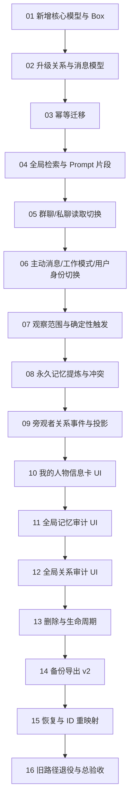

# 全局永久记忆系统：分阶段实施与可复制提示词

日期：2026-08-04

上游设计：[全局永久记忆与方向性关系系统：需求、技术设计与执行计划](2026-08-04-global-permanent-memory-design.md)

## 1. 使用方法

1. 按本文 Stage 01 → Stage 16 的顺序执行；每个 Stage 建议开启一个新的执行任务。
2. 把对应的完整提示词代码块复制给执行者，不要只发送标题。
3. 前一阶段未通过验收门槛，不要开始后一阶段。
4. 每个执行者必须先读取仓库 `AGENTS.md`、上游设计的指定章节、当前源码和已有测试，再动代码。
5. 执行者不得重置、覆盖或删除其他人的未提交改动；不得提交、推送或创建 PR，除非你另行授权。
6. 每阶段结束必须返回：改动文件、关键决策、执行命令、测试结果、未解决问题、下一阶段是否可开始。
7. 若源码与设计冲突，执行者必须先报告证据，不得静默修改需求。

## 2. 依赖图与里程碑



| 里程碑 | 阶段 | 通过条件 |
|---|---|---|
| A：存储基础 | 01–03 | 新模型可读写；旧数据可幂等迁移；运行时尚可回滚 |
| B：全局读取 | 04–06 | 所有生成入口使用同一人物卡、全局记忆和方向关系 |
| C：全局写入 | 07–09 | 观察者隔离、显式记忆、冲突历史和旁观者关系事件生效 |
| D：治理能力 | 10–13 | 用户能管理资料、记忆、关系；删除不会误删永久数据 |
| E：可恢复交付 | 14–16 | 备份恢复完整；旧路径停止读写；端到端验收通过 |

## 3. 通用完成标准

每个 Stage 都必须满足：

- 只实现本阶段范围，不顺手做后续阶段。
- 优先复用现有模型、`MemoryControls`、AI gateway、Hive 和测试 helper，不新增依赖。
- 新逻辑有最小可运行测试；生成文件通过 `dart run build_runner build` 生成，不手改 `.g.dart`。
- `flutter analyze` 无本阶段新增问题。
- 指定测试通过；若仓库存在历史失败，列出精确命令和证据。
- 手写文件预计超过 5 个时先拆分并报告，不把大改动硬塞进一个阶段。

---

## Milestone A：存储基础

## Stage 01：新增核心模型与 Hive Box

### 可复制提示词

```text
你是全局永久记忆项目 Stage 01 的执行者。只实现“新增核心模型与 Hive Box”，不要接入聊天流程、迁移旧数据或修改 UI。

工作目录：/Volumes/新/work/flutter/chat_group/chat_group

开始前必须：
1. 完整阅读仓库 AGENTS.md。
2. 阅读 docs/superpowers/specs/2026-08-04-global-permanent-memory-design.md 的 §1、§4、§5.1、§5.2、§5.4、§11、§12。
3. 阅读 lib/core/models 下现有 Hive 模型、lib/core/database/database_service.dart，以及相关 round-trip 测试模式。
4. 检查 git status，保留所有现有改动。

本阶段目标：
- 新增 UserProfile、PermanentMemory、RelationshipEvent 三个类型安全 Hive 模型及所需枚举。
- 字段、状态、来源、supersedesIds、审计信息必须符合设计文档。
- 在 DatabaseService 注册 adapter、打开 box、提供 getter，并把新 Hive 文件加入 release 数据文件清单。
- Hive typeId 必须避开仓库现有 0..16；先用 rg 再分配。
- 不新增依赖，不手写 .g.dart。

必须验证：
- 为三个模型增加最小 round-trip 测试，覆盖枚举、可选来源和列表字段。
- 运行 dart run build_runner build。
- 运行相关模型测试和 flutter analyze。

禁止：
- 不修改 CharacterMemory、RelationshipState、Message 的现有语义。
- 不创建迁移器，不切换 Prompt，不删除旧 box。

完成时按以下格式回复：改动文件；模型/typeId 决策；测试命令与结果；遗留问题；Stage 02 是否可开始。不要提交或推送。
```

### 验收门槛

- [ ] 三个新 box 可在空库和旧库旁边安全打开。
- [ ] typeId 无冲突，生成文件可重复生成。
- [ ] 没有运行时调用开始读取新模型。

## Stage 02：升级 `RelationshipState` 与 `Message`

### 可复制提示词

```text
你是全局永久记忆项目 Stage 02 的执行者。只升级现有 RelationshipState 和 Message 模型，为后续全局关系和观察者隔离建立兼容字段。

工作目录：/Volumes/新/work/flutter/chat_group/chat_group

前置条件：Stage 01 已通过。若新模型/box 不存在，停止并报告。

开始前必须阅读：
- AGENTS.md。
- 设计文档 §4.1、§5.3、§5.5、§9.5。
- lib/core/models/relationship_state.dart、message.dart 及其测试/adapter。
- DatabaseService 的消息持久化路径，只读理解，不在本阶段改聊天行为。

本阶段目标：
- 为 RelationshipState 增加全局关系所需的 stage、revision、lastEventId、updatedAt，以及生成稳定全局 relation ID 的纯函数/构造入口。
- 保留旧 HiveField 编号和旧 groupId 数据的可读取性；本阶段不迁移、不移除 groupId。
- 为 Message 增加可选 visibleToCharacterIds，旧消息默认安全为空。
- 所有分数 clamp 和默认值保持向后兼容。

必须验证：
- 旧字段缺失时反序列化仍成功。
- 稳定 relation ID 对相同方向相同、反向关系不同。
- Message 新字段 round-trip，旧值为空时行为明确。
- 运行 build_runner、相关测试和 flutter analyze。

禁止：
- 不改变 ChatRoomPage、Loader 或 Orchestrator。
- 不把旧 relationship 直接改成 global。
- 不清空/重写现有 Hive 数据。

完成时报告改动文件、Hive 兼容策略、验证结果、Stage 03 是否可开始。不要提交或推送。
```

### 验收门槛

- [ ] 老数据仍可打开。
- [ ] `A → B` 与 `B → A` 生成不同稳定 ID。
- [ ] 新消息观察范围字段为可选兼容字段。

## Stage 03：实现幂等旧数据迁移

### 可复制提示词

```text
你是全局永久记忆项目 Stage 03 的执行者。实现一次性、可重复、可审计的旧记忆迁移；不要切换运行时 Prompt。

工作目录：/Volumes/新/work/flutter/chat_group/chat_group

前置条件：Stage 01、02 已通过。

开始前必须阅读：
- AGENTS.md。
- 设计文档 §9 全部、§10.1、§12.2。
- CharacterMemory、AICharacter.memorySummary、ChatGroup.ownerName、RelationshipState 当前模型。
- DatabaseService 现有凭据迁移模式和 test/helpers/lifecycle_hive.dart。

本阶段目标：
- 新增独立 MemoryMigrator，在 app_settings 记录 schema marker 和迁移报告。
- 迁移 UserProfile：从 ownerName 候选生成全局人物卡，多候选按设计报告而非静默丢弃。
- 把每个 CharacterMemory 字符串条目展开为 PermanentMemory，observer=characterId，保留 group/DM 来源快照。
- 迁移 memorySummary 并与已迁移正文去重；无法解析时作为 legacyMigration。
- 按设计的熟悉度权重合并同方向旧 RelationshipState，并为每个旧场合写 legacy RelationshipEvent。
- 稳定 ID 和 marker 保证执行两次不产生重复记录或重复累计。
- 迁移先写新数据并验证，绝不清空旧 box/字段。

必须验证：
- 使用临时 Hive fixture 覆盖：单群、多群、DM、重复摘要、多 ownerName、重复执行、部分迁移后重试。
- 断言迁移后观察者不越权，关系方向不合并。
- 运行迁移测试和 flutter analyze；不在真实 data 目录试跑。

禁止：
- 不修改 Prompt 或运行时读取。
- 不删除 CharacterMemory、memorySummary、旧关系记录。
- 不在迁移中伪造 sourceMessageIds。

完成时报告迁移算法、fixture 结果、已知不可恢复信息、Stage 04 是否可开始。不要提交或推送。
```

### Milestone A 检查点

- [ ] 在临时 Hive 中连续迁移两次，条目数和关系分数不变。
- [ ] 旧 box 完整保留。
- [ ] 全量测试至少执行一次并记录基线。

---

## Milestone B：全局读取

## Stage 04：全局记忆检索与统一 Prompt 片段

### 可复制提示词

```text
你是全局永久记忆项目 Stage 04 的执行者。只实现与 UI/聊天页面解耦的全局检索和 Prompt 上下文构建。

工作目录：/Volumes/新/work/flutter/chat_group/chat_group

前置条件：Stage 01–03 已通过。

先阅读：AGENTS.md；设计文档 §4.1、§6.4、§7.1、§7.2、§12；现有 lib/features/memory/memory_controls.dart、HumanizedPromptBuilder 和相关测试。

本阶段目标：
- 在 lib/features/memory 下实现统一 selector/context builder。
- 输入包含 observerCharacterId、当前目标/参与者、当前文本、字符预算。
- 只选择当前观察者的 active 记忆；排除 superseded/invalidated、被 supersedesIds 指向的旧记录和其他 AI 私有记忆。
- 固定人物卡 > 当前方向关系 > 相关永久记忆 > 场合短期上下文的优先级。
- 使用本地结构化排序和中文字符 bigram；复用 stdlib，不新增向量/分词依赖。
- 预算、最大条目数和权重集中为命名常量。
- 人物卡与记忆冲突时 Prompt 明确以人物卡为准。

必须验证：
- A 无法检索 B 的私聊/私有记忆。
- 主体命中、固定、明确要求、重要度和关键词排序稳定。
- 失效链不会双重注入。
- 字符预算严格生效。
- 运行新增测试和 flutter analyze。

禁止：
- 不改 ChatRoomPage、主动消息、工作模式。
- 不读 CharacterMemory 或 memorySummary 作为新 selector 的 fallback。

完成时报告选择算法、预算常量、测试结果、Stage 05 是否可开始。不要提交或推送。
```

### 验收门槛

- [ ] selector 完全不依赖 conversationId 决定可见性。
- [ ] 隐私隔离和冲突优先级都有单元测试。

## Stage 05：切换群聊、私聊与发言选择读取链路

### 可复制提示词

```text
你是全局永久记忆项目 Stage 05 的执行者。把普通群聊、自动群聊、私聊和发言选择切换到 Stage 04 的统一全局读取；本阶段不实现新写入算法。

工作目录：/Volumes/新/work/flutter/chat_group/chat_group

前置条件：Stage 04 selector 测试通过。

先阅读：AGENTS.md；设计文档 §3、§7.2、§7.3；ChatRoomLoader、ChatRoomPage 的 _buildApiMessages/_buildDirectApiMessages、HumanizedChatOrchestrator、现有 prompt 测试。

本阶段目标：
- Loader 不再以 conversationId 作为永久记忆和关系边界；只加载当前发言所需的全局状态或通过 repository/selector 查询。
- 群聊和私聊 Prompt 都调用统一 context builder。
- HumanizedChatOrchestrator 查找关系时移除 groupId 语义，使用全局方向键。
- GroupMemory 仍只作为短期群话题上下文。
- 停止在这些入口注入 CharacterMemory 和 memorySummary，避免双源。
- ChatRoomPage 只保留薄调用，不把检索算法复制进页面。

必须验证：
- 群 1 → 群 2、群 → DM、DM → 群均能读取同一 AI 的有效记忆。
- A/B 群 1 关系能影响群 2 的发言选择。
- A 仍无法读取 B 私聊。
- 扩展 humanized_prompt_builder、humanized_chat_orchestrator 和 loader 测试；运行 flutter analyze。

禁止：
- 不新增记忆写入或旁观者更新。
- 不删除旧模型/box。
- 不继续在 ChatRoomPage 写新的 .where(groupId...) 永久记忆过滤。

完成时报告所有已切换入口、仍保留的 legacy 命中及原因、测试结果、Stage 06 是否可开始。不要提交或推送。
```

## Stage 06：切换主动消息、工作模式与全局用户身份

### 可复制提示词

```text
你是全局永久记忆项目 Stage 06 的执行者。完成剩余生成入口和用户称呼的读取切换，确保没有旁路失忆。

工作目录：/Volumes/新/work/flutter/chat_group/chat_group

前置条件：Stage 05 通过。

先阅读：AGENTS.md；设计文档 §3.2、§7.3、§8.1；DirectChatProactiveService、GroupChatProactiveService、DirectChatSession、WorkModePolicy、ownerName 的全部 rg 命中和相关测试。

本阶段目标：
- 主动群聊、主动私聊和工作模式调用统一人物卡/记忆 context builder。
- 群聊 Prompt、DM Prompt、消息转写、成员列表和 @用户识别的权威名称改读 UserProfile.displayName。
- 保留“我”作为 mention 兼容别名；ChatGroup.ownerName 暂时只读兼容，不再作为权威事实。
- 不把人物卡全部字段散落拼接到各 service；统一生成一段安全 Prompt。
- 页面/服务没有人物卡时安全回退“我”。

必须验证：
- 修改人物卡后，群聊、DM、两类 proactive 和 work mode 都能看到新称呼/资料。
- @我 与 @新显示名均能识别。
- rg 检查 ownerName/memorySummary 的剩余运行时命中，每个 legacy 命中必须说明理由。
- 运行 direct/group proactive、mention、work mode 相关测试和 flutter analyze。

禁止：
- 不做人物卡 UI。
- 不删除 ChatGroup.ownerName 或 AICharacter.memorySummary 字段。

完成时报告切换清单、剩余 legacy 清单、测试结果、Milestone B 是否通过。不要提交或推送。
```

### Milestone B 检查点

- [ ] 所有生成入口使用同一个全局上下文选择器。
- [ ] 不存在 memorySummary 与 PermanentMemory 同时注入。
- [ ] 用户身份只有 UserProfile 一个权威来源。

---

## Milestone C：全局写入

## Stage 07：消息观察范围与确定性触发器

### 可复制提示词

```text
你是全局永久记忆项目 Stage 07 的执行者。建立统一消息观察入口、可见范围快照和本地触发判断；不要在本阶段调用 LLM 提炼。

工作目录：/Volumes/新/work/flutter/chat_group/chat_group

前置条件：Milestone B 通过。

先阅读：AGENTS.md；设计文档 §5.5、§6.1–§6.3；Message 持久化的全部入口、ChatRoomRepository、主动消息 service 和 UserMessageSentiment。

本阶段目标：
- 新消息落库时写 visibleToCharacterIds：群聊为发送时群内未停用成员；DM 仅目标 AI。
- 所有普通、自动、主动、群聊、私聊消息在成功落库后进入同一个 observation/capture 入口。
- 实现纯 Dart 触发器：强制记忆词、遗忘词、承诺/身份/偏好候选、显著情绪/关系事件。
- “不要记住/忘记”等否定意图不能误存为正向记忆。
- 明确记忆指令立即创建本地 explicitInstruction 记录，保证无 API 时也不丢。
- 使用稳定键防止同一消息/观察者重复创建 explicit 记录。

必须验证：
- 群消息观察者、DM 隔离、角色停用边界。
- 记忆词必触发；否定词进入 forget；普通寒暄不强制保存。
- 同一消息重复进入入口不重复落库。
- 运行新增测试和 flutter analyze。

禁止：
- 不实现 LLM JSON 提炼。
- 不修改关系分数/阶段。
- 不把未在 visibleToCharacterIds 的 AI 加为观察者。

完成时报告所有消息入口覆盖情况、触发词策略、测试结果、Stage 08 是否可开始。不要提交或推送。
```

## Stage 08：永久记忆提炼、冲突处理与重试

### 可复制提示词

```text
你是全局永久记忆项目 Stage 08 的执行者。实现按观察者提炼永久记忆、冲突历史和失败重试；聊天成功不能依赖记忆提炼成功。

工作目录：/Volumes/新/work/flutter/chat_group/chat_group

前置条件：Stage 07 已提供统一 observation 入口和可见范围。

先阅读：AGENTS.md；设计文档 §6 全部、§7.1、§12.2；现有 HumanizedMemoryService JSON 解析、AI gateway summary 调用、AiGovernanceStore 和 memory_controls 测试。

本阶段目标：
- 调用现有 AI gateway 进行结构化提炼，输出按 observerCharacterId 分组的记忆建议。
- 保存前验证观察者在 visibleToCharacterIds 中；越权项直接拒绝。
- 实现 kind、subjectIds、importance、confidence、来源和显式触发字段校验。
- 实现重复、补充、冲突修正、supersedesIds 和人物卡覆盖规则。
- 固定记忆不得被自动失效。
- 提炼失败不影响消息；待处理 message IDs 以轻量、可恢复方式排队并重试。
- 显式记忆已有本地记录时，提炼结果通过 supersedesIds 规范化，不重复注入。

必须验证：
- 非 JSON、空输出、未知枚举、越权观察者、重复重试、部分成功。
- 冲突后旧记录可审计但不进入 Prompt。
- 人物卡覆盖和 pinned 规则。
- 运行新增测试、相关 memory_controls 测试和 flutter analyze。

禁止：
- 不实现关系分数投影或 UI。
- 不让 LLM 失败阻断/回滚聊天消息。

完成时报告提炼 schema、重试存储、冲突算法、测试结果、Stage 09 是否可开始。不要提交或推送。
```

## Stage 09：旁观者关系事件与全局投影

### 可复制提示词

```text
你是全局永久记忆项目 Stage 09 的执行者。把关系更新从“发言者→目标的本地规则”升级为每个在场观察者自己的全局事件历史和当前投影。

工作目录：/Volumes/新/work/flutter/chat_group/chat_group

前置条件：Stage 07、08 通过。

先阅读：AGENTS.md；设计文档 §5.3、§5.4、§6.3、§9.5；HumanizedMemoryService.applyLocalRelationshipRules、ChatRoomPage._persistRelationshipForIntent、RelationshipState/Event 模型及测试。

本阶段目标：
- 对一条消息分别计算直接参与者和旁观者的方向性关系建议。
- 只允许 AI 作为 source；用户和 AI 可作为 target。
- 每次变化先追加稳定 ID 的 RelationshipEvent，再按 revision/绝对 After 快照幂等更新 RelationshipState。
- 同一事件重放不重复加分；反向关系互不覆盖。
- 阶段变化最多跨一级；romantic 必须有明确语义或人工确认；短暂情绪不直接跳 hostile。
- 固定关系拒绝自动更新，但人工操作留给后续 UI。
- 用新全局入口替换旧 per-group 关系写入，旧数据仅保留迁移兼容。

必须验证：
- A 攻击 B 时 B→A 与旁观 C→A 可不同，A→B 也独立。
- DM 只更新目标 AI 的视角，其他 AI 无事件。
- 重放、并发顺序、revision、clamp、阶段防跳变。
- 运行 humanized memory/orchestrator 相关测试和 flutter analyze。

禁止：
- 不做 UI 或备份。
- 不继续按 groupId 创建新 RelationshipState。

完成时报告事件生成规则、投影幂等方案、测试结果、Milestone C 是否通过。不要提交或推送。
```

### Milestone C 检查点

- [ ] 无网络时显式记忆仍存在，关系本地确定性更新可用。
- [ ] A/B/C 观察者差异和 DM 隐私测试通过。
- [ ] 新写入不再产生 per-group CharacterMemory/RelationshipState。

---

## Milestone D：治理能力

## Stage 10：我的人物信息卡 UI

### 可复制提示词

```text
你是全局永久记忆项目 Stage 10 的执行者。只实现“我的人物信息卡”设置入口和编辑体验。

工作目录：/Volumes/新/work/flutter/chat_group/chat_group

前置条件：人物卡模型和读取切换已完成。

先阅读：AGENTS.md；设计文档 §5.1、§8.1；SettingsPage、现有表单页面、provider 导出模式和 UI 测试。

本阶段目标：
- 在设置页增加“我的资料”入口和 UserProfilePage。
- 支持 displayName、preferredAddress、avatar、pronouns、age、bio、personality、interests、importantBackground。
- 对年龄、空白名称、列表空项做本地校验；不引入表单依赖。
- 保存后统一人物卡读取立即生效。
- 页面明确提示资料可能随聊天上下文发送给用户配置的 LLM。
- 无人物卡时展示安全默认值；不要恢复逐群 ownerName 输入。

必须验证：
- Widget 测试覆盖加载、保存、校验和缺省值。
- 运行 settings/profile 相关测试和 flutter analyze。

禁止：
- 不改永久记忆审计 UI。
- 不删除 ChatGroup.ownerName 字段。

完成时报告入口、字段、验证规则、测试结果、Stage 11 是否可开始。不要提交或推送。
```

## Stage 11：全局永久记忆审计 UI

### 可复制提示词

```text
你是全局永久记忆项目 Stage 11 的执行者。把现有按会话过滤的记忆管理页改造成按观察者视角的全局永久记忆审计页；本阶段不做关系事件 UI。

工作目录：/Volumes/新/work/flutter/chat_group/chat_group

前置条件：Stage 04、08、10 通过。

先阅读：AGENTS.md；设计文档 §8.2；现有 memory_management_page.dart、memory_controls.dart、消息搜索/跳转能力和 memory_controls_test.dart。

本阶段目标：
- 页面数据边界从 conversationId 改为全局；聊天页传入的 conversationId 只作为初始来源筛选。
- 支持按观察 AI、主体、来源、状态、类型筛选。
- 展示正文、状态、重要度、置信度、发生时间、来源场合和修正链。
- 来源消息存在时复用现有 loadAround/搜索跳转；不存在时显示来源快照。
- 编辑时新增人工修正版并 supersede 旧记录，不原地抹除历史。
- 删除物理删除并立即停止 Prompt 注入；固定状态写入模型字段。
- 旧 CharacterMemory/legacy 摘要只可放在迁移诊断区，不作为正常编辑对象。

必须验证：
- Widget 测试覆盖筛选、修正、删除、固定、来源缺失。
- memory controls 单元测试覆盖 Prompt 删除同步。
- 运行相关测试和 flutter analyze。

禁止：
- 不实现关系时间线。
- 不重新引入按 conversationId 的数据可见性过滤。

完成时报告 UI 行为、修正/删除语义、测试结果、Stage 12 是否可开始。不要提交或推送。
```

## Stage 12：全局方向关系审计 UI

### 可复制提示词

```text
你是全局永久记忆项目 Stage 12 的执行者。为全局方向关系增加当前状态和事件时间线管理 UI。

工作目录：/Volumes/新/work/flutter/chat_group/chat_group

前置条件：Stage 09、11 通过。

先阅读：AGENTS.md；设计文档 §8.3；RelationshipState/Event、MemoryControls、现有全局审计页和相关 Widget 测试。

本阶段目标：
- 明确展示 source → target，不能把双向关系合并成一条无方向关系。
- 展示当前亲密、信任、摩擦、熟悉度、情绪、阶段、备注和更新时间。
- 提供事件时间线及来源跳转/来源快照。
- 人工编辑分数、情绪、阶段和备注时追加 manual RelationshipEvent，并幂等更新快照。
- “重置关系”保留重置事件；“删除关系及历史”必须二次确认并清除 state/events/pin。
- romantic 人工修改允许，但 UI 必须明确这是人工设定。

必须验证：
- A→B/B→A 分开展示和编辑。
- manual event、重置、删除和来源缺失 Widget 测试。
- 运行相关测试和 flutter analyze。

禁止：
- 不修改自动关系推断规则。
- 不新增关系图库或可视化依赖。

完成时报告交互、删除/重置区别、测试结果、Stage 13 是否可开始。不要提交或推送。
```

## Stage 13：删除、清空与角色生命周期

### 可复制提示词

```text
你是全局永久记忆项目 Stage 13 的执行者。更新数据生命周期，确保场合删除不会静默删除永久记忆，同时用户仍能明确彻底清除。

工作目录：/Volumes/新/work/flutter/chat_group/chat_group

前置条件：Stage 09–12 通过。

先阅读：AGENTS.md；设计文档 §10.1、§12.2；DataLifecycleService/Planner/Settings、删除确认 UI 和 data_lifecycle 测试。

本阶段目标：
- 删除群默认删除消息、GroupMemory 和群本身，保留 PermanentMemory/RelationshipEvent，并保留 originNameSnapshot。
- 删除/清空确认页提供明确的“同时删除源自此会话的永久记忆”选项，默认关闭。
- 删除 AI 且保留历史：按设计保留其他 AI 关于它的记录，用已删除角色快照显示；明确处理该 AI 自己作为观察者的私有记忆。
- 删除 AI 及关联数据：清除它作为观察者或目标的全部 memory/state/event。
- 清除用户内容覆盖 UserProfile、新旧记忆、新旧关系、事件和 legacy 摘要。
- 删除计划预览必须显示各类受影响数量。

必须验证：
- 群删除默认保留、显式关联删除、两种角色删除、全清理和中断重试。
- 运行 data lifecycle 单元/Widget 测试和 flutter analyze。

禁止：
- 不为方便而恢复按 groupId 级联删除全局关系快照。
- 不静默改变现有删除策略默认值而不更新确认文案和测试。

完成时报告每种删除策略矩阵、测试结果、Milestone D 是否通过。不要提交或推送。
```

### Milestone D 检查点

- [ ] 用户能查看和纠正人物卡、记忆、关系。
- [ ] 删除场合与删除永久记忆是两个明确动作。
- [ ] 所有治理操作立即反映到 Prompt 选择结果。

---

## Milestone E：备份恢复与交付

## Stage 14：备份导出 schema v2

### 可复制提示词

```text
你是全局永久记忆项目 Stage 14 的执行者。只升级备份导出、manifest 和 staged DTO；本阶段不实现恢复写入。

工作目录：/Volumes/新/work/flutter/chat_group/chat_group

前置条件：Stage 13 通过，模型和生命周期语义稳定。

先阅读：AGENTS.md；设计文档 §10.2；backup_models.dart、backup_entity_codec.dart、backup_snapshot.dart、staged_backup_data.dart 和备份测试。

本阶段目标：
- 将备份 schema 升级为 v2，同时继续识别 v1。
- 导出 user_profile.json、permanent_memories.json、relationship_events.json 和更新后的 relationships.json。
- 完整备份包含全部全局数据。
- 会话备份只包含 originConversationId 命中的 memory/events，不包含人物卡和跨其他场合聚合的关系快照。
- codec 使用稳定 JSON DTO，不导出 Hive 二进制、API Key、凭据或内部日志。
- manifest counts/checksum/文件清单包含新实体。

必须验证：
- v2 导出结构、计数、敏感字段排除、会话备份不泄漏其他来源。
- v1 fixture 仍可被 inspector/staging 识别。
- 运行 backup 相关测试和 flutter analyze。

禁止：
- 不修改 restore commit/remap 流程。
- 不把人物卡加入会话级备份。

完成时报告 v2 文件清单、v1 兼容策略、泄漏测试、Stage 15 是否可开始。不要提交或推送。
```

## Stage 15：恢复、冲突处理与 ID 重映射

### 可复制提示词

```text
你是全局永久记忆项目 Stage 15 的执行者。完成备份 v2 恢复、引用校验和 copyWithNewIds 重映射。

工作目录：/Volumes/新/work/flutter/chat_group/chat_group

前置条件：Stage 14 导出和 fixture 测试通过。

先阅读：AGENTS.md；设计文档 §10.2；RestoreExecutor、restore_plan.dart、StagedBackupData 校验和现有 rollback 测试。

本阶段目标：
- 恢复 UserProfile、PermanentMemory、RelationshipEvent 和全局 RelationshipState。
- 重映射 observer、AI subjectIds、关系双方、participantIds、sourceMessageIds、supersedesIds、lastEventId 和事件稳定 ID；内建 user 不重映射。
- 会话备份恢复后从导入事件合并/重建关系快照，不能覆盖其他场合已有状态。
- 支持 v1：先恢复旧实体，再由幂等 migrator 转为新结构。
- 所有引用在提交前校验；失败沿用现有事务回滚，不留下半恢复状态。
- 更新 emptyOnly/coreIsEmpty、conflict counts 和恢复报告。

必须验证：
- v2 空库 round-trip、重复导入、copyWithNewIds、会话包合并、损坏引用、回滚。
- v1 fixture 恢复后迁移成功。
- API 凭据仍不进入备份/恢复。
- 运行 backup restore 全部测试和 flutter analyze。

禁止：
- 不边解析边覆盖未校验数据。
- 不漏掉 supersedes/event/revision 引用重映射。

完成时报告引用映射矩阵、round-trip 结果、Stage 16 是否可开始。不要提交或推送。
```

## Stage 16：旧路径退役与端到端总验收

### 可复制提示词

```text
你是全局永久记忆项目 Stage 16 的收尾执行者。目标是退役旧运行时路径并完成端到端验收；不要做无关重构。

工作目录：/Volumes/新/work/flutter/chat_group/chat_group

前置条件：Stage 01–15 全部通过，并有每阶段交付记录。

先阅读：AGENTS.md；完整设计文档，重点 §2、§7.3、§9.1、§13；再阅读前 15 阶段改动和测试结果。

本阶段目标：
- 用 rg 审计 CharacterMemory、memorySummary、per-group RelationshipState、ownerName 的所有运行时读写。
- 迁移完成后，旧结构只能存在于 adapter、迁移、v1 恢复和兼容诊断代码；新聊天不再双写。
- 删除重复 Prompt 注入、废弃控制键和不可达旧调用，但首个兼容周期不删除旧 Hive box/字段。
- 补齐设计文档 §2 的 10 个端到端成功场景测试。
- 在临时 Hive 数据副本上执行：旧库启动 → 迁移 → 跨群/DM → 完整备份 → 清空临时库 → 恢复 → 再次验证。
- 更新项目文档中的记忆架构说明和已知迁移限制。

必须验证：
- dart run build_runner build
- flutter analyze
- flutter test
- 设计 §13.4 的定向测试
- git diff --check
- 记录真实命令、退出码和任何历史失败，不得写“应该通过”。

禁止：
- 不删除旧 box/字段或真实 data/*.hive。
- 不提交、推送或创建 PR。
- 不以大规模格式化掩盖功能 diff。

完成时按以下格式交付：
1. 设计 §2 的 10 项逐条 PASS/FAIL 证据。
2. legacy rg 审计表及每个保留命中的理由。
3. 全量测试与迁移/恢复演练结果。
4. 未解决风险和是否可以进入人工验收。
```

### Milestone E / 最终检查点

- [ ] 旧库可无损升级且迁移可重试。
- [ ] 所有 Prompt 入口只有一个永久记忆源。
- [ ] AI 不会读取未见证私聊。
- [ ] 关系跨群/DM 延续且事件可追溯。
- [ ] 人物卡、记忆、关系可治理。
- [ ] 完整备份恢复和会话备份隐私边界正确。
- [ ] `flutter analyze` 和 `flutter test` 有真实通过记录。

## 4. 给总协调者的收尾提示词

全部阶段完成后，可把以下提示词交给最后的审查者；它只审查，不继续扩展功能：

```text
请对“全局永久记忆与方向性关系系统”的最终实现做只读验收，不要先改代码。

仓库：/Volumes/新/work/flutter/chat_group/chat_group
设计：docs/superpowers/specs/2026-08-04-global-permanent-memory-design.md
阶段计划：docs/superpowers/specs/2026-08-04-global-permanent-memory-implementation-prompts.md

要求：
1. 完整阅读 AGENTS.md、设计成功标准和 Stage 01–16 的交付记录。
2. 对照设计 §2 的 10 条成功标准逐项查源码和测试证据。
3. 重点检查：观察者越权、DM 泄漏、groupId 残留隔离、memorySummary 双注入、关系事件重复累计、迁移幂等、删除误级联、会话备份泄漏。
4. 运行 flutter analyze、flutter test 和 git diff --check。
5. 只输出按严重度排序的问题；每个问题给出文件、行号、复现/证据和最小修复方向。没有问题则明确写“未发现阻塞项”，并列出仍需人工体验验证的项目。
6. 不提交、不推送、不创建 PR；未收到修复授权前不修改代码。
```
