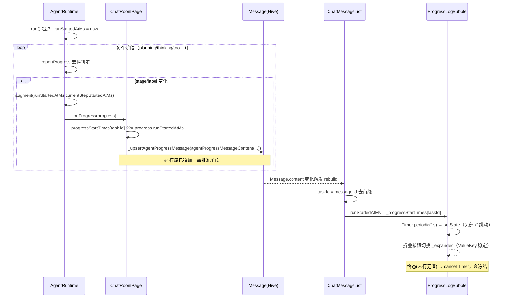

# P2 进度日志可读性增强 · 增量架构设计 + 任务分解

> 项目：chat_group（Flutter AI 群聊模拟器，本地 Flutter fork 3.24）
> 角色：架构师（Bob / 高见远）
> 范围：在已交付的「工作模式流式进度日志」之上的**纯增量**，复用既有通道，不破坏既有行为。
> 聚焦三件事：① 可折叠　② 总耗时实时跳动　③ 批准态区分

---

## 1. 实现方案概述

**整体定位：纯增量、零新依赖、复用既有进度通道。**

既有通道（`run()` 内各阶段 `_reportProgress` → `onProgress` handler → `_persistAgentProgress` → `_upsertAgentProgressMessage` 整体替换 content → `ChatMessageBubble` 渲染）全程不动语义，仅在其上叠加三件可读性增强：

| 增强项 | 落地层 | 依赖既有能力 |
|--------|--------|--------------|
| ① 可折叠 | **Widget 层**（新增 `ProgressLogBubble` StatefulWidget，状态本地化） | 复用 `message.id.startsWith('agent-progress:')` 识别；`ValueKey(message.id)` 稳定实例 |
| ② 总耗时实时跳动 | **Widget 层**（本地 `Timer.periodic` 每秒 setState） | 复用 `runStartedAtMs`（运行时新增字段，非持久化） |
| ③ 批准态区分 | **Content 层**（`agentProgressMessageContent` 聚合 ✅ 行时追加文案） | 复用 `AgentRuntime.requiresApproval(AgentToolName)` 静态方法 |

**数据模型最小侵入**：`AgentRuntimeProgress` 仅新增两个**运行时态、非持久化**字段 `int? runStartedAtMs`、`int? currentStepStartedAtMs`（const 构造兼容，默认 null）。无 `toJson`/无 Hive，天然不持久化。

**关键设计取舍**：
- 时间戳注入集中在 `_reportProgress` 内「步切换（stage/label 变化）」分支统一 augmentation，**不改动约 18 处 `_reportProgress(AgentRuntimeProgress(...))` 调用点**，降低回归风险；`runStartedAtMs` 由 `AgentRuntime` 实例字段 `_runStartedAtMs` 在 `run()` 起点捕获一次后透传。
- `currentStepStartedAtMs` 同期注入，但**P2 不展示单步耗时**（按拍板决策顺延），仅为后续「单步耗时」预留，避免二次改模型。
- 耗时实时跳动放 Widget 层而非 content 层：因为 content 由 `_upsertAgentProgressMessage` 整体替换驱动、不会每秒重写，每秒重写 content 既破坏去抖、又浪费渲染；Timer 本地驱动性能无忧。

---

## 2. 文件列表（相对项目根）

### 修改（5 个）
- `lib/features/agentic/agent_runtime.dart`
  — `AgentRuntimeProgress` 加两个字段（const 兼容）；`AgentRuntime` 加实例字段 `_runStartedAtMs`；`run()` 起点捕获；`_reportProgress` 步切换分支注入 `runStartedAtMs`/`currentStepStartedAtMs`。
- `lib/features/chat_group/chat_room_page.dart`
  — 新增内存 Map `_progressStartTimes`；`_persistAgentProgress` 写入；`ChatMessageList` 构造处传入 `_progressStartTimes`。
- `lib/features/chat_group/chat_room_utils.dart`
  — `agentProgressMessageContent` 遍历 `executedRequests` 生成 ✅ 行时追加批准态文案。
- `lib/features/agentic/agent_progress_meta.dart`
  — 新增常量 `approvalTag`/`autoTag` 与纯函数 `formatElapsed`（耗时格式化，可单测）。
- `lib/features/chat_group/widgets/chat_message_bubble.dart`
  — `ChatMessageBubble` 构造加可选参数 `int? runStartedAtMs`；新增 `ProgressLogBubble` StatefulWidget（折叠 + 实时耗时）；将 `_buildContent` 中 `isProgressTail` 分支替换为 `ProgressLogBubble`。
- `lib/features/chat_group/widgets/chat_message_list.dart`
  — 新增参数 `Map<String,int>? progressStartTimes`；itemBuilder 解析 taskId 并传给 `ChatMessageBubble`。

### 新增（3 个，测试）
- `test/features/agentic/agent_runtime_progress_test.dart`
- `test/features/chat_group/chat_room_utils_test.dart`
- `test/features/chat_group/widgets/progress_log_bubble_test.dart`

---

## 3. 数据结构与接口

### 3.1 扩展后 `AgentRuntimeProgress`（agent_runtime.dart）

```dart
class AgentRuntimeProgress {
  final AgentRuntimeProgressStage stage;
  final List<ToolRequest> executedRequests;
  final ToolRequest? pendingRequest;
  final String? currentStepLabel;

  // —— P2 新增：运行时态、非持久化 ——
  /// run() 启动时刻（ms 时间戳），整段任务仅捕获一次。
  final int? runStartedAtMs;
  /// 当前步起点（ms 时间戳），stage/label 切步时重置；P2 仅注入不展示。
  final int? currentStepStartedAtMs;

  const AgentRuntimeProgress({
    required this.stage,
    required this.executedRequests,
    this.pendingRequest,
    this.currentStepLabel,
    this.runStartedAtMs,          // 默认 null，兼容既有调用点
    this.currentStepStartedAtMs,  // 默认 null
  });
}
```

> const 构造兼容性：既有 18 处调用点不传这两个字段，默认 null，零改动即可编译。

### 3.2 `AgentRuntime` 时间戳注入（agent_runtime.dart）

```dart
class AgentRuntime {
  // P2: run() 起点捕获，整段任务一次
  int? _runStartedAtMs;

  Future<AgentRuntimeResult> run({ /* ... */ }) async {
    // ...（shouldCancel 早退检查之后）...
    _runStartedAtMs = DateTime.now().millisecondsSinceEpoch; // ← 捕获点
    await _reportProgress(AgentRuntimeProgress(stage: planning, ...));
    // ...
  }

  Future<void> _reportProgress(AgentRuntimeProgress progress) async {
    final sameAsLast = _lastReportedStage == progress.stage &&
        _lastReportedLabel == progress.currentStepLabel;
    _lastReportedStage = progress.stage;
    _lastReportedLabel = progress.currentStepLabel;
    if (sameAsLast) return;                       // 去抖跳过
    // 步切换分支：augment 后传入 handler（不改动各调用点）
    final augmented = AgentRuntimeProgress(
      stage: progress.stage,
      executedRequests: progress.executedRequests,
      pendingRequest: progress.pendingRequest,
      currentStepLabel: progress.currentStepLabel,
      runStartedAtMs: _runStartedAtMs,            // 透传
      currentStepStartedAtMs: DateTime.now().millisecondsSinceEpoch, // 重置当前步
    );
    final handler = onProgress;
    if (handler == null) return;
    await handler(augmented);
  }

  // 既有静态方法，P2 直接复用（入参 AgentToolName）
  static bool requiresApproval(AgentToolName tool) { /* workspacePatch/commandRun/... => true; read/list => false */ }
}
```

### 3.3 `_progressStartTimes` Map 方案（chat_room_page.dart）

```dart
class _ChatRoomPageState {
  // P2: 内存 Map，key=task.id，value=runStartedAtMs；非持久化
  final Map<String, int> _progressStartTimes = {};

  Future<void> _persistAgentProgress(AgentTask task, AgentRuntimeProgress progress) async {
    _lastAgentProgress[task.id] = progress;
    // P2: 仅首个非空值写入，天然幂等（后续 progress.runStartedAtMs 一致）
    _progressStartTimes[task.id] ??= progress.runStartedAtMs
        ?? DateTime.now().millisecondsSinceEpoch;
    task.markProgress(/* 既有逻辑不变 */);
    await _db.agentTaskBox.put(task.id, task);
    final character = _db.aiCharacterBox.get(task.characterId);
    await _upsertAgentProgressMessage(task,
        agentProgressMessageContent(characterName: character?.name ?? 'AI', progress: progress));
  }
  // ChatMessageList 构造处新增：progressStartTimes: _progressStartTimes
}
```

### 3.4 `agentProgressMessageContent` 改造点（chat_room_utils.dart）

仅改 ✅ 行聚合，保持 `completedStepLabel` 纯函数不变：

```dart
String agentProgressMessageContent({required String characterName, AgentRuntimeProgress? progress, bool finalResult = false}) {
  if (progress == null) return '🧭 $characterName 正在规划任务…'; // 旧路径不变
  // 首行 statusHeader（不变）
  for (final request in progress.executedRequests) {
    final needsApproval = AgentRuntime.requiresApproval(request.tool); // 静态方法，req.tool 为 AgentToolName
    final tag = needsApproval ? approvalTag : autoTag;                 // ← P2 追加
    lines.add('$stepPrefixDone ${completedStepLabel(request)}$tag');
  }
  // 当前 ⏳ 行逻辑不变（finalResult 时转 ✅）
}
```

### 3.5 `ChatMessageBubble` 构造新增参数 + `ProgressLogBubble`（chat_message_bubble.dart）

```dart
class ChatMessageBubble extends StatelessWidget {
  final Message message;
  // ...既有字段...
  final int? runStartedAtMs; // ← P2：可选，来自 _progressStartTimes 查表

  const ChatMessageBubble({super.key, required this.message, /* ... */ this.runStartedAtMs});

  Widget _buildContent(BuildContext context, Message message) {
    // ...isStreaming 分支不变...
    // 原 isProgressTail 分支替换为：
    if (message.id.startsWith('agent-progress:')) {
      return ProgressLogBubble(
        key: ValueKey(message.id), // 稳定实例，content 整体替换不重置 _expanded
        message: message,
        runStartedAtMs: runStartedAtMs,
      );
    }
    return base;
  }
}

/// P2: 可折叠 + 实时耗时进度气泡
class ProgressLogBubble extends StatefulWidget {
  final Message message;
  final int? runStartedAtMs;
  const ProgressLogBubble({super.key, required this.message, this.runStartedAtMs});
  // State: _expanded=true；Timer.periodic(Duration(seconds:1)) 每秒 setState；
  //       终态（末行无 ⏳）dispose/cancel；折叠态渲染单行摘要且仍显示 ⏱
}
```

### 3.6 `ChatMessageList` 透传（chat_message_list.dart）

```dart
class ChatMessageList extends StatelessWidget {
  final List<Message> messages;
  // ...既有字段...
  final Map<String, int>? progressStartTimes; // ← P2
  const ChatMessageList({super.key, required this.messages, /* ... */ this.progressStartTimes});

  // itemBuilder 内：
  // taskId = message.id.startsWith('agent-progress:')
  //     ? message.id.substring('agent-progress:'.length) : message.id;
  // final runStartedAtMs = progressStartTimes?[taskId];
  // ChatMessageBubble(message: message, ..., runStartedAtMs: runStartedAtMs)
}
```

### 3.7 共享协议层新增（agent_progress_meta.dart）

```dart
/// 批准态文案（✅ 行尾追加）
const String approvalTag = ' · 需批准';
const String autoTag = ' · 自动';

/// 总耗时格式化：<60s → "Ns"；≥60s → "Nm分ss秒"
String formatElapsed(int totalSeconds) {
  if (totalSeconds < 60) return '${totalSeconds}s';
  final m = totalSeconds ~/ 60;
  final s = totalSeconds % 60;
  return '${m}分${s.toString().padLeft(2, '0')}秒';
}
```

---

## 4. 程序调用流程

### 4.1 文本流程（数据从 runtime → Widget）

```
[run() 启动]
  └─ _runStartedAtMs = now                                            (捕获一次)
        │
        ▼  (每个阶段)
  _reportProgress(AgentRuntimeProgress(...))
        ├─ sameAsLast(stage+label)? → return（去抖跳过）
        └─ 否则 augment：runStartedAtMs=_runStartedAtMs,
                          currentStepStartedAtMs=now
                │
                ▼ onProgress handler = _persistAgentProgress(task, progress)
                      ├─ _progressStartTimes[task.id] ??= progress.runStartedAtMs   (内存 Map 写入)
                      └─ _upsertAgentProgressMessage(task,
                            agentProgressMessageContent(characterName, progress))
                              └─ 整体替换 Message.content（✅ 行已含「需批准/自动」标签）
                                    │
                                    ▼ (_messages 变化触发 rebuild)
  ChatMessageList.itemBuilder(message)
        ├─ taskId = message.id 去 "agent-progress:" 前缀
        ├─ runStartedAtMs = _progressStartTimes[taskId]
        └─ ChatMessageBubble(message, runStartedAtMs)
              └─ ProgressLogBubble(message, runStartedAtMs)
                    ├─ initState：runStartedAtMs!=null 且非终态 → Timer.periodic(1s) 每秒 setState
                    ├─ 头部渲染 "🧭 X · 工作模式 ｜ 执行中 ⏱ {formatElapsed(s)}"
                    ├─ 折叠按钮 ▾/▸ 切换 _expanded（本地状态，ValueKey 保证稳定）
                    └─ 终态（末行无 ⏳）→ cancel Timer，⏱ 冻结
```

### 4.2 伪 Mermaid 时序图



---

## 5. 任务列表（有序、含依赖、按实现顺序）

> 约束：T 数量 ≤ 6，每 T 跨 ≥ 2 文件；T01/T02 可并行，T03 依赖 T01，T04 依赖全部。

### T01 — 数据模型 + 时间戳注入（P0，无依赖）
- **源文件**：`lib/features/agentic/agent_runtime.dart`、`lib/features/chat_group/chat_room_page.dart`
- **改动**：
  - agent_runtime.dart：`AgentRuntimeProgress` 增加 `runStartedAtMs`/`currentStepStartedAtMs`（const 兼容）；`AgentRuntime` 增加 `_runStartedAtMs` 实例字段；`run()` 起点捕获；`_reportProgress` 步切换分支 augment 注入两字段。
  - chat_room_page.dart：新增 `_progressStartTimes` Map；`_persistAgentProgress` 写入（首个非空值）；`ChatMessageList` 构造处传入。
- **验收点**：
  - 单测 `AgentRuntimeProgress(..., runStartedAtMs: 123, currentStepStartedAtMs: 456)` 可构造；
  - 模拟 step 切换，`onProgress` 收到的 `progress.currentStepStartedAtMs` 为新值且 `runStartedAtMs` 与 `_runStartedAtMs` 一致；
  - `_progressStartTimes[task.id]` 在首次进度上报后被填充，后续不漂移。

### T02 — 批准态标记（content 层）（P0，无依赖）
- **源文件**：`lib/features/chat_group/chat_room_utils.dart`、`lib/features/agentic/agent_progress_meta.dart`
- **改动**：
  - agent_progress_meta.dart：新增 `approvalTag=' · 需批准'`、`autoTag=' · 自动'`、`formatElapsed()`。
  - chat_room_utils.dart：✅ 行聚合时调 `AgentRuntime.requiresApproval(req.tool)` 追加标签；`completedStepLabel` 保持纯函数不变。
- **验收点**：
  - ✅ 行尾含「需批准/自动」；`workspaceRead`/`workspaceList` → 自动，`workspacePatch`/`commandRun`/`browserContext`/`skillCreate`/`skillDownload` → 需批准；
  - `completedStepLabel` 既有单测不受影响；旧 `progress==null` 路径不变。

### T03 — 气泡可折叠 + 实时耗时 Widget（P1，依赖 T01）
- **源文件**：`lib/features/chat_group/widgets/chat_message_bubble.dart`、`lib/features/chat_group/widgets/chat_message_list.dart`
- **改动**：
  - chat_message_bubble.dart：`ChatMessageBubble` 加 `int? runStartedAtMs` 参数；新增 `ProgressLogBubble`（StatefulWidget，`_expanded` 默认 true，`Timer.periodic` 每秒刷新头部 ⏱，终态 cancel，`ValueKey(message.id)` 稳定）；`_buildContent` 的 `isProgressTail` 分支替换为 `ProgressLogBubble`；展开态渲染完整多行 + ⏳ 行尾 `BlinkingCursor`（沿用现状），折叠态渲染单行摘要（头部 ⏱ + `· 已/共 {✅行数} 步` + 折叠按钮）。
  - chat_message_list.dart：加 `Map<String,int>? progressStartTimes` 参数；itemBuilder 解析 taskId、查表得 `runStartedAtMs` 传给 `ChatMessageBubble`。
- **验收点**：
  - 进度气泡默认展开、头部每秒跳动 ⏱；点击折叠按钮后仅显示单行摘要且仍显示实时耗时；
  - 展开/折叠状态在 `_upsertAgentProgressMessage` 整体替换 content 后不丢失（ValueKey 稳定）；
  - 非进度消息与流式回复渲染不变；终态（末行无 ⏳）停止跳动且 ⏱ 冻结。

### T04 — 测试与验收（P1，依赖 T01/T02/T03）
- **源文件**：`test/features/agentic/agent_runtime_progress_test.dart`、`test/features/chat_group/chat_room_utils_test.dart`、`test/features/chat_group/widgets/progress_log_bubble_test.dart`
- **改动**：新增单测/Widget 测试（flutter_test，SDK 内置，非新依赖）。
- **验收点**：
  - agent_runtime：模型字段 + `_reportProgress` 注入；
  - chat_room_utils：`requiresApproval` 标签映射正确；
  - progress_log_bubble：默认展开、折叠切换、`Timer` 触发 setState、终态 cancel、`runStartedAtMs` 为 null 时不崩。

---

## 6. 依赖包

**无需新增任何第三方依赖。**
- 耗时实时跳动用 `dart:async` 的 `Timer.periodic`（SDK 内置）。
- 折叠用 `StatefulWidget` + `setState`（Flutter 内置）。
- 测试用 `flutter_test`（Flutter SDK 内置，非 pub 第三方依赖）。
- 不改 `Message` Hive schema、不新增实体类、不引入状态管理库。

---

## 7. 共享知识（跨任务约定）

- **进度消息 id 约定**：`agent-progress:<taskId>`（`WorkModeTaskLifecycle.progressMessageId`）。Widget 侧由其解析 taskId 查 `_progressStartTimes`。
- **ValueKey 稳定约定**：`ProgressLogBubble` 必须用 `ValueKey(message.id)`；外层 `chat_message_list` 已有 `KeyedSubtree(key: controller.keyFor(message.id))` 保证子树稳定，`_expanded` 在 content 整体替换后不重置。
- **折叠态摘要公式**：
  - 进行中：`${首行} ⏱ ${formatElapsed(s)} · 已 {✅行数} 步`
  - 终态：`${首行} ⏱ ${formatElapsed(s)} · 共 {✅行数} 步`
  - ✅ 行数 = content 中以 `✅` 开头的行数。
- **耗时格式**：`formatElapsed(s)` — `<60s → "Ns"`；`≥60s → "Nm分ss秒"`（秒补零两位）。
- **批准态文案常量**：`approvalTag=' · 需批准'`、`autoTag=' · 自动'`（集中 `agent_progress_meta.dart`）。
- **图标/emoji 约定**：折叠按钮 `▾`(展开)/`▸`(收起)；耗时 `⏱`；这些 UI 常量放 `chat_message_bubble.dart`。
- **终态判定（Widget）**：content 末非空行不以 `⏳` 开头即终态 → 停止 Timer、⏱ 冻结。
- **BlinkingCursor 出现条件**：仅展开态且当前为进行中步骤（末行 `⏳`）时出现。
- **非持久化约束**：`runStartedAtMs`/`currentStepStartedAtMs` 不入 Hive；App 重启后历史进度气泡无 ⏱（可接受，不回退）。

---

## 8. 待明确事项（仅列真实技术风险/假设）

1. **`requiresApproval` 入参类型已确认**：`static bool requiresApproval(AgentToolName tool)`，`req.tool` 即 `AgentToolName`，类型匹配，可直接调用（已在 agent_runtime.dart:1815 与 chat_room_utils 既有 `completedStepLabel` 用法双重确认）。**无阻塞。**
2. **`run()` 是否为每任务唯一入口 / resume 是否新建实例**：假设每个 `AgentRuntime` 实例对应一段任务运行；「继续执行」若新建实例，`runStartedAtMs` 会随新实例重置（重新计时），属可接受语义。若产品要求 resume 沿用原起点，需在主理人确认后改为由 `AgentTask` 持久化起点——但受「不改 Message schema / 不引入持久化」约束，本期按 reset 处理。
3. **`_progressStartTimes` 内存生命周期**：纯内存、不跨进程/重启；页面 dispose 或任务取消后该 Map 条目可保留（无害），如需严格清理可在 `_removeAgentProgressMessage`/`_finishAgentTask` 终态后 `remove(task.id)`——本期不强制，列为可选优化。
4. **`currentStepStartedAtMs` P2 不展示**：仅注入、不渲染（单步耗时顺延）；若主理人希望 P2 即显示单步耗时，需要引入 `ProgressStep` 结构，已超出本期拍板范围，故保留字段不动 UI。
5. **`chat_message_list` 透传耦合**：`ChatMessageList` 新增 `progressStartTimes` 参数后，除 `chat_room_page`（已传）外的其他潜在调用点（如有）需补 `null` 默认值——当前全局仅 `chat_room_page:4090` 一处构造，无遗漏风险。
