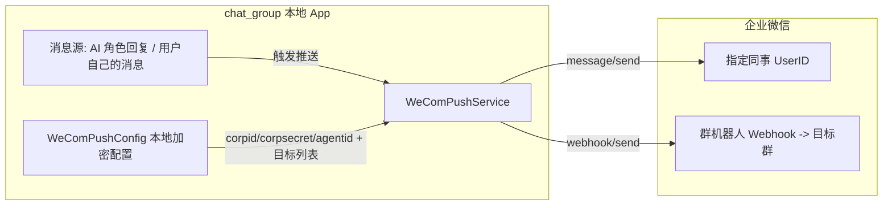

# chat_group × 企业微信 出站推送 · 技术方案

> 状态:草案(待确认触发方式与目标配置后进入实现)
> 范围已收敛:**仅出站推送,不搭服务器、不做入站**。
> 目标:把 chat_group 中某个 AI 角色(或你自己)的消息,推送到企业微信的指定同事(人)或指定群。

---

## 1. 为什么不需要服务器

出站方向只需 **App 内调用企业微信 API**,消息接收方是企微服务器,不要求本地 App 公网可达。
(入站——企微用户发消息回流到 chat_group——才需要公网中转,本次**不做**,你手动在 chat_group 里发即可。)

---

## 2. 两条推送通道

| 目标 | 通道 | 所需凭证 | 说明 |
|---|---|---|---|
| 推给**同事(人)** | 自建应用 `message/send` | `corpid` + `corpsecret` + `agentid` | 指定 `touser=UserID`,可同时多人 `id1\|id2` |
| 推给**群** | **群机器人 Webhook** | 群机器人的 `webhook key` | 在目标群「添加群机器人」拿到 URL,POST 即可;不依赖自建应用 |

> 注:自建应用的 `message/send` **只能发给人/部门/标签,进不了群**;真正往群里发最稳的是群机器人 Webhook。所以「人」和「群」走两条不同通道,两套凭证。

### 关键 API
- 取 `access_token`:`GET https://qyapi.weixin.qq.com/cgi-bin/gettoken?corpid=&corpsecret=` → `{access_token, expires_in(7200s)}`
- 发给人:`POST https://qyapi.weixin.qq.com/cgi-bin/message/send?access_token=`  body `{"touser":"UserID","msgtype":"text","agentid":AGENTID,"text":{"content":"..."}}`
- 发到群:`POST https://qyapi.weixin.qq.com/cgi-bin/webhook/send?key=KEY`  body `{"msgtype":"markdown","markdown":{"content":"..."}}`

---

## 3. 架构(出站单向)

---

## 4. chat_group 改造点

### 4.1 配置模型 `WeComPushConfig`(本地加密,类似现有 `ApiConfig`)
- 自建应用:`corpid` / `corpsecret` / `agentid`
- 推送目标列表(两类):
  - 同事:`{ name, userId }`(可多个)
  - 群:`{ name, webhookKey }`(可多个)
- 不入库明文,存本地加密配置(或沿用 `ApiConfig` 的本地存储方式)。

### 4.2 `WeComPushService`(新增,纯 Dart + Dio)
- `getAccessToken()`:`corpid/corpsecret` 换 token,内存缓存 + 7200s 过期刷新。
- `sendToUser(userId, text)`:带 token 调 `message/send`(markdown/text)。
- `sendToGroup(webhookKey, text)`:POST webhook。
- 统一返回成功/失败 + 企微错误码(errcode/errmsg),便于 UI 提示。

### 4.3 UI
- **设置页**:新增「企业微信推送」配置区(填自建应用三件套 + 管理目标列表)。
- **聊天页**:消息长按 / 输入框旁加「推送到企微」按钮 → 弹出目标选择器(同事/群)→ 调用 `WeComPushService`。
- **自动同步(可选增强)**:群设置里加开关「AI 回复自动同步到企微目标 X」。

---

## 5. 实现步骤与估算

| 步骤 | 内容 | 估算 |
|---|---|---|
| 1 | `WeComPushConfig` 模型 + 本地加密存储 | 0.25 天 |
| 2 | `WeComPushService`(token 缓存 + 发人 + 发群) | 0.5 天 |
| 3 | 设置页配置 UI + 聊天页「推送到企微」按钮/选择器 | 0.5 天 |
| 4 | (可选)自动同步开关 | 0.25 天 |
| **合计** | | **约 1–1.5 天** |

---

## 6. 待确认决策
1. **触发方式**:手动按钮(每条消息按需推)/ 自动同步(某群开启)/ 两者都要?
2. **目标配置**:固定配置在设置页(几个同事 + 几个群)/ 每次发送时现选 / 两者结合?

---

## 7. 风险与边界
- `access_token` 有调用频率限制(每日 2000 次获取),必须缓存,不能每条消息都取。
- 群机器人 Webhook 无鉴权(只有 key),key 等同"能发消息",需本地妥善保管。
- 企微消息长度限制(text 2048 字节、markdown 4096 字节),超长需截断或拆分。
- 仅原生端/桌面可靠(已有 Dio);Web 端受 CORS 限制,企微 API 可能需代理,建议先支持原生/桌面。
- 不读取 `api_configs.hive` 以外敏感文件,凭证独立存储。
