# 工作模式 AI Agent V1 使用手册

**适用版本：** 1.1.0+1
**文档状态：** V1 使用说明
**最后核对：** 2026-09-09（macOS Debug App 真实操作 + 自动化回归）

## 先读结论

工作模式是应用内的 AI Agent。它在群聊或私聊中接收一个明确任务，读取你授权的文件夹，按角色能力规划步骤，并在独立的非模态执行面板中持续显示“正在做什么、做到哪一步、结果是什么”。需要改变本地状态的操作会在真正执行前显示具体路径、影响范围和原因，由你决定是否批准。

V1 已经可以完成：

- 授权多个本地文件夹，并在应用重启后保留授权；
- 读取、列出、搜索文本和源码，解析 PDF、DOCX、XLSX；
- 在支持视觉的模型上分析图片；
- 创建、修改、重命名和删除授权目录内的文件；
- 对写入、删除、命令和安装等有影响的操作进行审批；
- 为可逆改动创建快照，完成后从任务面板撤销；
- 通过 @角色 指定执行者，或由 AI 根据职业/技能自动选择；
- 产品 → 开发 → 测试的串行接力；
- 任务运行中继续追问、排队多个追问，并保持同一任务的上下文和文件目标；
- 运行受约束的结构化命令，实时显示 stdout/stderr；
- 无搜索 API Key 时按配置 API → 无 Key 网页 → 可见浏览器顺序降级；
- 隐藏或折叠面板、离开当前页面后继续运行，重启后手点“继续”恢复。

V1 暂不承诺：

- 音频/视频理解；
- App 完全退出后的后台自主执行；
- 自动填写密码、验证码、登录或交互式终端菜单；
- 把 PDF、DOCX、XLSX、图片等二进制文件当作源码直接改写；
- Windows 实机 UI 已验收（Windows 核心代码已覆盖，真实 UI 需要 Windows 环境）。

> 安全边界：这是应用级路径和审批保护，不是操作系统级沙箱。请只授权完成任务所需的目录，并把敏感文件的读取视为需要额外确认的操作。

## 目录

1. [五分钟上手](#五分钟上手)
2. [首次配置](#首次配置)
3. [界面和执行面板](#界面和执行面板)
4. [发起任务和查看进度](#发起任务和查看进度)
5. [权限与审批](#权限与审批)
6. [面板状态、隐藏和恢复](#面板状态隐藏和恢复)
7. [连续追问与上下文记忆](#连续追问与上下文记忆)
8. [角色选择与多阶段接力](#角色选择与多阶段接力)
9. [文件、文档和图片](#文件文档和图片)
10. [命令、联网搜索和可见浏览器](#命令联网搜索和可见浏览器)
11. [撤销、冲突和数据生命周期](#撤销冲突和数据生命周期)
12. [常见问题](#常见问题)
13. [能力边界和提示词模板](#能力边界和提示词模板)
14. [验收依据和已知限制](#验收依据和已知限制)

## 五分钟上手

### 步骤 1：准备一个有凭据的 AI 角色

在“设置 → API 配置”中配置一个可用的模型，并将它绑定到至少一个 AI 角色。工作模式会使用角色自己的 API 配置；如果角色没有可用凭据，任务会在路由或执行前明确提示，而不会静默借用其他角色的 Key。

### 步骤 2：开启工作模式并授权目录

打开“设置 → 工作模式 AI Agent”，点击“添加目录”，选择一个或多个工作目录。首次选择后会出现一次批量确认框，确认内容包括：

- 规范化后的目录路径；
- 可读/可写能力；
- 目录内容可能按需发送给当前角色 API 的披露；
- 敏感文件默认需要额外确认。

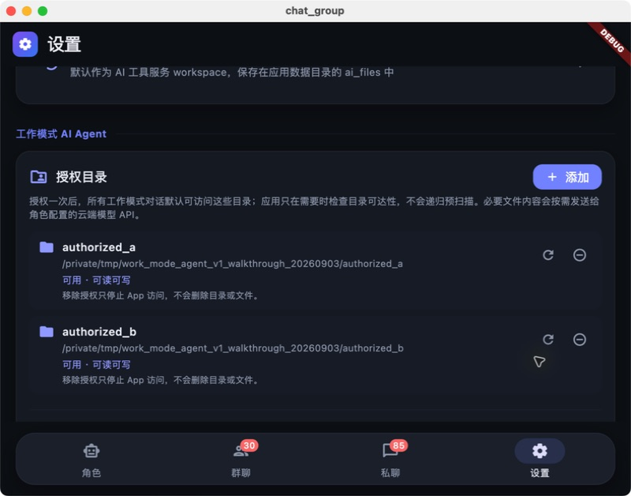

一次确认可以覆盖多个目录。授权记录属于本 App；移除记录不会删除磁盘上的目录。

### 步骤 3：在群聊或私聊打开开关

进入目标群聊或 /dm/{characterId} 私聊，在输入区打开“工作模式”开关。工作模式只对当前会话生效；普通聊天、自动发言和私聊主动联系仍然走各自的控制器。

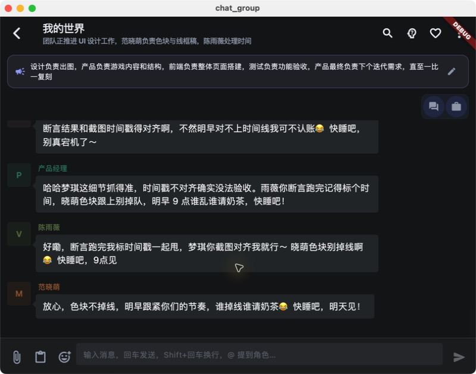

### 步骤 4：发送一个可验收的任务

先从只读任务开始：

> 读取授权目录下的 README.md，告诉我项目入口、主要模块和三个风险点，不要修改任何文件。

面板会显示角色路由、步骤、当前工具和结论。读取、列表、搜索等只读操作通常不需要普通写入确认；敏感文件、目录外路径或首次授权仍可能暂停等待你处理。

### 步骤 5：让 Agent 修改一个文件

例如：

> 修改授权目录下的 docs/CHANGELOG.md，在文件末尾追加本次版本的三条变更。只改这个文件，完成后告诉我修改前后摘要。

真正写入前会出现审批卡片。确认后才会创建快照并提交变更；拒绝则是安全跳过，不会偷偷写入。

### 步骤 6：不满意时直接追问

任务完成后直接发送：

> 刚才的修改太长，请在同一个文件中压缩成 5 行，保留版本号和迁移注意事项。

系统会把它识别为同一任务的后续修改，保留上一轮摘要、角色、路径和已完成步骤。任务仍在运行时，新问题进入 FIFO 队列，不取消旧任务，也不会丢掉新输入。

## 首次配置

### API 配置建议

工作模式需要模型能稳定返回结构化决策。建议为产品、开发、测试角色分别绑定合适的模型，并在角色资料中填写职业、技能和职责。没有显式 @ 时，路由器会使用这些信息。

如果模型返回空内容或无法解析的结构化结果，工作模式只对同一请求做一次有限修复；仍失败会归类为“模型协议错误”，面板提供重试或修改请求，不会把原始响应直接当作可执行命令。

### 授权多个目录

可以同时授权项目源码、文档和测试夹具目录。路径必须是有效目录，应用会规范化 ..、盘符大小写和符号链接边界：

1. 在设置中选择目录；
2. 检查一次确认框中的完整路径和读写能力；
3. 确认后目录记录才落盘；
4. 目录移动、删除或系统权限改变后，设置页会显示不可用，需要重新授权。

### 重新授权和移除

- “重新授权”用于目录仍是同一业务目录、但系统访问状态失效的情况；
- “添加目录”用于把新的根目录纳入工作范围；
- “移除”只撤销 App 的访问记录，不删除目录及其内容；
- 如果任务请求授权目录外的路径，面板会暂停并提供“重新授权/授权目录”入口。

## 界面和执行面板

### 工作模式输入区

输入 @ 会显示当前会话中可用的角色建议。明确选择某个角色后，路由优先使用该角色；不带 @ 时由 AI 按任务类型和能力自动判断。

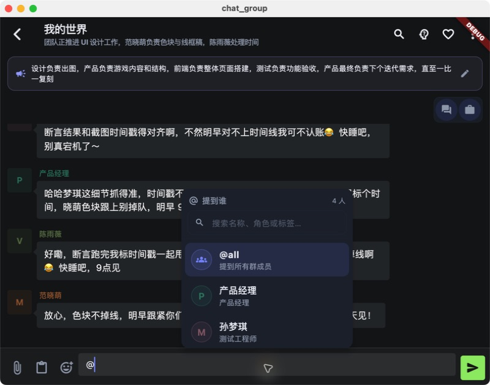

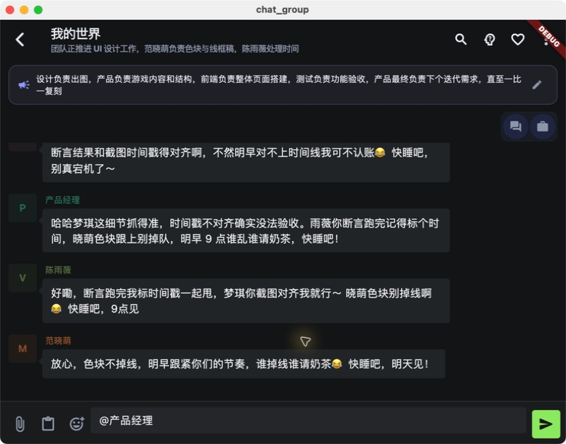

### 全局执行面板

执行面板由 App 根部承载，不绑定某个路由，因此可以在设置、群聊、私聊和角色列表之间切换。面板顶部显示任务标题、会话、执行角色、状态、耗时和 n/100 步预算；中部是实时事件；底部是当前动作、结论和可用操作。

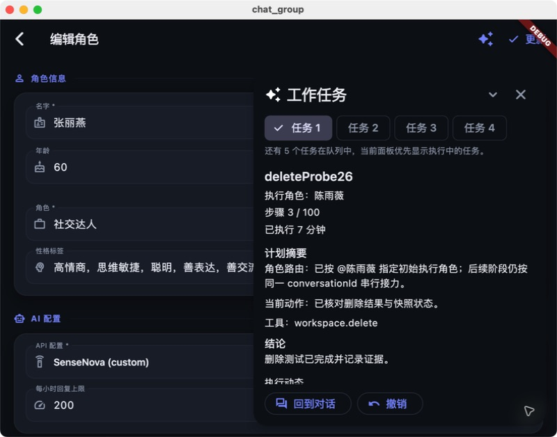

面板是非模态的：它不会锁住整个 App。你可以折叠成任务条，也可以隐藏面板；两者都不会停止任务。

### 三种可见状态

| 状态 | 你看到什么 | 任务是否继续 |
|---|---|---|
| 展开 | 完整步骤、事件、审批和恢复按钮 | 是 |
| 折叠 | 底部“工作任务 n 项 · 点击展开”任务条 | 是 |
| 隐藏 | 页面右下角的工作任务入口 | 是 |

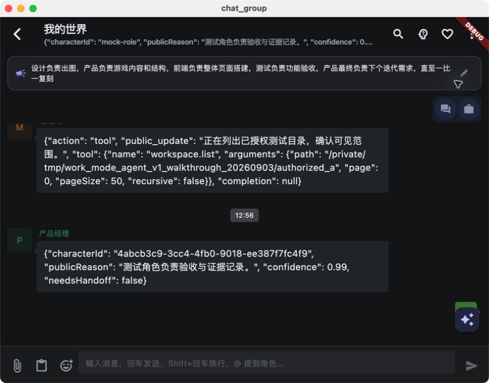

## 发起任务和查看进度

### 一次完整执行链

输入
→ 判断会话是否开启工作模式
→ 角色路由（@角色优先，否则 AI 自动选择）
→ 检查授权目录、模型能力和任务边界
→ 计划 / 工具调用 / 流式事件
→ 只读直接执行，写入和高风险操作先审批
→ 记录检查点、快照和结果
→ 完成、暂停、失败或等待用户动作

面板中的每一步都应该能回答三个问题：

1. 正在做什么：例如“读取 README.md”“等待写入审批”“等待用户完成验证码”；
2. 做到哪一步：例如 n/100、当前角色和阶段；
3. 结论是什么：例如“已读取 2 个文件，未修改磁盘”。

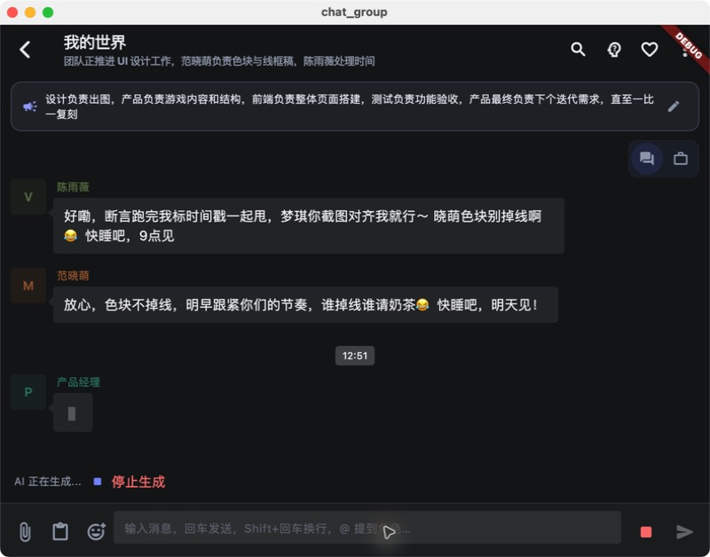

“停止生成”只停止当前普通聊天流；面板中的“停止任务”才会取消工作任务。隐藏面板不会触发停止。

### 建议的任务表达方式

请尽量同时写清：

- 目标：要得到什么；
- 范围：允许访问哪些目录/文件；
- 是否允许写入；
- 是否允许命令或联网；
- 交付格式：摘要、差异、文件路径、测试结论；
- 完成条件：什么结果算完成。

示例：

> 在 /项目/docs 内找出所有包含“迁移”的 Markdown 文件，只读分析并按风险排序。不要修改文件，不运行构建，不访问其他目录。

## 权限与审批

### 默认权限矩阵

| 操作 | 默认行为 | 可能的额外门禁 |
|---|---|---|
| 列目录、读取文本、搜索源码 | 授权根内自动执行 | 敏感文件需要精确读取确认 |
| 只读命令 | 自动执行并流式显示输出 | 命令、工作目录和 URL 仍需通过策略校验 |
| 公共联网搜索 | 按搜索优先级自动尝试 | 登录、验证码、付费墙会暂停 |
| 创建、写入、Patch、重命名 | 先显示变更计划 | 普通写入确认可在设置关闭，但新路径/无快照仍会再确认 |
| 删除、覆盖、安装、提交、依赖下载 | 始终显示具体审批 | 删除和不可逆操作不能被普通写入开关关闭 |
| 目录外路径 | 不执行 | 重新授权后再继续 |
| 密码、登录、验证码、交互式菜单 | 不代填 | 面板暂停，按提示由用户手点继续或在外部终端完成 |

### 审批卡片会显示什么

审批卡片至少显示：

- 准确的绝对路径或结构化命令；
- 影响目录；
- 预计字节数或命令影响；
- 是否创建快照、是否可撤销；
- 为什么需要这次批准；
- “允许本次范围”“拒绝”等明确按钮。

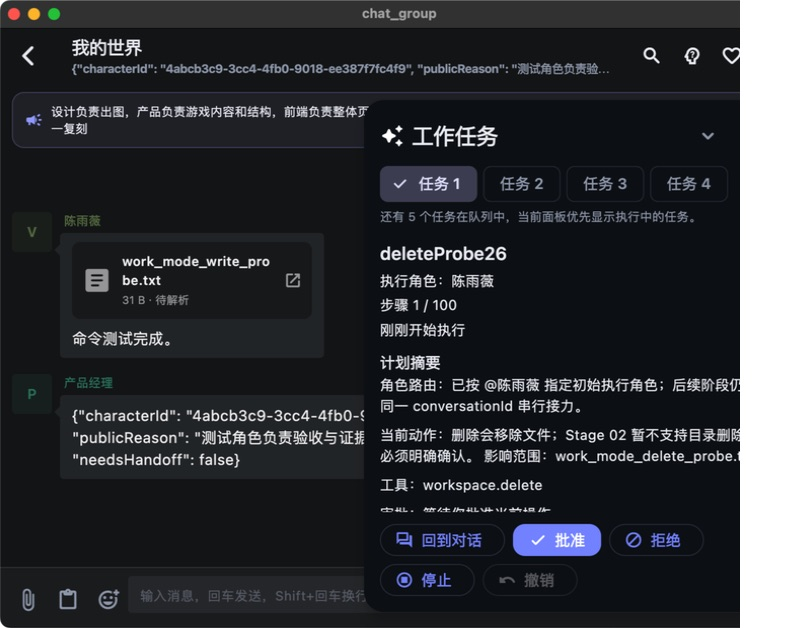

批准只授予当前任务、当前明确范围，不会把整个磁盘变成永久白名单。下一次新增文件或目录可能再次请求补充范围。

### 普通写入确认开关

设置中的“普通写入前确认”可以关闭，用于减少低风险、可逆写入的重复提示。以下门禁仍然保留：

- 删除、不可逆覆盖、无快照写入；
- 安装工具、依赖下载、Git 提交；
- 跨目录或超出当前审批范围；
- 敏感文件读取；
- 影响不确定的命令。

### 直接写入和一键撤销

批准后，Agent 才能执行真正的写入。完成后，从任务面板点击“撤销”，先查看恢复范围，再确认。撤销也会重新检查授权和当前文件哈希；如果文件已被外部修改，系统报告冲突并保留外部内容，不强行覆盖。

## 面板状态、隐藏和恢复

| 状态 | 含义 | 推荐操作 |
|---|---|---|
| 排队 | 等待同会话 FIFO 或全局执行槽位 | 等待，或停止排队任务 |
| 规划中 | 正在选择角色、工具和范围 | 检查当前角色和计划 |
| 执行中 | 正在读文件、调用模型、运行命令 | 观察事件；需要时停止 |
| 等待审批 | 任何有影响的操作尚未获批 | 查看具体路径和原因后允许/拒绝 |
| 等待用户动作 | 登录、验证码、安装、重新授权等需要人工处理 | 按面板提示完成后点“继续” |
| 可重试 | 网络、模型临时故障等可恢复错误 | 点“重试” |
| 冲突 | 文件在计划后被外部修改 | 查看冲突，手动决定后再继续 |
| 达到上限 | 达到 100 步或 60 分钟软上限 | 检查摘要后点“继续”开启新额度 |
| 已完成 | 有最终结论和交付物 | 可追问、查看事件或撤销 |
| 已停止/失败 | 本次未完成 | 根据错误类型重试、授权或修改请求 |

### 隐藏、折叠和停止的区别

- 折叠：只减少占屏，任务继续；
- 隐藏：关闭大面板，右下角入口仍在，任务继续；
- 离开页面：任务仍由全局协调器持有；
- 停止：明确取消当前任务，之后不会自动续跑。

### 重启后的行为

应用重启会从持久化检查点恢复任务元数据、事件和队列，但不会在启动时自动执行。必须由用户点击“继续”，避免 App 重启后无提示地访问磁盘或联网。

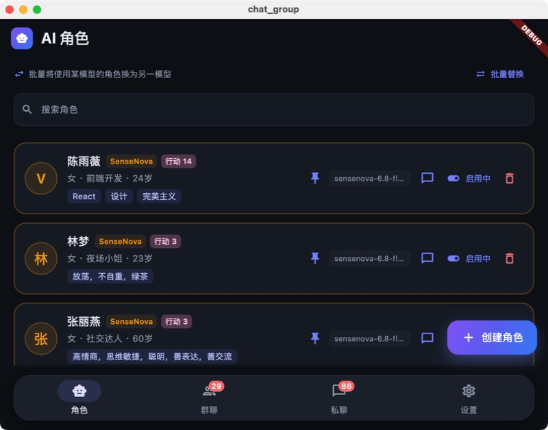

## 连续追问与上下文记忆

这是工作模式与一次性问答的核心区别。

### 任务未完成时

新输入进入当前任务的 FIFO 队列：

1. 旧任务继续执行；
2. 新追问显示为排队项；
3. 旧任务释放执行槽后，按提交顺序处理；
4. 新追问沿用同一会话的摘要、已授权范围、已确认路径和阶段信息。

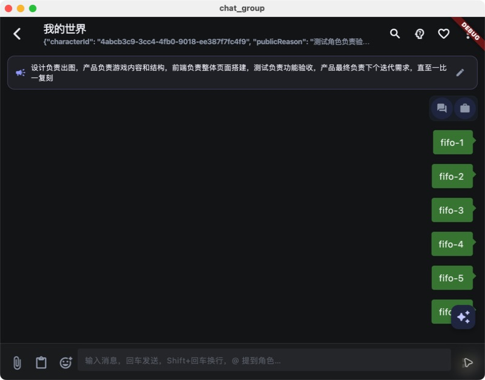

### 任务完成后

完成任务仍可以“同任务追问”。例如：

> 修改刚才生成的同一个文件，改成更简短的版本。

明确提到“刚才生成的同一个文件”“上次文件”“当前文件”等修订语义时，系统会锁定原交付物路径，不因为重名自动生成 -1、-2。只有明确的新建请求发生重名时，才允许自动改名。

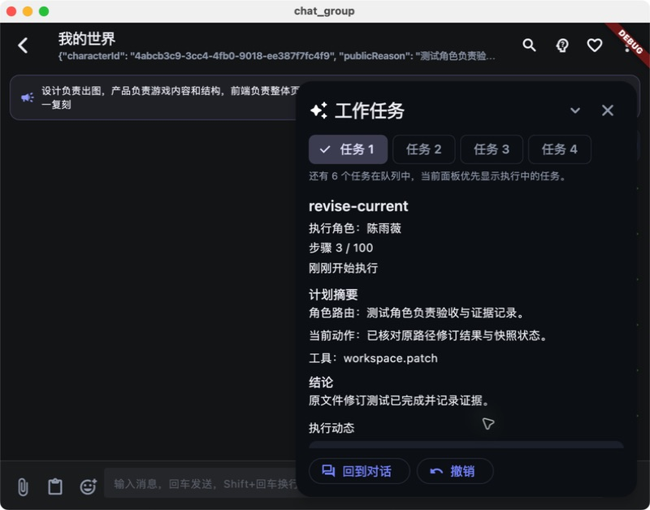

如果只说“把它改一下”，但历史中有多个可能文件，系统会先问一个精确澄清问题，不猜最近文件，也不覆盖不确定目标。

### 上下文包含和不包含什么

会保留：

- 原始目标和后续追问；
- 已完成步骤、任务摘要和检查点；
- 已验证的授权目录；
- 结构化交付物路径和哈希；
- 当前角色、阶段和接力状态；
- 已批准的明确文件范围。

不会把完整文件正文、API Key、密码、原始命令输出无限期塞进检查点。大内容按需重新读取，并经过边界和脱敏处理。

### 会话隔离

- 同一个群聊共享该群的工作上下文；
- 私聊只绑定当前角色和 dm:{characterId}；
- 不会因为某个群聊里出现过文件，就让另一个私聊自动看到它；
- 工作模式开启时会暂停该会话的自动发言；关闭后自动发言可恢复；
- 普通聊天和主动私聊不会悄悄变成工作任务。

## 角色选择与多阶段接力

### 明确指定角色

在群聊中输入 @产品经理、@开发、@测试 等，确认建议后发送。精确的 @ 优先于模型自动判断；未知或重名角色会要求澄清，不会随便选一个。

### AI 自动判断

不带 @ 时，系统根据：

- 用户请求中的任务类型；
- 角色职业、简介和技能；
- 当前群成员；
- 附件类型和模型能力；
- 当前阶段和已有接力状态；

选择合适的执行者。例如：

| 请求 | 通常的首选角色 |
|---|---|
| 梳理需求、验收标准、用户故事 | 产品 |
| 修改源码、实现功能、重构 | 开发 |
| 编写测试、复现问题、回归验证 | 测试 |
| 分析图片 | 支持视觉模型的角色 |

模型路由失败时，会使用本地职业/技能降级规则；降级原因会显示在面板，不会伪装成模型已经做过判断。

### 产品 → 开发 → 测试

复杂请求可以形成串行阶段：

1. 产品角色先产出需求和验收条件；
2. 开发角色接收结构化摘要和交付物路径；
3. 测试角色读取同一上下文进行验证；
4. 同一会话同一时刻只有一个阶段执行者真正占用该阶段。

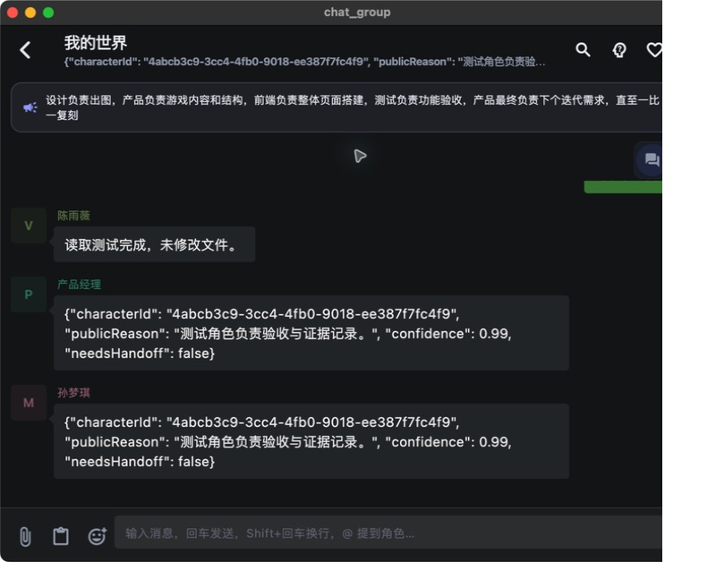

全局最多同时运行 2 个工作任务；同一会话内仍按 FIFO 串行，写入同一路径会加资源锁。

## 文件、文档和图片

### 可读取和分析

| 类型 | V1 行为 |
|---|---|
| TXT、Markdown、JSON、源码 | 有界读取、分页、搜索和摘要 |
| PDF | 保留页码位置并提取文本 |
| DOCX | 保留段落位置并提取文本 |
| XLSX | 保留工作表/单元格位置并提取文本 |
| PNG、JPG、HEIC、HEIF、AVIF | 仅在当前角色模型支持视觉时发送分析 |
| 音频、视频 | 明确返回不支持，不伪装成已读取 |

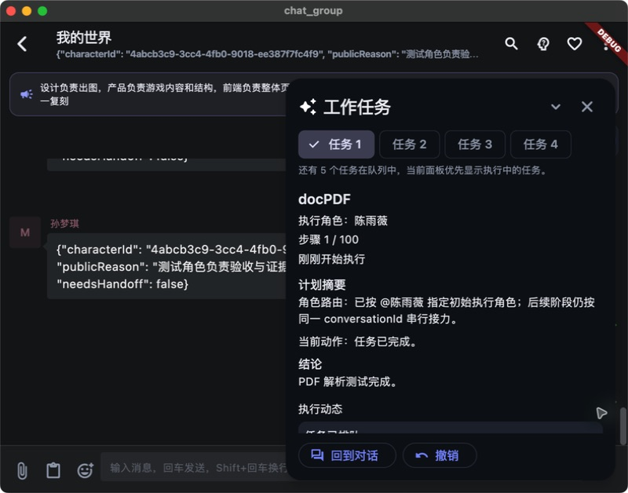

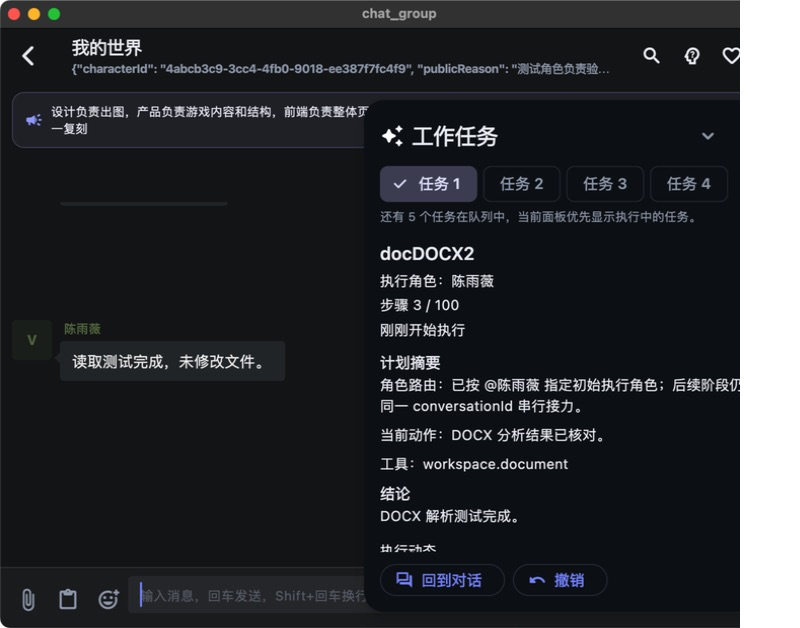

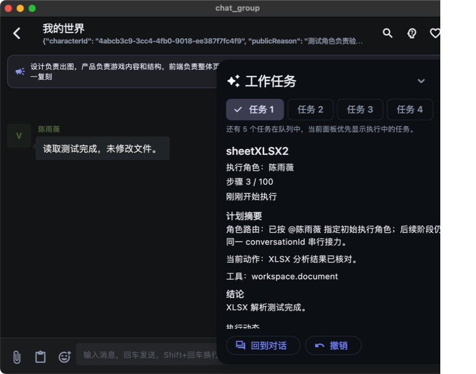

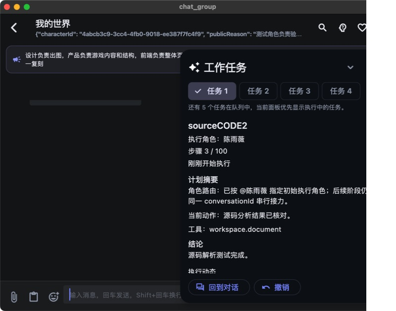

### 图片模型选择

如果当前角色没有视觉能力，任务会暂停并让你选择已配置的视觉模型，不会自动切换角色或偷偷上传到其他模型。选择后，面板会记录附件路径、消息 ID 和分析结果。

### 二进制文件的边界

V1 可以读取和分析 PDF/DOCX/XLSX/图片，但不把它们当作普通源码进行原地二进制编辑。要生成文档内容，建议让 Agent 创建 Markdown、TXT、JSON、源码等文本交付物；要改动原始二进制文件，请使用专门的桌面工具并让工作模式只做分析和变更建议。

## 命令、联网搜索和可见浏览器

### 结构化命令

命令由可执行文件、参数、工作目录和声明的影响范围组成，不通过隐式 shell 拼接。Agent 会：

- 检查可执行文件和工作目录是否在允许范围；
- 阻止路径穿越、符号链接越界和危险网络目标；
- 分开处理 stdout/stderr，并在面板中流式显示；
- 对超时、输出过大、密码提示和交互菜单安全终止或暂停；
- 对安装、依赖下载、Git 提交和不确定影响的命令单独审批。

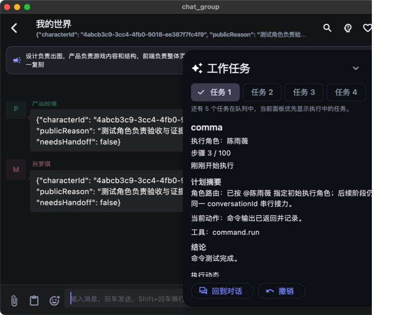

构建和测试默认不自动执行。只有你明确说“运行测试”“构建 macOS 包”等，工作模式才会规划这些步骤，并在需要时再次请求命令审批。

### 搜索优先级

联网搜索按以下顺序尝试：

1. 已配置且健康的搜索 API；
2. 不需要 API Key 的网页搜索；
3. App 内可见浏览器；
4. 明确告诉你失败原因和下一步。

搜索结果默认只记录来源，不在普通答案中强制附裸链接。你可以继续问：

> 给出刚才搜索使用的来源链接。

系统会复用本轮搜索快照，不重复发起第二次搜索。

### 可见浏览器和人工介入

可见浏览器会显示当前域名、导航和页面状态。登录、验证码、付费墙或要求输入账号密码时，任务暂停：

1. 浏览器保持可见；
2. 面板解释为什么暂停；
3. 你在浏览器中完成允许的人工操作；
4. 回到 App 点击“手点继续”；
5. Agent 只读取继续后允许的公开正文，不读取密码。

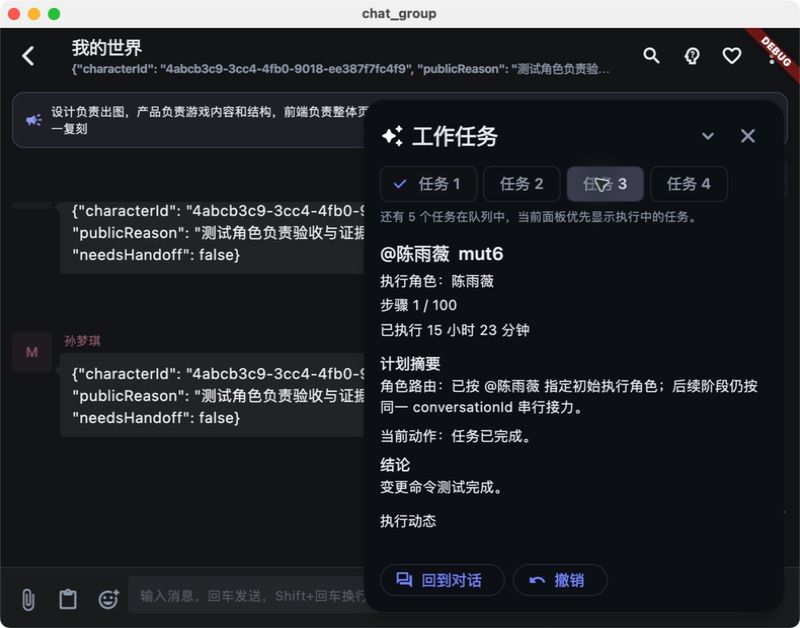

Windows 上的可见浏览器使用 WebView2。Windows 11 通常已有；部分 Windows 10 环境可能需要你确认后由 App 协助安装。核心工作模式不依赖额外服务，但可见浏览器运行时是平台组件例外。

## 撤销、冲突和数据生命周期

### 快照和撤销

可逆写入在提交前预留快照空间，完成后保留快照用于撤销。默认：

- 任务事件和快照保留 30 天；
- 快照总量上限 2 GB；
- 超限优先清理最旧的已完成任务；
- 清理只删除 App 自己的事件/快照，不删除你的项目文件。

### 冲突保护

写入和撤销都会重新检查路径、符号链接和哈希。如果外部程序在审批后修改文件：

- 任务进入冲突状态；
- 面板列出冲突路径；
- 不覆盖外部内容；
- 你可以查看冲突后决定重新读取、重新规划或手动处理。

### 事件、备份和凭据

任务事件以有界 JSONL 形式保存在 App 支持目录中，面板和持久化数据会脱敏、限制长度和层级。API Key 不写入事件、导出或截图。备份/恢复保留可恢复的任务元数据，但会丢弃机器相关的工作目录路径和凭据，需要在新环境重新绑定。

## 常见问题

| 现象 | 原因 | 处理 |
|---|---|---|
| 提示没有可用工作目录 | 尚未授权或授权已失效 | 设置 → 工作模式 → 添加/重新授权目录 |
| 目录显示“不可用” | 目录被移动、删除或系统权限改变 | 选择原目录重新授权 |
| 任务停在“等待审批” | 需要你确认路径/命令 | 查看范围和原因；允许或拒绝 |
| 任务停在“等待用户动作” | 登录、验证码、安装、视觉模型等需要人工选择 | 完成提示动作后手点继续 |
| 点击隐藏后看不到任务 | 面板隐藏但任务仍在运行 | 点击右下角工作任务入口；隐藏不等于停止 |
| 重启后没有自动继续 | V1 设计为重启后必须手动确认 | 打开任务面板并点击“继续” |
| 图片任务无法继续 | 当前角色模型不支持视觉 | 选择已配置的视觉模型 |
| 搜索总是失败 | API 不可用、网页挑战或浏览器运行时缺失 | 查看失败原因，允许可见浏览器或配置搜索 API |
| 找不到 rg/其他命令 | 工具未安装或路径不在允许范围 | 查看安装建议；确认来源和影响后再安装 |
| 撤销提示冲突 | 文件已被外部程序修改 | 查看冲突，不要强行覆盖；重新读取后再规划 |
| 任务达到 100/100 或 60 分钟 | 软上限触发保护 | 阅读摘要，确认后点击继续 |
| 普通聊天被自动执行 | 检查当前会话工作模式开关 | 关闭工作模式；普通/自动/私聊控制器与工作模式隔离 |
| 没有显示来源链接 | 默认只记录来源，避免打扰 | 继续问“给出刚才的来源链接” |

## 能力边界和提示词模板

### 推荐模板

**只读分析**

> 读取 <授权目录或文件>，只做分析，不修改任何文件、不运行命令。请给出结论、证据路径和不确定项。

**精确修改**

> 修改 <绝对路径或授权目录内相对路径>，只改这个文件。先说明计划和预计影响，批准后再写入，完成后给出差异摘要。

**同一文件修订**

> 修改刚才生成的同一个文件 <文件名/路径>：将 <要求>。不要另存为新文件，不要改其他路径。

**测试/构建**

> 在 <授权项目目录> 运行 <明确命令>，这是我明确要求的测试/构建。不要修改源码；输出失败摘要和退出码。

**联网搜索**

> 搜索 <主题>，优先可靠公开来源。默认答案不要放链接，只记录来源；我之后会单独追问来源链接。

**图片分析**

> 分析附件 <图片>，只读取图片内容，不修改本地文件。若当前模型不支持视觉，请暂停并让我选择模型。

### 不推荐的表达

- “把电脑清理一下”：范围和删除风险不明确；
- “把刚才那个改好”：可能存在多个文件，应给出文件名或路径；
- “顺便跑一下所有东西”：构建、测试、依赖安装应明确写出；
- “自动登录并提交”：登录和提交通常需要人工确认，且可能涉及敏感凭据。

## 验收依据和已知限制

本手册中的关键界面来自仓库内 macOS CUA 证据，不是示意图。完整 33 项真实 walkthrough、截图和首次失败记录见：

- [macOS 真实操作 walkthrough](verification/work_mode_agent_v1_macos_walkthrough.md)
- [Stage 05 安全与发布复核](verification/work_mode_agent_v1_stage05_review_20260909.md)
- [工作模式 V1 全量 Review](verification/work_mode_agent_v1_full_review_20260909.md)
- [需求规格](work_mode_agent_v1_requirements.md)
- [技术设计与实施验收计划](work_mode_agent_v1_technical_design.md)

当前验收结论：

- 工作模式定向测试：462 项通过；
- 相关 Agentic/Web/文档/多模态回归：359 项通过；
- 串行全量 Flutter 测试：1983 项通过；
- flutter analyze、macOS Debug/Release 构建、签名和新 DMG 安全扫描通过；
- macOS 真实 CUA：33/33 PASS；
- Windows：代码、策略和构建边界已覆盖，真实 Windows UI 仍待 Windows 环境；
- Release DMG 当前为 ad-hoc 签名，未包含 Developer ID 和公证票据，不能把它当作最终公开分发包；
- 音视频、App 完全退出后的自主执行、交互式密码/验证码仍是明确 V1 边界。

## 后续优化方向

按优先级建议：

1. **安全与可靠性**：继续缩小跨进程文件替换的 TOCTOU 窗口，强化事务日志和崩溃恢复；
2. **Windows 完整验收**：检测/安装 WebView2，补齐 Windows 实机 CUA 和正式签名；
3. **审批体验**：增加权限预览、差异查看器、按任务的授权范围管理；
4. **模型协议**：优先使用原生 function/tool calling，减少 JSON 文本协议修复；
5. **任务管理**：历史任务搜索、导出、成本估算和预算/保留期可配置；
6. **交互式终端**：在独立安全设计后支持伪终端、登录和菜单，不自动代填密码；
7. **大项目性能**：为大型工作区增加可选增量索引，仍保持按需读取；
8. **后台能力**：只有在明确的推送、权限和隐私设计完成后，才考虑 App 关闭时的主动任务。

V1 先以“可见、可控、可撤销、可继续”为主；以上优化不会改变当前的审批和隔离底线。
